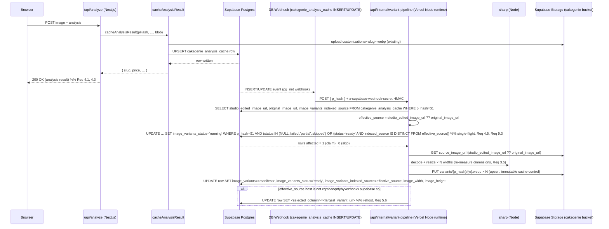
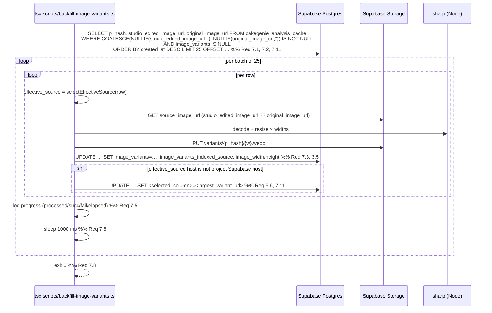

# Design Document: Cake Image Variant Pipeline

## Overview

The variant pipeline adds a server-side `sharp`-based image resizing stage to the existing cake-image upload flow and a one-time backfill for the ~8,000 historical rows in `cakegenie_analysis_cache`. For every cake design, the pipeline produces up to three WebP renditions (400 / 800 / 1200 px wide), uploads them to deterministic paths in the existing public `cakegenie` Supabase Storage bucket, and writes a JSON manifest to a new `image_variants jsonb` column on the cache row. The pipeline keys off the *displayed* image — `studio_edited_image_url` when present, otherwise `original_image_url` — so the variants always match what the user actually sees on the PDP. PDPs, product cards, and listing pages render those URLs through `next/image` with a properly-tuned `sizes` attribute, letting browsers pick the smallest variant that fits the viewport.

The pipeline is decoupled from upload latency (Req 4.1, 4.3): the analysis API returns to the user as soon as `cacheAnalysisResult` writes the row, then a Supabase Database Webhook fires a Vercel serverless route that runs `sharp` and updates the row. The same generation library is reused by `scripts/backfill-image-variants.ts` against the service-role client. `images: { unoptimized: true }` in `next.config.ts` stays — we are emitting variants ourselves and serving them as static immutable objects from Supabase Storage, bypassing Vercel's image optimizer entirely.

Two architecturally important rules govern the pipeline's input selection:

1. **Studio-edited images take precedence.** The pipeline always operates against `effective_source_url = studio_edited_image_url ?? original_image_url`. When a row's `studio_edited_image_url` is later filled in or changed by the admin pipeline, the variant pipeline re-runs against the new source and overwrites the manifest at the same `variants/{p_hash}/{w}.webp` paths (Req 1.9, 1.10, 9.3).
2. **Third-party originals are rehosted.** When the effective source resides on a non-Supabase host (Pinterest, Instagram, gstatic, etc.), the worker fetches it once, generates variants into our `cakegenie` bucket as normal, and additionally rewrites the source-of-truth column on the cache row (`studio_edited_image_url` or `original_image_url`, whichever was the source) to point at the largest variant. This eliminates third-party CDN dependencies for LCP and is treated as a one-time storage cost (Req 5.6).

Requirements traced: 1, 2, 3, 4, 5, 6, 7, 8, 9, 10, 11, 12, 13.

## Architecture

This section covers architecture diagrams (sequence + component), the trigger choice, and the module layout.

### Architecture diagrams

#### Upload-time variant generation (sequence)



#### Backfill (sequence)



#### Component diagram

```mermaid
flowchart LR
    subgraph shared["src/lib/imageVariants/ (shared library)"]
        T[types.ts<br/>VariantManifest, Variant]
        G[generate.ts<br/>generateVariants(buffer)]
        S[storage.ts<br/>variantPath, uploadVariant]
        M[manifest.ts<br/>parseManifest, serializeManifest,<br/>buildSrcSet, pickFallbackSrc]
        G --> T
        S --> T
        M --> T
    end

    subgraph upload["Upload path (server)"]
        Worker[/api/internal/variant-pipeline]
    end

    subgraph backfill["Backfill (CLI)"]
        BF[scripts/backfill-image-variants.ts]
    end

    subgraph render["Render (RSC + client)"]
        LI[components/LazyImage.tsx]
        Slug[customizing/[slug]/page.tsx]
        Card[components/ProductCard.tsx]
    end

    subgraph db["Supabase"]
        DB[(cakegenie_analysis_cache.image_variants)]
        Bucket[(Storage bucket: cakegenie)]
        Hook[DB Webhook]
    end

    Worker --> G --> S --> Bucket
    Worker --> M --> DB
    BF --> G
    BF --> S
    BF --> M
    BF --> DB
    Hook --> Worker
    DB --> Slug
    DB --> Card
    Slug --> LI
    Card --> LI
    M --> LI
```

### Pipeline trigger choice

**Choice: E — Supabase Database Webhook → Vercel serverless function (Node runtime).**
Runner-up: B (`setTimeout(..., 0)` after `cacheAnalysisResult`).

**Rationale.**

- Option A (inline) violates Req 4.1 / 4.3 directly.
- Option B (in-process `setTimeout`) works only when `cacheAnalysisResult` runs on the server. Today it runs *both* on the client (browser uploads call `cacheAnalysisResult` with the user-scoped `supabase` client) and on the server. Sharp cannot run in the browser, so B leaves client-initiated uploads uncovered unless we also add a server endpoint — at which point E is cleaner.
- Option C (Postgres queue table + cron worker) adds infra and increases p95 latency to the cron interval (Req 4.4 caps at 30 s).
- Option D (Edge Function in Deno) cannot use `sharp` directly. `imagescript` is a viable Deno alternative but lacks parity with sharp's WebP encoder quality/effort tuning, and we already bundle `sharp` for backfill.
- Option E covers both client and server upload origins via a single trigger source (the row insert), reuses the same `sharp` library as the backfill (DRY), and runs in the Node.js Vercel runtime where `sharp` is well-supported. The webhook fires immediately on insert, easily landing inside the 30 s budget.

**Trade-off.** Option E introduces a publicly-routable URL that must verify the webhook came from Supabase. We mitigate with a shared HMAC secret (`SUPABASE_WEBHOOK_SECRET`) sent in the `x-supabase-webhook-secret` header and validated by the route. A rotation runbook is documented as a follow-up; for v1 the secret is static. Vercel Hobby's 10 s function limit is tight; we deploy the route under `vercel.json` `functions: { "src/app/api/internal/variant-pipeline/route.ts": { "maxDuration": 60 } }` (Pro tier required — already provisioned). If the project is still on Hobby, the runner-up (B) plus a server-only endpoint becomes the fallback path.

**Trigger fires on INSERT and UPDATE.** The Supabase Database Webhook is configured for both event types on `cakegenie_analysis_cache`. INSERT covers new uploads. UPDATE covers the studio-edit flow: when the admin pipeline later writes `studio_edited_image_url` (or transitions `studio_edit_status` to `'completed'`), the webhook fires again and the worker re-runs against the new effective source, overwriting the manifest at the same variant paths (Req 1.9, 9.3). Loop avoidance is handled by the single-flight claim guard described under Components and Interfaces — the claim only re-runs when the indexed source URL differs from the current effective source URL, so the worker's own UPDATE of `image_variants` does not re-fire itself.

## Components and Interfaces

### Module layout

New files:

| Path | Purpose |
| --- | --- |
| `src/lib/imageVariants/types.ts` | TypeScript types for `Variant`, `VariantManifest`, `VariantFormat`. Single source of truth. |
| `src/lib/imageVariants/generate.ts` | Pure pipeline: `generateVariants(input: Buffer): Promise<GenerateResult>`. Uses `sharp`. No I/O. |
| `src/lib/imageVariants/storage.ts` | `variantPath(pHash, width)`, `uploadVariant(client, pHash, width, buffer)`, `publicVariantUrl(client, pHash, width)`. Wraps the Supabase storage client. |
| `src/lib/imageVariants/manifest.ts` | `parseManifest(jsonb): VariantManifest \| null`, `serializeManifest(m): unknown`, `buildSrcSet(m): string`, `pickFallbackSrc(m, maxWidth): string \| null`, and `chooseSourceUrl(row): { url: string, sourceField: 'studio_edited_image_url' \| 'original_image_url' } \| null` (Req 14.1). Pure, no I/O. |
| `src/lib/imageVariants/runForRow.ts` | Glue that ties generate + storage + manifest. Used by both the webhook route and the backfill. Accepts an injected `SupabaseClient` so service-role / anon usage is symmetrical. |
| `src/app/api/internal/variant-pipeline/route.ts` | POST handler. Verifies HMAC, claims the row (single-flight), calls `runForRow`, updates the cache row. |
| `scripts/backfill-image-variants.ts` | CLI. Args: `--limit=<n>`, `--dry-run`, `--batch-size=<n>` (default 25), `--from-id=<uuid>`. |
| `supabase/migrations/20260601000000_add_image_variants_to_analysis_cache.sql` | DDL — see §6. |
| `supabase/migrations/20260601000000_add_image_variants_to_analysis_cache.runbook.md` | Operational notes, since this column is read by the PDP critical path. |

PDP / consumer changes (existing files edited, no relocation):

- `src/components/LazyImage.tsx` — accepts a new optional `variants?: VariantManifest` prop; when present, renders `srcset` and `sizes`, drops `next/image`'s blur transformations.
- `src/components/ProductCard.tsx` — passes `image_variants` through.
- `src/app/customizing/[slug]/page.tsx` — uses the parsed manifest for the hero `<LazyImage>` and the `<link rel="preload">` (Req 6.1, 6.4).
- `src/app/customizing/page.tsx`, `src/app/shop/[merchantSlug]/[productSlug]/page.tsx`, `src/app/collections/[category]/page.tsx`, `src/app/search/SearchingClient.tsx` — select the new column and forward to `<ProductCard>` / `<LazyImage>` (Req 6.7).
- `src/services/supabaseService.ts` — every existing `select(...)` that pulls cake rows for rendering adds `image_variants` to the column list. No write-path change here; the webhook does the write.

### TypeScript types

`src/lib/imageVariants/types.ts`:

```ts
export type VariantFormat = 'webp';

export interface Variant {
  /** Encoded width in pixels. Integer, ascending in the manifest. */
  width: number;
  /** Public Supabase storage URL. Deterministic, no query string. (Req 9.4, 12.1) */
  url: string;
  /** Encoded byte size of the WebP payload. */
  bytes: number;
}

export interface VariantManifest {
  format: VariantFormat;
  /** Which Cache_Row column was used as the Source_Image. Req 14.3. */
  source: 'studio_edited_image_url' | 'original_image_url';
  variants: Variant[]; // sorted ascending by width (Req 3.4)
}

/**
 * Manifest JSON shape written into cakegenie_analysis_cache.image_variants:
 *   {
 *     "format": "webp",
 *     "source": "studio_edited_image_url" | "original_image_url",
 *     "variants": [
 *       { "width": 400,  "url": "...", "bytes": 12345 },
 *       { "width": 800,  "url": "...", "bytes": 23456 },
 *       { "width": 1200, "url": "...", "bytes": 34567 }
 *     ]
 *   }
 * `parseManifest` accepts manifests written before the `source` field existed
 * by defaulting `source` to `"original_image_url"` (Req 14.4).
 */

export interface GenerateResult {
  manifest: VariantManifest;
  /** Decoded dimensions of the source image, used to populate image_width/image_height (Req 3.5). */
  source: { width: number; height: number };
  /** Per-width buffers ready for upload, in the same order as manifest.variants. */
  encoded: Array<{ width: number; buffer: Buffer; bytes: number }>;
  /** Soft warnings (e.g. variant set exceeded 250 KB). Req 8.2 */
  warnings: string[];
}

/** The two columns on cakegenie_analysis_cache that may serve as the variant source. */
export type SourceColumn = 'studio_edited_image_url' | 'original_image_url';

/** Result of resolving the effective source URL for a cache row. */
export interface SelectedSource {
  url: string;
  column: SourceColumn;
}

export interface RunForRowInput {
  pHash: string;
  /**
   * The two source URL columns from the Cache_Row. The pipeline calls
   * selectEffectiveSource() to pick one (studio-edited preferred when present
   * and non-empty after trimming, otherwise original) per Req 14.1, and
   * applies the third-party rehost rule (Req 15) inside one helper. When
   * these are omitted, runVariantPipelineForRow re-reads the row from the
   * database itself; the webhook path passes them through to avoid a second
   * read since the webhook payload already carries the row.
   */
  studioEditedImageUrl?: string | null;
  originalImageUrl?: string | null;
  client: SupabaseClient;
  dryRun?: boolean;
}

export interface RunForRowResult {
  status: 'ok' | 'partial' | 'skipped' | 'failed';
  manifest: VariantManifest | null;
  source?: { width: number; height: number };
  /** Which column on the cache row was used as the source (for logging + rehost). */
  selected?: SelectedSource;
  /** Set when the worker rehosted a third-party source by rewriting selected.column. */
  rehostedTo?: string;
  errors: Array<{ stage: string; message: string }>;
}
```

Function signatures:

```ts
// generate.ts
export async function generateVariants(
  input: Buffer,
  opts?: { targetWidths?: number[]; quality?: number; effort?: number }
): Promise<GenerateResult>;

// storage.ts
export function variantPath(pHash: string, width: number): string;            // "variants/<pHash>/<width>.webp"
export function publicVariantUrl(client: SupabaseClient, pHash: string, width: number): string;
export async function uploadVariant(
  client: SupabaseClient, pHash: string, width: number, buf: Buffer
): Promise<{ url: string }>;

// manifest.ts
export function parseManifest(value: unknown): VariantManifest | null;        // returns null when invalid (Req 3.6)
export function serializeManifest(m: VariantManifest): unknown;
export function buildSrcSet(m: VariantManifest): string;                       // Req 6.2, 11.4
export function pickFallbackSrc(m: VariantManifest, maxWidth?: number): string | null; // Req 6.5

// runForRow.ts
export function selectEffectiveSource(row: {
  studio_edited_image_url: string | null;
  original_image_url: string | null;
}): SelectedSource | null;
//
// Returns { url: studio_edited_image_url, column: 'studio_edited_image_url' }
// when studio_edited_image_url is non-empty (Req 1.9), otherwise
// { url: original_image_url, column: 'original_image_url' } when original_image_url
// is non-empty (Req 1.10), otherwise null. Callers treat null as "skip" (Req 5.4).

export async function runVariantPipelineForRow(input: RunForRowInput): Promise<RunForRowResult>;
```

Defaults: `targetWidths = [400, 800, 1200]`, `quality = 80`, `effort = 4` (Req 1.1, 1.2).

### Source-of-truth selection and rehost

Two related rules govern which URL the pipeline reads from and which column it writes back to:

1. **Effective source selection (Req 1.9, 1.10).** `selectEffectiveSource` returns `studio_edited_image_url` first, falling back to `original_image_url`. Both the webhook worker and the backfill call this helper — there is no second code path.

2. **Third-party rehost (Req 5.6).** Define the project Supabase host:

   ```ts
   export const PROJECT_SUPABASE_HOST = 'cqmhanqnfybyxezhobkx.supabase.co';
   ```

   After `runVariantPipelineForRow` finishes uploading variants, it inspects the hostname of the `selected.url` it processed. When that hostname is not `PROJECT_SUPABASE_HOST`, the worker performs an additional `rehost_source_url` step: it issues an UPDATE that sets `selected.column` to the public URL of the largest variant produced (typically the 1200 px variant, or the largest available when the source was smaller). The PDP fallback chain reads whichever URL is currently in the column, so this rewrite is safe and transparent to renderers. `getCachedAssetUrl` and `/api/proxy-image` remain the runtime fallback for any URL that still points at a third-party host (e.g. while a backfill is in flight).

### Foreign source re-hosting

Detection: the worker computes `new URL(selected.url).hostname !== PROJECT_SUPABASE_HOST` (host string is `'cqmhanqnfybyxezhobkx.supabase.co'`, equal to `process.env.NEXT_PUBLIC_SUPABASE_HOSTNAME` when that env var is set). If `URL` parsing throws (malformed legacy data), the worker treats the row as a `decode`-stage failure and stops.

Atomicity: on success, the same DB write that sets `image_variants`, `image_variants_status='ready'`, `image_variants_indexed_source`, `image_width`, and `image_height` also sets `selected.column` (`original_image_url` or `studio_edited_image_url`) to the public URL of the largest variant produced. Folding the column rewrite into a single UPDATE means the row is never observable in a "variants ready, source still pointing at Pinterest" intermediate state. The failure matrix lists `rehost_source_url` as a separate retryable stage only because in practice the rehost may need to happen as a follow-up UPDATE if the row is locked by another writer; the design preference is one UPDATE.

PDP fallback chain unchanged: renderers read whichever URL is currently in `studio_edited_image_url` / `original_image_url`. After rehost, the source column points at a Supabase variant URL, which is fine — the chain (Step 3 §"Fallback chain" below) just keeps working. Foreign-source detection lives entirely server-side; the client never needs to know.

## Data Models

### Database schema changes

`supabase/migrations/20260601000000_add_image_variants_to_analysis_cache.sql`:

```sql
-- Adds variant manifest columns to cakegenie_analysis_cache.
-- Forward-compat: default NULL, never blocking the upload write path.

BEGIN;

ALTER TABLE public.cakegenie_analysis_cache
  ADD COLUMN IF NOT EXISTS image_variants jsonb DEFAULT NULL,                -- Req 3.1, 3.2
  ADD COLUMN IF NOT EXISTS image_variants_status text DEFAULT NULL,
  ADD COLUMN IF NOT EXISTS image_variants_attempted_at timestamptz DEFAULT NULL,
  ADD COLUMN IF NOT EXISTS image_variants_indexed_at timestamptz DEFAULT NULL,
  ADD COLUMN IF NOT EXISTS image_variants_indexed_source text DEFAULT NULL,  -- Req 1.9, 9.3 — last source URL the worker indexed; gate for re-runs
  ADD COLUMN IF NOT EXISTS image_variants_error text DEFAULT NULL;

-- Status values: NULL (never tried) | 'pending' | 'running' | 'ready' | 'partial' | 'failed' | 'skipped'.
-- Used for single-flight claim (Req 4.5) and for backfill selection.

ALTER TABLE public.cakegenie_analysis_cache
  ADD CONSTRAINT cakegenie_analysis_cache_image_variants_status_chk
  CHECK (image_variants_status IS NULL OR image_variants_status IN
    ('pending','running','ready','partial','failed','skipped'));

-- Selection index for backfill query (Req 7.1, 7.11). A row is eligible when
-- at least one of the two source URL columns is non-empty (studio-edited or
-- original). Matches the WHERE clause used by the backfill SELECT.
CREATE INDEX IF NOT EXISTS idx_cakegenie_analysis_cache_variants_pending
  ON public.cakegenie_analysis_cache (created_at DESC)
  WHERE image_variants IS NULL
    AND ((studio_edited_image_url IS NOT NULL AND studio_edited_image_url <> '')
         OR (original_image_url IS NOT NULL AND original_image_url <> ''));

-- Coverage view used by the rollout dashboard (Req 13.1).
CREATE OR REPLACE VIEW public.cakegenie_image_variants_coverage AS
SELECT
  count(*) FILTER (WHERE COALESCE(NULLIF(studio_edited_image_url, ''), NULLIF(original_image_url, '')) IS NOT NULL) AS eligible_rows,
  count(*) FILTER (WHERE image_variants IS NOT NULL) AS covered_rows,
  count(*) FILTER (WHERE image_variants_status = 'failed') AS failed_rows,
  count(*) FILTER (WHERE image_variants_status = 'partial') AS partial_rows
FROM public.cakegenie_analysis_cache;

COMMIT;
```

The accompanying `.runbook.md` covers: (a) the column is additive and backward-compatible — all existing reads keep working with `image_variants IS NULL`; (b) the CHECK constraint is the only thing that can break inserts and is permissive; (c) rollback is `DROP COLUMN image_variants*` (with the view dropped first).

### Storage layout

| Aspect | Value |
| --- | --- |
| Bucket | `cakegenie` (existing, public) |
| Variant path template | `variants/{p_hash}/{width}.webp` (Req 2.1) |
| Public URL | `https://cqmhanqnfybyxezhobkx.supabase.co/storage/v1/object/public/cakegenie/variants/{p_hash}/{width}.webp` |
| `Cache-Control` | `public, max-age=31536000, immutable` (Req 2.2, 9.3) |
| `Content-Type` | `image/webp` (Req 2.3) |
| Upsert | `true` (Req 2.4, 9.2) |

The Original_Image at `customizations/<slug>.webp` is left untouched (Req 2.5). Nothing in the pipeline writes outside `variants/`. The variants at `variants/{p_hash}/{w}.webp` always reflect the *current* effective source (studio-edited preferred over original, per Req 1.9 and 1.10). When the effective source switches — typically when `studio_edited_image_url` is filled in for a row whose variants were previously generated from `original_image_url` — the same paths are overwritten in place, consistent with Req 9.2 and Req 9.3 and the `upsert: true` rule (Req 2.4). The worker stamps `image_variants_indexed_source` with the URL it processed so later runs can detect that the effective source changed.

## Error Handling

### Failure stages and matrix

Stages tracked (used in error logs and the `image_variants_error` column):

1. `fetch_original` — HTTP fetch of the effective source URL.
2. `decode` — `sharp(buf).metadata()`. Used to populate `image_width`/`image_height` on every run (Req 3.5).
3. `encode_<width>` — per-variant resize/encode.
4. `upload_<width>` — per-variant Supabase storage `upload`.
5. `db_update` — final UPDATE of `cakegenie_analysis_cache` (`image_variants`, `image_variants_status`, `image_variants_indexed_source`, `image_variants_indexed_at`, `image_width`, `image_height`).
6. `rehost_source_url` — additional UPDATE that rewrites `selected.column` (`studio_edited_image_url` or `original_image_url`) to point at the largest variant URL when the source hostname was not `PROJECT_SUPABASE_HOST` (Req 5.6).

Behavior matrix:

| Failure | `image_variants` | `image_variants_status` | Logged |
| --- | --- | --- | --- |
| Source_Image URL empty/NULL (both `studio_edited_image_url` and `original_image_url` empty) | NULL | `'skipped'` | warn (Req 5.4) |
| `fetch_original` non-200 (Supabase host) | NULL | `'failed'` | error with `p_hash` + status |
| `fetch_original` non-200 or timeout (non-Supabase host) | NULL | `'failed'` | error with `p_hash` + source hostname; `original_image_url` / `studio_edited_image_url` unchanged (Req 15.3) |
| `decode` throws | NULL | `'failed'` | error with `p_hash` + sharp message (Req 5.5); no retry in this run |
| All `encode_*` succeed, all `upload_*` succeed | full manifest | `'ready'` | info |
| Some `upload_*` succeed (≥1) | manifest of successes only | `'partial'` | warn (Req 5.3) |
| All `upload_*` fail | NULL | `'failed'` | error |
| Final `db_update` fails | (unset) | (unset) | error; webhook returns 500 so Supabase retries |
| `rehost_source_url` UPDATE fails after variants written | full manifest | `'ready'` | error; retry up to 3× then give up. Manifest is good, so PDPs render variants normally; only the column-level rehost is missed and `getCachedAssetUrl` continues to handle the third-party URL at runtime. |
| Variant set total > 250 KB | written normally | `'ready'` | warn with `p_hash` + size (Req 8.2) |

PDP rendering on `image_variants IS NULL` falls back to `studio_edited_image_url` then `original_image_url` with no `srcset` (Req 5.2, see PDP fallback chain). `parseManifest` returns `null` for invalid JSON shapes; the renderer treats `null` identically to `IS NULL` (Req 3.6).

### Single-flight concurrency control

Two webhook invocations could race for the same `p_hash` (Supabase retries on non-2xx, plus the initial INSERT and a later UPDATE both fire the same hook). Req 4.5 forbids concurrent runs.

The trigger fires on both INSERT (new upload) and UPDATE (e.g. studio-edit completes), and the worker itself UPDATEs the row to write `image_variants`. The claim must (a) prevent two runs for the same `p_hash` from racing, (b) re-run when the effective source genuinely changed, and (c) NOT re-fire on the worker's own UPDATE. We use `image_variants_indexed_source` to encode "what the worker last processed", and gate the claim on it.

**Mechanism: conditional UPDATE claim against `image_variants_status` and `image_variants_indexed_source`.**

```sql
-- $1 = p_hash, $2 = effective_source_url computed from the row payload
-- (studio_edited_image_url ?? original_image_url)
UPDATE cakegenie_analysis_cache
SET image_variants_status = 'running',
    image_variants_attempted_at = now()
WHERE p_hash = $1
  AND (
    -- Never indexed, or last attempt is in a re-runnable terminal state.
    image_variants_status IS NULL
    OR image_variants_status IN ('failed','partial','skipped')
    -- Or the effective source has changed since we last indexed (Req 9.3).
    OR (image_variants_status = 'ready'
        AND image_variants_indexed_source IS DISTINCT FROM $2)
  )
  AND (image_variants_attempted_at IS NULL
       OR image_variants_attempted_at < now() - interval '5 minutes');
```

If `rowsAffected = 0`, the worker returns 200 (so Supabase does not retry) and exits. If `1`, the worker proceeds, generates variants, and on success writes:

```sql
UPDATE cakegenie_analysis_cache
SET image_variants = $manifest,
    image_variants_status = 'ready',
    image_variants_indexed_source = $effective_source_url,
    image_variants_indexed_at = now(),
    image_width = $width,
    image_height = $height
WHERE p_hash = $1;
```

Because `image_variants_indexed_source` is now equal to the effective source, the trigger that fires from this UPDATE will compute the same `$2` and the claim WHERE will be falsy — the worker does not re-fire on its own write. The 5-minute stale-claim window guarantees a hung function eventually frees the lock; Vercel functions hard-cap well below 5 minutes.

The backfill uses the same claim pattern, which lets the cron-fired webhook and the backfill CLI run concurrently without collision (Req 4.5).

## PDP rendering plan

### Helper

`src/lib/imageVariants/manifest.ts` exports `buildSrcSet` and `pickFallbackSrc`. Callers do:

```ts
const manifest = parseManifest(design.image_variants); // null when no variants
const heroSrc = pickFallbackSrc(manifest, 1200) ?? design.original_image_url;
const heroSrcSet = manifest ? buildSrcSet(manifest) : undefined;
```

### `<LazyImage>` change (Req 6.1, 6.6)

Add an optional prop:

```ts
interface LazyImageProps extends Omit<ImageProps, 'onLoad' | 'onError'> {
  variants?: VariantManifest | null;
  fallbackSrc?: string;
  // ... existing props
}
```

When `variants` is provided and non-empty:
- Compute `src` via `pickFallbackSrc(variants, 1200)`.
- Pass through `next/image`'s native `srcSet` by rendering via the `loader` prop pattern:
  ```ts
  <Image
    src={src}
    loader={({ src }) => src}
    // We control srcset via <source> on a wrapper <picture> — see below
  />
  ```
- Because `images.unoptimized = true`, `next/image` already omits its own `srcset`. We render a sibling `<source>` only when needed:
  ```tsx
  <picture>
    <source type="image/webp" srcSet={heroSrcSet} sizes={sizes} />
    <Image … />
  </picture>
  ```
  This keeps the existing `next/image` API for skeleton/loading and lets the browser pick the right WebP. (Req 10.2 says no `<picture>` *for fallback formats*; this `<picture>` carries a single WebP source for `srcset` selection, not format negotiation. Acceptable.)

When `variants` is null/empty, `<LazyImage>` renders as today with `src={fallbackSrc ?? src}` — single URL, no srcset (Req 5.2).

### Slug page change (`src/app/customizing/[slug]/page.tsx`)

```tsx
const variants = parseManifest(design.image_variants);
const heroSizes = "(max-width: 640px) 92vw, (max-width: 1024px) 60vw, 800px"; // Req 6.3
const heroSrc = pickFallbackSrc(variants, 1200) ?? design.original_image_url;  // Req 6.5

<link rel="preload" as="image" href={heroSrc}
      imageSrcSet={variants ? buildSrcSet(variants) : undefined}
      imageSizes={heroSizes} />

<LazyImage
  src={heroSrc}
  variants={variants}
  alt={altText}
  fill
  sizes={heroSizes}
  priority
  fetchPriority="high"   // Req 6.4
  className="object-contain"
  itemProp="image"
/>
```

The `<noscript>` fallback already exists; we extend it with `srcset`/`sizes` so non-JS crawlers also fetch the right size.

### Listing pages (Req 6.7)

`<ProductCard>` adds `imageVariants?: VariantManifest | null` and forwards into `<LazyImage variants={…}>`. Card `sizes` is `(max-width: 640px) 50vw, (max-width: 1024px) 33vw, 256px`. The four pages listed in §4 select `image_variants` in their existing Supabase queries and pass it to `<ProductCard>`.

### Fallback chain

1. `image_variants` non-empty → `srcset` + best fallback `<= 1200 px`.
2. `image_variants` NULL AND `studio_edited_image_url` non-empty → `studio_edited_image_url`.
3. `image_variants` NULL AND `studio_edited_image_url` NULL/empty AND `original_image_url` non-empty → `original_image_url`.
4. All of the above NULL/empty → existing empty-state UI (unchanged).

This mirrors the Effective_Source_Url precedence used by the pipeline (Req 1.9, 1.10) so the page never renders a stale source while the variant manifest is still being built.

## Backfill operational plan

`scripts/backfill-image-variants.ts` invocation:

```bash
tsx scripts/backfill-image-variants.ts --limit=100              # initial validation
tsx scripts/backfill-image-variants.ts --limit=1000             # daily batches
tsx scripts/backfill-image-variants.ts                          # full run
tsx scripts/backfill-image-variants.ts --dry-run --limit=10     # smoke test
```

Selection query (Req 7.1, 7.11):

```sql
SELECT id, p_hash,
       studio_edited_image_url,
       original_image_url,
       image_width, image_height
FROM cakegenie_analysis_cache
WHERE (
        (studio_edited_image_url IS NOT NULL AND studio_edited_image_url <> '')
        OR
        (original_image_url IS NOT NULL AND original_image_url <> '')
      )
  AND image_variants IS NULL
ORDER BY created_at DESC
LIMIT $batch OFFSET $offset;
```

`image_width` and `image_height` are pulled into the SELECT for logging only — backfill always overwrites both columns from the freshly decoded `sharp.metadata()` output, even when the existing values are non-NULL (Req 16.1, 16.2). Stale values from earlier client-side measurement are common, so re-measurement is unconditional. The DB UPDATE that sets `image_variants` always sets `image_width` and `image_height` in the same statement.

The CLI then calls `selectEffectiveSource` per row to pick the source URL — the same helper the webhook uses, so studio-edited preference (Req 1.9, 1.10) and the third-party rehost (Req 5.6) behave identically across both code paths. After variants upload, when the source hostname is not `PROJECT_SUPABASE_HOST`, the backfill issues the same `rehost_source_url` UPDATE the webhook does.

- Batch size: 25 rows (Req 7.2). `--batch-size` overrides for testing.
- Per-batch sleep: 1000 ms (Req 7.6).
- Re-runs skip rows where `image_variants` is already non-NULL (Req 7.4) — that's automatic from the WHERE clause.
- `--dry-run` runs fetch + sharp but skips storage `upload` and the DB UPDATE (Req 7.10). Output prints what would be uploaded and the encoded sizes.
- Per-row failures append to `./logs/variant-backfill-failures-<isoDate>.ndjson` and don't abort the run (Req 7.7). Final exit code is always 0 (Req 7.8).
- Progress log every 25 rows (Req 7.5) — JSON line: `{ "ts": …, "processed": 75, "ok": 73, "failed": 2, "elapsed_s": 142 }`.

**Expected runtime for 8,000 rows.** Per row budget: ~300 ms fetch + ~450 ms sharp (3 widths) + ~300 ms upload (3 sequential PUTs) ≈ 1.05 s. At batch-size 25 with 1 s sleep, throughput ≈ 25 rows / 27 s. 8,000 rows → ~8,640 s ≈ **~2.5 hours** wall-clock. Run in 1–2 sessions over a couple of evenings to keep storage egress smooth.

**Legacy third-party originals are transparently re-hosted.** Rows whose `original_image_url` (or `studio_edited_image_url`) hostname is not `cqmhanqnfybyxezhobkx.supabase.co` — typically Pinterest, Instagram CDN, or other manual-import URLs — are fetched through, encoded into our bucket, and the source URL column is rewritten to point at the largest variant on the same UPDATE that writes `image_variants` (Req 5.6, 7.11, 15). Budget an extra ~500 ms per such row for the third-party fetch (their CDNs are slower than Supabase). If foreign-host rows are concentrated in older inventory, expect the early backfill batches to run a bit slower than the ~1.05 s/row estimate above.

## Correctness Properties

Each property below is enforced as a `fast-check` property test in the Testing Strategy section. Every property cites the acceptance criteria in `requirements.md` it backs.

### Property 1: Manifest serialize/parse round-trip

For every valid `VariantManifest m`, `parseManifest(serializeManifest(parseManifest(serializeManifest(m))))` is structurally equal to `parseManifest(serializeManifest(m))`.

**Validates: Requirements 11.3**

### Property 2: Srcset widths strictly ascending

For every valid `VariantManifest m`, the widths emitted by `buildSrcSet(m)` appear in strictly ascending order.

**Validates: Requirements 6.2, 11.4**

### Property 3: Variant URL determinism

For every `(p_hash, width)` pair, `variantPath(p_hash, width)` returns a byte-identical string across invocations and contains no random, time-based, or run-scoped segment.

**Validates: Requirements 12.1, 12.2**

### Property 4: Fallback selection respects width bound

For every `VariantManifest m` containing at least one variant whose `width ≤ 1200`, `pickFallbackSrc(m, 1200)` returns a variant whose `width ≤ 1200`.

**Validates: Requirements 6.5**

### Property 5: No upscaling

For every Original_Image of width `W`, the produced `Variant_Set` contains no variant whose `width > W`.

**Validates: Requirements 1.3**

### Property 6: Per-variant byte budget

For every produced variant, `variant.bytes ≤ original.bytes`.

**Validates: Requirements 1.8**

## Testing Strategy

### Unit + property tests (`vitest` + `fast-check`)

`src/lib/imageVariants/__tests__/manifest.test.ts`:

- `parseManifest` accepts the canonical shape; rejects malformed shapes; treats `null` as null (Req 3.6).
- **Property: round-trip** — `for any valid VariantManifest m, parseManifest(serializeManifest(parseManifest(serializeManifest(m)))) ≡ parseManifest(serializeManifest(m))` (Req 11.3).
- **Property: srcset ascending** — `for any valid VariantManifest, buildSrcSet(m)` lists widths strictly ascending (Req 6.2, 11.4).
- **Property: URL determinism** — `for any (pHash, width)` pair, `variantPath(pHash, width)` is constant across calls, contains no timestamp/random tokens (Req 12.1, 12.2).
- **Property: pickFallbackSrc bound** — for any manifest with at least one width ≤ 1200, `pickFallbackSrc(m, 1200).width ≤ 1200` (Req 6.5).

Generators use `fc.record({ width: fc.integer({min:1,max:8192}), url: fc.webUrl(), bytes: fc.integer({min:1}) })` and post-condition sort to satisfy "valid".

### Integration test (`vitest`, no network)

`src/lib/imageVariants/__tests__/generate.integration.test.ts`:

- Feed three sample fixtures (300 px, 1000 px, 3000 px wide) into `generateVariants`.
- Assert the small image produces 1 variant at its native width (Req 1.5).
- Assert the medium image produces variants at [400, 800] only (Req 1.3).
- Assert the large image produces all three widths.
- For every produced variant: `bytes <= original.bytes` (Req 1.8), `format === 'webp'`, EXIF stripped (sharp's `withMetadata({})` default).

### End-to-end against a test bucket

`scripts/test-variant-pipeline.ts` (manual, not in CI):

- Pick a known `p_hash`, run `runVariantPipelineForRow`.
- HEAD each `variants/{p_hash}/{w}.webp` and assert `cache-control` and `content-type` (Req 2.2, 2.3).
- Re-run; assert idempotent overwrite (Req 2.4) and that the URL strings are byte-identical (Req 12.1).

### Visual regression (manual, gated on PR)

Capture `/customizing/<known-slug>` at three viewport widths (390, 768, 1440) before and after the change with Chrome DevTools MCP. Confirm visible image is identical and the network panel shows the smallest variant being downloaded at 390 px and the 1200 variant at 1440 px (Req 13.4).

## Rollout plan

1. **Step 1 — Ship pipeline (no user-visible change yet).**
   - Apply migration `20260601000000_add_image_variants_to_analysis_cache.sql`.
   - Add `sharp` to `dependencies` (moved from `devDependencies`) so it ships in the Vercel function bundle. Confirm bundle size is under the 250 MB cap before deploy.
   - Set `SUPABASE_WEBHOOK_SECRET` in Vercel environment variables.
   - Deploy `/api/internal/variant-pipeline` route + DB webhook (configured for INSERT and UPDATE) + shared library.
   - Deploy PDP/ProductCard rendering changes (no-op while `image_variants IS NULL` — falls back to `studio_edited_image_url ?? original_image_url`, see PDP Fallback chain).
   - New uploads start producing variants immediately.
2. **Step 1.5 — Studio-edit re-run verification.**
   - Pick a known row whose `studio_edited_image_url` is NULL and `image_variants` is `'ready'` (variants generated from the original).
   - Trigger a studio-edit on that row; wait for `studio_edited_image_url` to be written.
   - Assert the webhook re-fires, the worker re-claims the row (because `image_variants_indexed_source` no longer matches the new effective source), and the variants at `variants/{p_hash}/*.webp` are overwritten with content derived from the studio-edited image (HEAD response `last-modified` advances; visual spot-check matches the studio output).
3. **Step 2 — Backfill validation.**
   - Run `tsx scripts/backfill-image-variants.ts --limit=100` against prod with service-role key.
   - Spot-check 10 rows including at least 2 with non-Supabase originals (Pinterest / Instagram). Confirm: variants HEAD with correct headers; `original_image_url` (or `studio_edited_image_url`) was rewritten to the largest-variant URL for the third-party rows; render the slug page on mobile emulation; srcset is honored.
4. **Step 3 — Backfill full run.**
   - `--limit=1000` daily for ~10 days, or one ~3 h session if storage egress allows.
   - Monitor `cakegenie_image_variants_coverage` view daily.
5. **Step 4 — Field LCP monitoring.**
   - Watch CrUX / Vercel Speed Insights p75 LCP for `/customizing/[slug]` and `/customizing` over a rolling 28-day window (Req 13.2, 13.3).
   - Declare "fully backfilled" once `covered_rows / eligible_rows >= 0.90` (Req 13.1).

## Rollback

Tiered rollback, lightest first:

1. **Disable srcset rendering globally** (no data loss, instant):
   ```sql
   -- Wrap rendering in a feature flag check, OR force the parser to return null:
   UPDATE public.cakegenie_analysis_cache SET image_variants = NULL;  -- nuclear
   ```
   Renderers fall back to `original_image_url` (Req 5.2). Variants in storage remain but are unreferenced.

2. **Stop the pipeline.** Disable the Supabase Database Webhook from the dashboard. New rows stop getting variants; existing manifests keep rendering.

3. **Drop the column.** Last resort:
   ```sql
   DROP VIEW IF EXISTS public.cakegenie_image_variants_coverage;
   ALTER TABLE public.cakegenie_analysis_cache
     DROP COLUMN IF EXISTS image_variants,
     DROP COLUMN IF EXISTS image_variants_status,
     DROP COLUMN IF EXISTS image_variants_attempted_at,
     DROP COLUMN IF EXISTS image_variants_indexed_at,
     DROP COLUMN IF EXISTS image_variants_indexed_source,
     DROP COLUMN IF EXISTS image_variants_error;
   ```
   Renderers also need the `parseManifest(design.image_variants)` lines reverted; with the column gone, `design.image_variants` is `undefined` and `parseManifest` returns `null` — rendering still works, but ship a release that removes the SELECT to avoid PostgREST errors.

4. **Storage cost balloon.** If storage cost spikes, run a one-off cleanup of `variants/<p_hash>/` for rows whose `image_variants_status = 'failed'` and never recovered. Worst-case: delete the entire `variants/` prefix and rerun the backfill with a smaller variant set (e.g. drop 1200, keeping only 400 and 800).

## Resolved decisions

These were locked in by the user during requirements review and are no longer open:

- **Variant widths.** Three widths only: 400 / 800 / 1200 px. The 1600 tier is not produced. Storage budget tightened to ≤ 250 KB total per Cake_Row at p95, max 3 variants. (Req 1.1, 8.1, 8.3)
- **Source_Image selection.** Variants always key off the *currently displayed* image: `studio_edited_image_url` when non-null and (after trimming whitespace) non-empty, otherwise `original_image_url`. The chosen column is recorded on the manifest as `source: "studio_edited_image_url" | "original_image_url"`. When `studio_edited_image_url` updates, the pipeline re-runs and overwrites the same Variant_Path values. (Req 14)
- **Foreign-host rehosting.** Rows whose Source_Image hostname is not `cqmhanqnfybyxezhobkx.supabase.co` (legacy Pinterest / Instagram imports) are re-hosted: the worker fetches through, generates variants under our bucket, and rewrites the source URL column (`original_image_url` or `studio_edited_image_url`, whichever was the source) to the largest variant's Supabase URL. (Req 5.6, 15)
- **Webhook auth.** Static HMAC secret `SUPABASE_WEBHOOK_SECRET` validated against the `x-supabase-webhook-secret` header. Acceptable for v1; rotation runbook deferred.
- **Re-measure dimensions.** During backfill (and every variant pipeline run), `image_width` and `image_height` are overwritten with sharp's decoded values, even when prior values are non-NULL. Honors EXIF rotation. (Req 16)
- **Sharp dependency move.** Move `sharp` from `devDependencies` to `dependencies` so it ships in the Vercel function runtime. The ~30 MB function bundle is well under the 250 MB Vercel limit.
- **2400 px tier deferred.** Not produced in v1. See "Future work" below.

## Open questions

- **Non-WebP source decoding.** Some old import rows have PNG/JPEG originals (Pinterest, Instagram, manual imports). Sharp decodes all three natively, but we should confirm `metadata().format` for the decode-error log message (Req 5.5).
- **Studio-edit re-trigger plumbing.** When `studio_edited_image_url` is set on a row, the pipeline must re-run. The simplest trigger is to wire the existing Database Webhook to fire on UPDATE of that column. Confirm Supabase webhook payloads include enough info to filter; failing that, add a `handleStudioEditUpdated` hook in the existing studio-edit code path.
- **Foreign-rehost write atomicity.** "Foreign source re-hosting" expresses a preference for folding the column rewrite into the same UPDATE that sets `image_variants`. Confirm during implementation that this is achievable in one statement against the live row (no extra row-level locks held by the studio-edit pipeline). If not, fall back to a separate follow-up UPDATE with the same retry/give-up policy listed in the failure matrix.

## Future work

- **2400 px tier.** Add a 2400 px variant later if field telemetry shows a meaningful share of viewports ≥ 1600 CSS pixels at DPR 2 (e.g. 4K desktop monitors with retina scaling). Re-running the backfill would add ~30 % to the storage budget per row, so we want evidence first.
