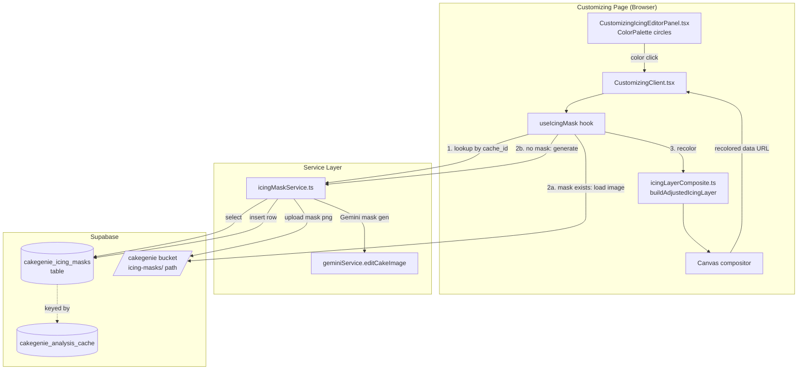
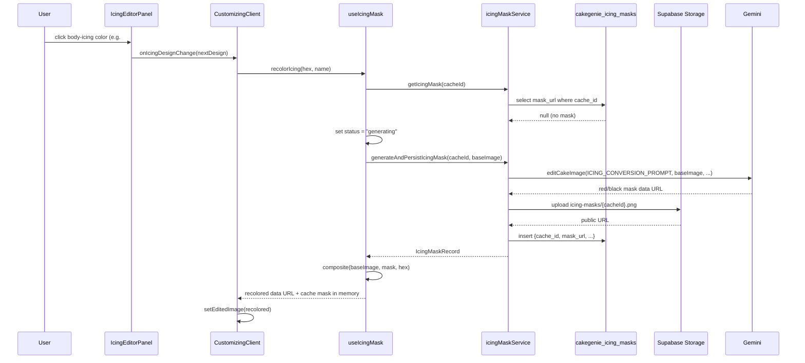
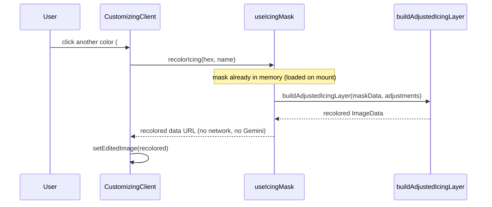

# Design Document: Customizing Page Icing Mask (Persistent Mask-Based Recolor)

## Overview

Today, recoloring a cake's icing on the customizing page goes through Gemini on every color
click (via `useDesignUpdate` → `updateDesign`), which is slow and expensive, and only the final
recolored *result* image is cached per color in `cakegenie_color_variants`. The internal lab at
#[[file:src/app/admin/icing-recolor-lab/IcingRecolorLabClient.tsx]] proves a cheaper approach:
ask Gemini *once* to produce an "icing mask" (icing rendered solid red, everything else pitch
black), key out the black, then do unlimited instant client-side HSL recolors with
`buildAdjustedIcingLayer` (#[[file:src/lib/icingLayerComposite.ts]]).

This feature brings that mask-based flow to the customizing page. When a user first clicks a
color circle for the icing body, the system generates the icing mask once via Gemini, persists
the mask image permanently in Supabase Storage with a row in a new `cakegenie_icing_masks` table
keyed to the cake design (`cache_id` / `p_hash`), and then composites the chosen color
client-side. Every subsequent color click — for that design, for this user or any other user —
reuses the stored mask and recolors instantly with zero Gemini calls.

The mask is a property of the *cake design*, not of a session, so it is generated at most once
per design across the entire platform. This document covers both the High-Level Design (system
architecture, components, data flow, database schema, storage layout) and the Low-Level Design
(function signatures, generation/persistence pipeline, instant recolor algorithm, React
state/component changes, and Supabase access functions).

### Goals

- Generate the icing mask once per cake design (the expensive Gemini step) and never regenerate it.
- Persist the mask permanently: Supabase Storage object + a `cakegenie_icing_masks` row keyed by `cache_id`.
- On every color click after the mask exists, recolor instantly client-side (no network round trip to Gemini).
- Handle loading, empty (no mask yet), and error states gracefully, falling back to the existing Gemini recolor path when needed.

### Non-Goals

- Replacing the existing `cakegenie_color_variants` flow for non-icing edits (toppers, messages, drips). Those stay on the current Gemini path.
- Per-surface masks (separate masks for top vs. side vs. border). v1 produces a single icing-body mask, matching the lab.
- Pre-generating masks for all 11,813 designs in a batch job. v1 is generation-on-first-use; a batch backfill is noted as a future extension.

---

## Architecture



### Architectural decisions

1. **Mask keyed to design via `cache_id`.** We reuse the exact pattern already established by
   `cakegenie_color_variants` (#[[file:src/hooks/useDesignUpdate.ts]]): the foreign key is
   `cache_id` (the `id` of a `cakegenie_analysis_cache` row, passed into the customizer as
   `recentSearchDesign.id`). `CakeGenieMerchantProduct` links to the same analysis cache via
   `p_hash`, so products and ad-hoc designs that resolve to the same cake share one mask.

2. **Generation on first use, not pre-generation.** The mask is generated lazily the first time
   any user clicks an icing color on a design that has no mask yet. This avoids spending Gemini
   budget on designs nobody recolors. A batch backfill job can populate masks ahead of time later
   (future extension) using the same `icingMaskService` functions.

3. **Single shared mask per design (permanent, cross-user).** Because the mask describes which
   pixels are icing — independent of the chosen color — it is computed once and reused by everyone.
   This is the core cost win: one Gemini call per design instead of one per color per design.

4. **Instant recolor reuses the lab's proven compositing.** We reuse `buildAdjustedIcingLayer`
   and the HSL-shift math (#[[file:src/lib/instantIcingRecolor.ts]]) unchanged. The only new
   client logic is a hook that orchestrates mask lookup/generation/caching and triggers the canvas
   composite.

5. **Graceful fallback to the existing Gemini path.** If mask generation fails, or the mask
   produces a visibly poor result, the system falls back to the current `useDesignUpdate` color
   variant flow so the user still gets a recolored cake.

---

## Data Flow

### Sequence: first color click on a design with no mask (cold path)



### Sequence: subsequent color clicks (warm path, instant)



### Mask lifecycle states

| State | Trigger | UI behavior |
|-------|---------|-------------|
| `idle` | Design loaded, no icing color interaction yet | Color circles enabled; mask prefetch happens in background |
| `ready` | Mask row found and mask image decoded into memory | Instant recolor on click |
| `generating` | First click, no mask exists | Show spinner/disabled state on the affected preview; other UI stays responsive |
| `error` | Gemini or storage failure | Fall back to existing Gemini color-variant path; surface non-blocking notice |

---

## Database Design

### New table: `cakegenie_icing_masks`

Mirrors the structure and conventions of `cakegenie_color_variants` (one row per design rather
than per color, since the mask is color-independent).

```sql
CREATE TABLE public.cakegenie_icing_masks (
    id          UUID PRIMARY KEY DEFAULT gen_random_uuid(),
    cache_id    UUID NOT NULL
                REFERENCES public.cakegenie_analysis_cache (id) ON DELETE CASCADE,
    mask_url    TEXT NOT NULL,                 -- Supabase Storage public URL of the red/black mask
    source_image_url TEXT,                     -- base image the mask was generated from (provenance)
    mask_version SMALLINT NOT NULL DEFAULT 1,  -- bump if ICING_CONVERSION_PROMPT semantics change
    width       INTEGER,                       -- mask pixel dimensions (for compositing sanity checks)
    height      INTEGER,
    status      TEXT NOT NULL DEFAULT 'ready', -- 'ready' | 'failed'
    created_at  TIMESTAMPTZ NOT NULL DEFAULT now(),

    CONSTRAINT cakegenie_icing_masks_cache_version_uniq UNIQUE (cache_id, mask_version)
);

CREATE INDEX idx_cakegenie_icing_masks_cache_id
    ON public.cakegenie_icing_masks (cache_id);
```

Design rationale:

- **`cache_id` FK with `ON DELETE CASCADE`** — identical relationship to `cakegenie_color_variants`; if a design is purged, its mask goes with it.
- **`UNIQUE (cache_id, mask_version)`** — guarantees one canonical mask per design per prompt version, and makes the persistence insert idempotent (safe against concurrent first-clicks via `upsert`/`ON CONFLICT DO NOTHING`).
- **`mask_version`** — lets us regenerate masks platform-wide if `ICING_CONVERSION_PROMPT` (#[[file:src/lib/icingConversionPrompt.ts]]) materially changes, without deleting history.
- **`status`** — records `'failed'` attempts so we can avoid hammering Gemini on a design that reliably fails, and so a backfill job can retry selectively.
- **`width`/`height`** — used by the compositor to validate the mask matches the base image aspect before keying.

### TypeScript type (added to `src/lib/database.types.ts`)

```typescript
// src/lib/database.types.ts — alongside CakeGenieColorVariant

/**
 * Represents a persisted icing mask for a design from cakegenie_analysis_cache.
 * The mask is the Gemini-generated red-icing / black-everything-else reference image,
 * generated once per design and reused for all client-side HSL recolors.
 */
export interface CakeGenieIcingMask {
  id: string;            // UUID
  cache_id: string;      // UUID -> cakegenie_analysis_cache.id
  mask_url: string;      // Supabase Storage public URL
  source_image_url: string | null;
  mask_version: number;  // default 1
  width: number | null;
  height: number | null;
  status: 'ready' | 'failed';
  created_at: string;    // ISO 8601 timestamp
}
```

### Storage layout (Supabase `cakegenie` bucket)

Follows the existing color-variant convention `color-variants/{cacheId}/{hex}.webp` from
#[[file:src/hooks/useDesignUpdate.ts]]:

```
cakegenie/
└── icing-masks/
    └── {cacheId}/
        └── v{maskVersion}.png      e.g. icing-masks/3f2b.../v1.png
```

- **PNG, not WebP** — the mask relies on near-exact `#000000` black for keying
  (`getNonBlackAlpha` threshold ≈ 14). Lossy WebP compression introduces near-black noise that
  bleeds into the alpha key, so the mask is stored as lossless PNG. (The recolored *result*
  shown to the user can still be WebP; only the stored mask must be lossless.)
- **`upsert: true`** — matches the existing storage upload call and makes regeneration safe.

---

## Components and Interfaces

### Component: `icingMaskService` (new — `src/services/icingMaskService.ts`)

**Purpose**: Server-of-record access layer for masks. Owns all Supabase reads/writes and the
Gemini generation call. Pure data/IO — no React.

**Responsibilities**:
- Look up an existing mask row by `cache_id`.
- Generate a mask via `editCakeImage` using `ICING_CONVERSION_PROMPT` + `ICING_LAYER_SYSTEM_INSTRUCTION`.
- Upload the mask PNG to Storage and insert the DB row idempotently.
- Record `'failed'` status on generation errors.

```typescript
interface IcingMaskService {
  getIcingMask(cacheId: string): Promise<CakeGenieIcingMask | null>;
  generateAndPersistIcingMask(params: GenerateMaskParams): Promise<CakeGenieIcingMask>;
}

interface GenerateMaskParams {
  cacheId: string;
  baseImage: { data: string; mimeType: string }; // same shape editCakeImage expects
  sourceImageUrl?: string | null;
  maskVersion?: number; // defaults to CURRENT_MASK_VERSION
}
```

### Component: `useIcingMask` (new — `src/hooks/useIcingMask.ts`)

**Purpose**: React orchestration hook. Bridges `icingMaskService` and the canvas compositor;
owns the in-memory mask cache, lifecycle status, and the public `recolorIcing` action.

**Responsibilities**:
- On mount / `cacheId` change, prefetch the mask row and decode the mask image into an in-memory `ImageData` (warm cache).
- Expose `recolorIcing(hex, name)` that: generates the mask if missing, then composites instantly.
- Track `status` (`idle | generating | ready | error`) for the UI.
- Fall back to the caller-provided Gemini recolor when mask generation fails.

```typescript
interface UseIcingMaskParams {
  cacheId: string | null;
  baseImage: { data: string; mimeType: string } | null;  // current working cake image
  baseImageUrl: string | null;                            // for canvas draw + provenance
  onRecolored: (recoloredDataUrl: string, hex: string) => void;
  onFallback: (hex: string, name: string) => void;        // delegate to useDesignUpdate path
}

interface UseIcingMaskResult {
  status: 'idle' | 'generating' | 'ready' | 'error';
  hasMask: boolean;
  recolorIcing: (hex: string, name: string) => Promise<void>;
}
```

### Component: `CustomizingIcingEditorPanel` (modified — #[[file:src/app/customizing/CustomizingIcingEditorPanel.tsx]])

**Change**: The "Body Icing" / "Top Icing" / "Side Icing" `ColorPalette.onColorChange` handlers
route through the new mask-based recolor instead of (or in front of) the existing
`onIcingDesignChange` Gemini trigger. Adds a lightweight `isGeneratingMask` prop to show a spinner
on the affected color group during the one-time cold generation.

### Component: `CustomizingClient` (modified — #[[file:src/app/customizing/CustomizingClient.tsx]])

**Change**: Instantiate `useIcingMask` next to the existing `useDesignUpdate`, wire `cacheId`
from `recentSearchDesign?.id` (same source already used for color variants), and connect
`onRecolored` to `setEditedImage` / `setActiveTab('customized')`. `onFallback` delegates to the
existing `onUpdateDesign(instruction, colorMeta)` Gemini path.

---

## Data Models

### Working types reused from existing code

```typescript
// From geminiService / useDesignUpdate — base image payload shape
type BaseImagePayload = { data: string; mimeType: string };

// From icingLayerComposite.ts — the recolor adjustment vector
interface IcingLayerAdjustments {
  hueShift: number;
  saturationShift: number;
  lightnessShift: number;
  blackThreshold?: number;   // default 14
  blackSoftness?: number;    // default 28
}
```

### In-memory mask cache entry (client-only)

```typescript
interface DecodedMask {
  record: CakeGenieIcingMask;
  imageData: ImageData;       // decoded mask pixels, ready for buildAdjustedIcingLayer
  width: number;
  height: number;
}
```

**Validation rules**:
- `mask_url` must be a non-empty, decodable image; failure to decode marks the cache miss and triggers fallback.
- `imageData` dimensions must match the base image's constrained dimensions before compositing; otherwise the mask is re-scaled to the base via an offscreen canvas (same `constrainDimensions` from #[[file:src/lib/instantIcingRecolor.ts]]).
- `hex` passed to `recolorIcing` must satisfy `hexToRgb` (`/^#?[0-9a-fA-F]{3,6}$/`); invalid hex throws before any IO.

---

## Algorithmic Pseudocode

### Constants

```typescript
const CURRENT_MASK_VERSION = 1;
const MASK_LAYER_BASE_COLOR = '#FF0000';     // matches DEFAULT_LAYER_COLOR in the lab
const PREVIEW_MAX_DIMENSION = 1200;          // matches the lab
const STORAGE_BUCKET = 'cakegenie';
const ICING_LAYER_SYSTEM_INSTRUCTION = /* identical string to the lab */;
```

### Algorithm: mask lookup + lazy generation (service layer)

```pascal
ALGORITHM getOrGenerateMask(cacheId, baseImage, sourceImageUrl)
INPUT:  cacheId (UUID), baseImage ({data, mimeType}), sourceImageUrl (string?)
OUTPUT: mask record (CakeGenieIcingMask)

BEGIN
  ASSERT cacheId != null
  ASSERT baseImage != null

  // Step 1: try existing persisted mask (the common, cheap case)
  existing <- DB.select(cakegenie_icing_masks)
                .where(cache_id = cacheId AND mask_version = CURRENT_MASK_VERSION)
                .maybeSingle()

  IF existing != null AND existing.status = 'ready' THEN
    RETURN existing
  END IF

  // Step 2: cold path — generate via Gemini exactly once
  TRY
    maskDataUrl <- editCakeImage(
        ICING_CONVERSION_PROMPT, baseImage, [], [], null,
        ICING_LAYER_SYSTEM_INSTRUCTION, 'gemini-2.5-flash-image',
        traceId, 'customizing-icing-mask')

    {width, height} <- decodeDimensions(maskDataUrl)

    // Step 3: persist to Storage as lossless PNG
    pngBlob   <- dataUrlToPngBlob(maskDataUrl)
    objectPath <- "icing-masks/" + cacheId + "/v" + CURRENT_MASK_VERSION + ".png"
    Storage.upload(STORAGE_BUCKET, objectPath, pngBlob,
                   {contentType: 'image/png', upsert: true})
    publicUrl <- Storage.getPublicUrl(STORAGE_BUCKET, objectPath)

    // Step 4: idempotent DB insert (safe under concurrent first-clicks)
    record <- DB.insert(cakegenie_icing_masks, {
        cache_id: cacheId, mask_url: publicUrl, source_image_url: sourceImageUrl,
        mask_version: CURRENT_MASK_VERSION, width, height, status: 'ready'
    }).onConflict('cache_id, mask_version').ignore().selectResult()

    RETURN record
  CATCH error
    // Step 5: record failure so we don't retry forever; let caller fall back
    DB.upsert(cakegenie_icing_masks,
        {cache_id: cacheId, mask_version: CURRENT_MASK_VERSION, status: 'failed', mask_url: ''})
    THROW error
  END TRY
END
```

**Preconditions**: `cacheId` and `baseImage` are non-null; `editCakeImage` endpoint reachable.
**Postconditions**: returns a `status='ready'` record whose `mask_url` points at a decodable PNG,
OR throws after persisting a `'failed'` marker (caller falls back).
**Loop invariants**: N/A (no loops).

### Algorithm: instant recolor reuse (client compositor)

This is the warm path that runs on every color click once the mask is in memory. It reuses
`buildAdjustedIcingLayer` and `getLayerColorAdjustments` exactly as the lab does.

```pascal
ALGORITHM recolorWithMask(baseImageEl, decodedMask, targetHex)
INPUT:  baseImageEl (HTMLImageElement), decodedMask (DecodedMask), targetHex (hex string)
OUTPUT: recoloredDataUrl (string)

BEGIN
  ASSERT isValidHex(targetHex)
  ASSERT decodedMask.imageData != null

  // Step 1: constrain to preview size (parity with the lab)
  dims <- constrainDimensions(baseImageEl.naturalWidth,
                              baseImageEl.naturalHeight,
                              PREVIEW_MAX_DIMENSION)

  // Step 2: draw base image onto a working canvas
  work <- createCanvas(dims.width, dims.height)
  work.ctx.drawImage(baseImageEl, 0, 0, dims.width, dims.height)

  // Step 3: ensure mask matches working dimensions
  maskData <- decodedMask.imageData
  IF decodedMask.width != dims.width OR decodedMask.height != dims.height THEN
    maskData <- rescaleImageData(decodedMask.imageData, dims.width, dims.height)
  END IF

  // Step 4: compute HSL shift from base red (#FF0000) to target color
  adjustments <- getLayerColorAdjustments(targetHex)   // {hueShift, saturationShift, lightnessShift}

  // Step 5: key out black + apply HSL shift to the red icing layer
  adjustedLayer <- buildAdjustedIcingLayer(maskData.data, adjustments)
  layerCanvas   <- createCanvas(dims.width, dims.height)
  layerCanvas.ctx.putImageData(new ImageData(adjustedLayer, dims.width, dims.height), 0, 0)

  // Step 6: composite recolored icing layer over the original photo
  work.ctx.drawImage(layerCanvas, 0, 0)

  RETURN work.toDataURL('image/webp')   // result can be lossy; only the stored mask is lossless
END
```

**Preconditions**: `targetHex` valid; `decodedMask.imageData` populated; base image fully loaded.
**Postconditions**: returns a data URL of the original photo with only the icing pixels recolored;
no network calls, no Gemini calls.
**Loop invariants**: the pixel loop lives inside `buildAdjustedIcingLayer`
(#[[file:src/lib/icingLayerComposite.ts]]); for each pixel, every already-processed pixel either
preserved its original color (black/keyed-out region) or received the hue-shifted color — input
pixels are never mutated (output is a fresh `Uint8ClampedArray`).

---

## Key Functions with Formal Specifications

### `icingMaskService.getIcingMask`

```typescript
async function getIcingMask(cacheId: string): Promise<CakeGenieIcingMask | null>
```

**Preconditions**: `cacheId` is a non-empty UUID string.
**Postconditions**: returns the `status='ready'` mask row for `(cacheId, CURRENT_MASK_VERSION)` if it exists, else `null`. No writes. Never throws on "not found" (returns `null`); only throws on transport errors.

### `icingMaskService.generateAndPersistIcingMask`

```typescript
async function generateAndPersistIcingMask(
  params: GenerateMaskParams
): Promise<CakeGenieIcingMask>
```

**Preconditions**: `params.cacheId` non-empty; `params.baseImage.data` is valid base64; `params.baseImage.mimeType` is an image mime.
**Postconditions**: on success, a PNG exists at `icing-masks/{cacheId}/v{version}.png` and a `status='ready'` row exists; returns that row. On failure, a `status='failed'` row is recorded and the error is rethrown. Concurrent calls for the same `(cacheId, version)` converge to a single row (idempotent via unique constraint).

### `useIcingMask.recolorIcing`

```typescript
async function recolorIcing(hex: string, name: string): Promise<void>
```

**Preconditions**: hook initialized; `baseImage`/`baseImageUrl` available; `hex` parseable by `hexToRgb`.
**Postconditions**: calls `onRecolored(recoloredDataUrl, hex)` with the instantly composited image when a mask is available (generating it first if needed). If mask generation fails, calls `onFallback(hex, name)` exactly once and leaves `status='error'`. Idempotent for rapid repeated clicks of the same color (last-click-wins via request id guard, mirroring `generationRequestIdRef` in the lab).

### `getLayerColorAdjustments` (reused from the lab)

```typescript
function getLayerColorAdjustments(targetHex: string): {
  hueShift: number;
  saturationShift: number;
  lightnessShift: number;
}
```

**Preconditions**: `targetHex` valid hex.
**Postconditions**: returns the HSL delta from `#FF0000` to `targetHex`; pure, no side effects. (Extracted from #[[file:src/app/admin/icing-recolor-lab/IcingRecolorLabClient.tsx]] into a shared module so both the lab and the customizer use one implementation.)

---

## Example Usage

```typescript
// In CustomizingClient.tsx — wiring the hook
const {
  status: icingMaskStatus,
  hasMask,
  recolorIcing,
} = useIcingMask({
  cacheId: recentSearchDesign?.id ?? null,        // same source as cakegenie_color_variants
  baseImage: originalImageData,
  baseImageUrl: originalImagePreview,
  onRecolored: (recoloredDataUrl, hex) => {
    setEditedImage(recoloredDataUrl);
    setActiveTab('customized');
    onIcingDesignChange({
      ...icingDesign!,
      colors: { ...icingDesign!.colors, top: hex, side: hex },
    });
    scrollToHero();
  },
  onFallback: (hex, name) => {
    // Mask unavailable — use the existing Gemini color-variant path
    onUpdateDesign(`Recolor the icing to ${name}`, { hex, name });
  },
});

// In CustomizingIcingEditorPanel — Body Icing color circle
<ColorPalette
  selectedColor={icingDesign.colors.top || icingDesign.colors.side || '#FFFFFF'}
  onColorChange={(newHex) => {
    const name = HEX_TO_COLOR_NAME_MAP[newHex.toLowerCase()] ?? newHex;
    void recolorIcing(newHex, name);   // instant after first generation
  }}
/>
```

```typescript
// Service usage in isolation
const existing = await getIcingMask(cacheId);
const mask = existing ?? await generateAndPersistIcingMask({
  cacheId,
  baseImage: originalImageData,
  sourceImageUrl: originalImagePreview,
});
// mask.mask_url is now permanent and reusable by every future visitor
```

---

## Correctness Properties

### Property 1: At-most-once generation per design/version
For any `cacheId`, `generateAndPersistIcingMask` results in at most one `status='ready'` row for `(cacheId, CURRENT_MASK_VERSION)`, even under concurrent first-clicks. Enforced by `UNIQUE (cache_id, mask_version)` + `ON CONFLICT DO NOTHING`.

### Property 2: Warm-path purity
Once a mask is in memory, `recolorIcing` performs no network or Gemini calls; every color click is a pure client-side canvas operation.

### Property 3: Recolor preserves geometry
The composited result has the same dimensions and framing as the base image; only pixels the mask marks as non-black icing change color. Black/keyed-out regions render the original photo unchanged.

### Property 4: HSL round-trip stability
For `targetHex = #FF0000`, `getLayerColorAdjustments` returns a zero shift, so recoloring to red reproduces the mask's base red layer (no drift).

### Property 5: Idempotent persistence
Re-running generation for an existing `(cacheId, version)` does not create duplicate rows or duplicate storage objects (storage `upsert: true`, DB unique constraint).

### Property 6: Lossless mask integrity
The stored mask is PNG; decoding it and keying with `getNonBlackAlpha` yields the same alpha mask that was generated (no lossy-compression black bleed).

### Property 7: Keyed-out pixels are untouched
For every pixel where `getNonBlackAlpha(r, g, b) == 0` in the mask, the composited output pixel equals the base image pixel for all target hexes.

---

## Error Handling

### Scenario 1: Gemini generation fails (timeout, safety block, 5xx)
**Condition**: `editCakeImage` throws inside `generateAndPersistIcingMask`.
**Response**: write a `status='failed'` row; hook sets `status='error'` and calls `onFallback(hex, name)`.
**Recovery**: user still gets a recolored cake via the existing `useDesignUpdate` Gemini path. The `'failed'` row prevents repeated immediate retries; a future backfill/retry job can clear it.

### Scenario 2: Mask image fails to decode / 404 from storage
**Condition**: `mask_url` present but the image won't load.
**Response**: treat as cache miss for this session; attempt one regeneration; if that also fails, fall back.
**Recovery**: same Gemini fallback path; logs a warning (mirrors the `console.warn` style in `useDesignUpdate`).

### Scenario 3: Mask/base dimension mismatch
**Condition**: stored mask dimensions differ from the constrained base dimensions.
**Response**: rescale mask `ImageData` to the base dimensions via offscreen canvas before compositing.
**Recovery**: transparent to the user; recolor proceeds.

### Scenario 4: No `cacheId` (ad-hoc design not yet cached)
**Condition**: `recentSearchDesign?.id` is null.
**Response**: skip persistence entirely; the hook still allows an in-memory-only generation+recolor for the session, OR falls back to the Gemini path if generation is undesirable without a key.
**Recovery**: once the design is persisted to `cakegenie_analysis_cache` and gets an `id`, masks persist normally.

### Scenario 5: Concurrent first-clicks across users
**Condition**: two users click colors on the same maskless design simultaneously.
**Response**: both call generation; the `ON CONFLICT DO NOTHING` insert means only one row wins; the loser re-reads the winning row.
**Recovery**: both converge on the same `mask_url`; at most a redundant Gemini call and storage upsert (harmless, idempotent).

---

## Testing Strategy

### Unit Testing
- `getLayerColorAdjustments`: zero shift for `#FF0000`; correct hue delta for representative palette colors from `COLORS` (#[[file:src/constants]]).
- `recolorWithMask` compositor: black-keyed pixels remain identical to the base; red icing pixels shift toward target hue; output dimensions equal constrained dimensions.
- `generateAndPersistIcingMask`: builds correct storage path `icing-masks/{cacheId}/v{version}.png`; inserts expected row; on Gemini throw, records `status='failed'` and rethrows.
- `getIcingMask`: returns `null` (not throw) when no row; returns row when present.

### Property-Based Testing
**Property test library**: `fast-check` (matches the existing JS/TS toolchain).

Candidate properties:
- For all valid hex colors `c`, `hslToRgb(rgbToHsl(hexToRgb(c)))` round-trips within ±1 per channel (guards the reused color math in #[[file:src/lib/instantIcingRecolor.ts]]).
- For all mask buffers, `buildAdjustedIcingLayer` never mutates the input buffer and always returns a buffer of equal length.
- For all `(cacheId)`, repeated `generateAndPersistIcingMask` calls yield exactly one ready row (idempotency), simulated against an in-memory Supabase double.
- For pixels where `getNonBlackAlpha(r,g,b) == 0`, the composited output pixel equals the base pixel for all target hexes.

### Integration Testing
- Cold path: maskless design → first click generates, persists (row + storage object), and renders a recolored hero.
- Warm path: reload page for the same design → mask prefetched → color clicks recolor with zero `/api/ai/edit-image` calls (assert no network to the Gemini endpoint).
- Fallback path: stub `editCakeImage` to throw → assert `onFallback` invoked and existing color-variant flow runs.
- Cross-user reuse: seed a mask row → second "user" (fresh memory cache) reuses `mask_url` without generation.

---

## Performance Considerations

- **One Gemini call per design, ever.** This is the headline win versus today's one-call-per-color. With 11,813 designs and ~12 palette colors, the worst-case generation count drops from potentially ~140k to ≤11,813 (and in practice far fewer, since generation is lazy).
- **Warm recolor is canvas-bound**, matching the lab's already-acceptable render times (`renderStats.renderDurationMs`). Reuse `PREVIEW_MAX_DIMENSION = 1200` to cap pixel work.
- **Prefetch on mount**: decode the mask into `ImageData` once when the design loads so the first user color click is also instant (not just subsequent ones).
- **Image element cache**: reuse the lab's `loadImageElement` memoization pattern to avoid re-decoding base/mask images per click.

## Security Considerations

- Mask images contain no PII (they are abstract red/black silhouettes); public-read storage (consistent with existing `cakegenie` bucket public URLs) is acceptable.
- Writes to `cakegenie_icing_masks` go through the same authenticated Supabase client used for `cakegenie_color_variants`; apply equivalent RLS so only the app role can insert/update mask rows while reads stay public.
- Validate/sanitize `cacheId` (UUID) before building storage paths to prevent path traversal in the object key.

## Dependencies

- **Existing, reused**: `editCakeImage`, `fileToBase64` (#[[file:src/services/geminiService.ts]]); `buildAdjustedIcingLayer`, `getNonBlackAlpha` (#[[file:src/lib/icingLayerComposite.ts]]); `constrainDimensions`, `rgbToHsl`, `hslToRgb`, `hexToRgb` (#[[file:src/lib/instantIcingRecolor.ts]]); `ICING_CONVERSION_PROMPT` (#[[file:src/lib/icingConversionPrompt.ts]]); Supabase client (#[[file:src/hooks/useDesignUpdate.ts]] pattern); `COLORS` / `HEX_TO_COLOR_NAME_MAP`.
- **New code**: `src/services/icingMaskService.ts`, `src/hooks/useIcingMask.ts`, a shared `getLayerColorAdjustments` extraction, `CakeGenieIcingMask` type in #[[file:src/lib/database.types.ts]].
- **New infra**: `cakegenie_icing_masks` table + index (Supabase migration); `icing-masks/` storage convention in the existing `cakegenie` bucket.
- **Testing**: `fast-check` for property-based tests.
