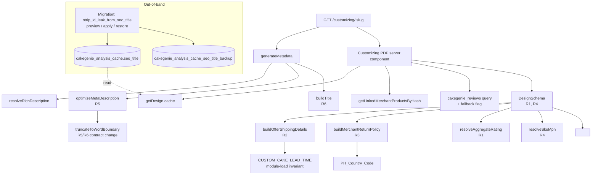

# Design Document: Customizing PDP SEO Fixes

## Overview

This feature delivers seven point-fixes to the `/customizing/[slug]` route so that every rendered PDP emits Google-compliant Product JSON-LD, a clean meta title under the 60 cp browser/SERP cap, and a meta description free of mid-sentence ellipsis-pipe artifacts. The fixes touch three locations:

- `src/lib/commerce/machineReadable.ts` — Schema_Builder pure functions (R2, R3 surfaces).
- `src/app/customizing/[slug]/page.tsx` — Metadata_Builder helpers and `DesignSchema` (R1, R4, R5, R6 surfaces).
- A one-time SQL migration `supabase/migrations/<timestamp>_strip_id_leak_from_seo_title.sql` (R7 surface).

The migration runs out-of-band (operator-invoked, not on every deploy) and depends on no application code. The application changes are pure additions to existing pure functions and pure components — no new abstractions, no architectural shifts.

### Request Flow



The new constants `PH_Country_Code` and `CUSTOM_CAKE_LEAD_TIME` are introduced in `machineReadable.ts` and imported by the existing `buildMerchantReturnPolicy` and `buildOfferShippingDetails` helpers respectively. No call site changes are required for those helpers; their return shapes are extended in a strictly additive way (pre-existing keys preserved per R2.8 / R3.4).

The migration is fully decoupled: it operates on stored data, not on code paths. After apply, the existing `revalidate = 3600` ISR window naturally republishes affected slugs; operators may optionally `revalidatePath('/customizing/<slug>')` for any slug requiring immediate refresh.

---

## Architecture

The feature is layered as three concentric, decoupled rings — application code (helpers + component), schema-builder pure functions, and an out-of-band SQL migration:

```mermaid
flowchart LR
    subgraph App[Application — src/app/customizing/[slug]/]
        Page[page.tsx<br/>generateMetadata + DesignSchema wiring]
        Helpers[metadataHelpers.ts<br/>NEW pure module]
    end

    subgraph SB[Schema_Builder — src/lib/commerce/]
        MR[machineReadable.ts<br/>+ PH_Country_Code<br/>+ CUSTOM_CAKE_LEAD_TIME]
    end

    subgraph DB[Persistence — Supabase Postgres]
        Cache[(cakegenie_analysis_cache)]
        Listings[(cakegenie_merchant_products)]
        Reviews[(cakegenie_reviews)]
        Backup[(cakegenie_analysis_cache_seo_title_backup)]
    end

    subgraph OOB[Out-of-band Migration]
        SQL[strip_id_leak_from_seo_title.sql<br/>preview / apply / restore]
    end

    Page --> Helpers
    Page --> MR
    Helpers --> MR
    Page -. read .-> Cache
    Page -. read .-> Listings
    Page -. read .-> Reviews
    SQL -. one-time write .-> Cache
    SQL -. one-time write .-> Backup
```

Module-level dependency direction is one-way (`page.tsx → metadataHelpers.ts → machineReadable.ts`); helper modules have no React imports and no I/O. The migration ring is fully decoupled from the running application — no code path in the app imports or invokes it.

The pre-existing layering (Schema_Builder under `src/lib/commerce/`, route under `src/app/customizing/[slug]/`) is preserved verbatim. The only architectural addition is the new sibling helper file `metadataHelpers.ts`, which exists solely to extract previously-inline functions out of the route component so they become independently unit-testable.

## Components and Interfaces

### 1. `src/lib/commerce/machineReadable.ts` (Schema_Builder)

#### Added exports

```ts
// New constant — referentially shared by both applicableCountry and returnPolicyCountry (R3.1, R3.3).
export const PH_Country_Code: 'PH' = 'PH';

// New constant — drives ShippingDeliveryTime numeric values (R2.1, R2.2).
export const CUSTOM_CAKE_LEAD_TIME = {
  handlingTimeMinDays: 1,
  handlingTimeMaxDays: 3,
  transitTimeMinDays: 0,
  transitTimeMaxDays: 1,
} as const;

// New helper — extracted so R2.9 can be unit-tested without process-level side effects.
export function validateLeadTimeConstants(c: typeof CUSTOM_CAKE_LEAD_TIME): void;
```

#### Module-load invariant guard (R2.9)

`validateLeadTimeConstants(CUSTOM_CAKE_LEAD_TIME)` is invoked at the bottom of the module body (after the constant declaration). If any value is non-integer, negative, > 30, or violates `min ≤ max`, it throws `RangeError` whose message names the offending property. The throw runs at module import time; subsequent imports of `buildOfferShippingDetails` therefore fail fast, satisfying R2.9.

#### Modified: `buildOfferShippingDetails`

**Before:**
```ts
export function buildOfferShippingDetails(
  _merchant?: CakeGenieMerchant | null,
): {
  '@type': 'OfferShippingDetails';
  shippingDestination: { '@type': 'DefinedRegion'; addressCountry: 'PH' };
  doesNotShip: false;
};
```

**After (R2.4–R2.8):**
```ts
export function buildOfferShippingDetails(
  _merchant?: CakeGenieMerchant | null,
): {
  '@type': 'OfferShippingDetails';
  shippingDestination: { '@type': 'DefinedRegion'; addressCountry: 'PH' };
  doesNotShip: false;
  deliveryTime: {
    '@type': 'ShippingDeliveryTime';
    handlingTime: {
      '@type': 'QuantitativeValue';
      unitCode: 'DAY';
      minValue: number;
      maxValue: number;
    };
    transitTime: {
      '@type': 'QuantitativeValue';
      unitCode: 'DAY';
      minValue: number;
      maxValue: number;
    };
  };
};
```

The pre-existing keys `'@type'`, `shippingDestination`, `doesNotShip` retain identical literal values, satisfying R2.8.

#### Modified: `buildMerchantReturnPolicy`

**Before:**
```ts
export function buildMerchantReturnPolicy() {
  return {
    '@type': 'MerchantReturnPolicy',
    returnPolicyCategory: 'https://schema.org/MerchantReturnNotPermitted',
    merchantReturnDays: 0,
    returnFees: 'https://schema.org/ReturnFeesCustomerResponsibility',
    returnPolicyCountry: 'PH',
    url: DEFAULT_POLICY_URLS.returnPolicy,
  };
}
```

**After (R3.2–R3.5):**
```ts
export function buildMerchantReturnPolicy() {
  return {
    '@type': 'MerchantReturnPolicy',
    returnPolicyCategory: 'https://schema.org/MerchantReturnNotPermitted',
    merchantReturnDays: 0,
    returnFees: 'https://schema.org/ReturnFeesCustomerResponsibility',
    returnPolicyCountry: PH_Country_Code,
    applicableCountry: PH_Country_Code, // NEW — R3.2
    url: DEFAULT_POLICY_URLS.returnPolicy,
  };
}
```

`returnPolicyCountry` and `applicableCountry` both reference the same exported constant, satisfying R3.3 (`===` referential identity). No other field is added or removed (R3.5).

#### Removed / Deprecated

None. All existing exports retain their signatures so `machineReadable.test.ts` does not need any existing assertion modified (R9.5).

---

### 2. `src/app/customizing/[slug]/page.tsx` (route component)

#### Modified: `truncateToWordBoundary` (contract change)

**Before:** appends `'...'` whenever truncation occurs; reserves `maxLength - 3` for the body.

**After (R5.1, R6.7):**
```ts
function truncateToWordBoundary(text: string, maxLength: number): string;
// Postcondition: result.length <= maxLength.
// Postcondition: result NEVER appends '...' or '…'.
// Truncation is performed at the last space ≤ maxLength;
// if no space exists, returns text.substring(0, maxLength).
```

Callers must now apply the iterative trailing-punctuation strip themselves (R5.1) — this is what `optimizeMetaDescription` and the title builder do.

#### Modified: `optimizeMetaDescription` (algorithm rewrite — R5)

Signature unchanged: `function optimizeMetaDescription(descriptionText: string, price: number | null): string`.

The boilerplate-filter step is preserved verbatim. The post-truncation step is rewritten — see *Algorithms* below.

#### New: title builder helper (R6)

The inline title construction inside `generateMetadata` is extracted into a pure helper for testability:

```ts
export function buildPdpTitle(input: {
  seoTitle: string | null | undefined;
  keywords: string | null | undefined;
  tags: string[] | null | undefined;
  price: number | null | undefined;
  slug: string;
}): string;
```

The helper is exported from a new sibling module `src/app/customizing/[slug]/metadataHelpers.ts` so it is unit-testable without mounting the route. `optimizeMetaDescription` and `truncateToWordBoundary` are also moved into that module.

#### Modified: `DesignSchema` props (R1, R4)

**Before:**
```tsx
function DesignSchema({ design, prices }: { design: any; prices?: BasePriceInfo[] });
```

**After:**
```tsx
function DesignSchema({
  design,
  prices,
  siteReviewSummary,        // NEW — wired from page-level reviewSummary fetch
  isSiteReviewSummaryFallback, // NEW — true when constant {6, 4.8} fallback was used
  perDesignReviewStats,     // NEW — null today; reserved for future per-design feed (R1.1)
  linkedMerchantProducts,   // NEW — feeds SKU resolver (R4.3)
}: {
  design: any;
  prices?: BasePriceInfo[];
  siteReviewSummary: { total: number; averageRating: number };
  isSiteReviewSummaryFallback: boolean;
  perDesignReviewStats: { total: number; averageRating: number } | null;
  linkedMerchantProducts: LinkedMerchantProduct[];
});
```

#### Modified: page-level wiring

The existing `Promise.allSettled` block in the page server component already produces `reviewSummary`. We extend it to also surface a flag tracking whether the constant fallback was used:

```ts
let reviewSummary = { total: 6, averageRating: 4.8 };
let isSiteReviewSummaryFallback = true;       // NEW
if (ratingRowsResult.status === 'fulfilled' && ratingRowsResult.value.data) {
  const ratingRows = ratingRowsResult.value.data;
  if (ratingRows.length > 0) {
    const total = ratingRows.length;
    const averageRating = ratingRows.reduce((s, r) => s + r.rating, 0) / total;
    reviewSummary = { total, averageRating };
    isSiteReviewSummaryFallback = false;       // NEW
  }
}
```

`linkedMerchantProducts` is already produced by the existing `getLinkedMerchantProductsByHash(design.p_hash)` call in the same `Promise.allSettled` and just needs to be passed into `<DesignSchema>` as a new prop.

#### Removed

None.

---

### 3. SQL migration `supabase/migrations/<timestamp>_strip_id_leak_from_seo_title.sql` (out-of-band component)

A single SQL file ships both preview, apply, and restore as named functions, plus a single guarded statement that exits with a NOTICE if no `--apply` arg is detected. Because Supabase migrations are applied via `supabase db push`, the apply mode is gated by a session-local setting that the operator must `SET` explicitly (R7.8).

#### Backup table (R7.5)

```sql
CREATE TABLE IF NOT EXISTS cakegenie_analysis_cache_seo_title_backup (
  slug TEXT NOT NULL,
  seo_title_before TEXT NOT NULL,
  backed_up_at TIMESTAMPTZ NOT NULL DEFAULT NOW(),
  migration_id TEXT NOT NULL DEFAULT 'strip_id_leak_v1',
  PRIMARY KEY (slug, migration_id, backed_up_at)
);
```

Retention is policy, not enforced by schema — see *Risks*.

#### Functions

```sql
-- Preview (R7.1): returns count + per-row before/after, no writes.
CREATE OR REPLACE FUNCTION strip_id_leak_preview()
RETURNS TABLE (slug TEXT, seo_title_before TEXT, seo_title_after TEXT)
LANGUAGE sql STABLE AS $$
  SELECT
    slug,
    seo_title,
    regexp_replace(seo_title, '\s-\s\d{2,}\s*$', '') AS seo_title_after
  FROM cakegenie_analysis_cache
  WHERE seo_title ~ '\s-\s\d{2,}\s*$';
$$;

-- Apply (R7.2, R7.4): transactional UPDATE+backup.
CREATE OR REPLACE FUNCTION strip_id_leak_apply()
RETURNS INTEGER
LANGUAGE plpgsql AS $$
DECLARE
  affected INTEGER;
BEGIN
  -- Single transaction: backup then update.
  WITH targets AS (
    SELECT slug, seo_title
    FROM cakegenie_analysis_cache
    WHERE seo_title ~ '\s-\s\d{2,}\s*$'
  ),
  inserted AS (
    INSERT INTO cakegenie_analysis_cache_seo_title_backup (slug, seo_title_before)
    SELECT slug, seo_title FROM targets
    RETURNING slug
  )
  UPDATE cakegenie_analysis_cache c
  SET seo_title = regexp_replace(c.seo_title, '\s-\s\d{2,}\s*$', '')
  FROM inserted i
  WHERE c.slug = i.slug;
  GET DIAGNOSTICS affected = ROW_COUNT;
  RETURN affected;
END;
$$;

-- Restore (R7.9).
CREATE OR REPLACE FUNCTION strip_id_leak_restore(p_slug TEXT DEFAULT NULL,
                                                  p_migration_id TEXT DEFAULT 'strip_id_leak_v1')
RETURNS INTEGER
LANGUAGE plpgsql AS $$
DECLARE
  affected INTEGER;
BEGIN
  UPDATE cakegenie_analysis_cache c
  SET seo_title = b.seo_title_before
  FROM cakegenie_analysis_cache_seo_title_backup b
  WHERE c.slug = b.slug
    AND b.migration_id = p_migration_id
    AND (p_slug IS NULL OR b.slug = p_slug);
  GET DIAGNOSTICS affected = ROW_COUNT;
  RETURN affected;
END;
$$;
```

The migration file body executes only the `CREATE TABLE` and `CREATE OR REPLACE FUNCTION` statements; it does NOT call `strip_id_leak_apply()`. Operators run `SELECT strip_id_leak_preview();` first, eyeball the diff, then explicitly run `SELECT strip_id_leak_apply();` (R7.8 — confirmation flag analog).

The regex `\s-\s\d{2,}\s*$` uses a standard end-of-string anchor (`$`). The pattern matches only true end-of-string occurrences (the `$` anchor requires the digits to be the last non-whitespace token in the string). Mid-string occurrences are preserved per R7.2 worked example #4.

Idempotence (R7.3) follows from the regex itself: applying it twice yields the same string, and the second-run preview returns zero rows.

---

## Data Models

### `LeadTimeConstants`

```ts
type LeadTimeConstants = Readonly<{
  handlingTimeMinDays: number; // integer in [0, 30]
  handlingTimeMaxDays: number; // integer in [0, 30], ≥ handlingTimeMinDays
  transitTimeMinDays: number;  // integer in [0, 30]
  transitTimeMaxDays: number;  // integer in [0, 30], ≥ transitTimeMinDays
}>;
```

### Extended `OfferShippingDetails`

```ts
type OfferShippingDetailsV2 = {
  '@type': 'OfferShippingDetails';
  shippingDestination: { '@type': 'DefinedRegion'; addressCountry: 'PH' };
  doesNotShip: false;
  deliveryTime: {
    '@type': 'ShippingDeliveryTime';
    handlingTime: {
      '@type': 'QuantitativeValue';
      unitCode: 'DAY';
      minValue: number;
      maxValue: number;
    };
    transitTime: {
      '@type': 'QuantitativeValue';
      unitCode: 'DAY';
      minValue: number;
      maxValue: number;
    };
  };
};
```

### Extended `MerchantReturnPolicy`

```ts
type MerchantReturnPolicyV2 = {
  '@type': 'MerchantReturnPolicy';
  returnPolicyCategory: 'https://schema.org/MerchantReturnNotPermitted';
  merchantReturnDays: 0;
  returnFees: 'https://schema.org/ReturnFeesCustomerResponsibility';
  returnPolicyCountry: 'PH';
  applicableCountry: 'PH'; // NEW
  url: string;
};
```

### `DesignSchema` props extension

```ts
type DesignSchemaPropsV2 = {
  design: any;
  prices?: BasePriceInfo[];
  siteReviewSummary: { total: number; averageRating: number };
  isSiteReviewSummaryFallback: boolean;
  perDesignReviewStats: { total: number; averageRating: number } | null;
  linkedMerchantProducts: LinkedMerchantProduct[];
};
```

### JSON-LD before/after snippets

#### `shippingDetails.deliveryTime` (R2)

**Before:**
```json
{
  "@type": "OfferShippingDetails",
  "shippingDestination": { "@type": "DefinedRegion", "addressCountry": "PH" },
  "doesNotShip": false
}
```
**After:**
```json
{
  "@type": "OfferShippingDetails",
  "shippingDestination": { "@type": "DefinedRegion", "addressCountry": "PH" },
  "doesNotShip": false,
  "deliveryTime": {
    "@type": "ShippingDeliveryTime",
    "handlingTime": { "@type": "QuantitativeValue", "unitCode": "DAY", "minValue": 1, "maxValue": 3 },
    "transitTime":  { "@type": "QuantitativeValue", "unitCode": "DAY", "minValue": 0, "maxValue": 1 }
  }
}
```

#### `hasMerchantReturnPolicy.applicableCountry` (R3)

**Before:**
```json
{
  "@type": "MerchantReturnPolicy",
  "returnPolicyCategory": "https://schema.org/MerchantReturnNotPermitted",
  "merchantReturnDays": 0,
  "returnFees": "https://schema.org/ReturnFeesCustomerResponsibility",
  "returnPolicyCountry": "PH",
  "url": "https://genie.ph/return-policy"
}
```
**After:**
```json
{
  "@type": "MerchantReturnPolicy",
  "returnPolicyCategory": "https://schema.org/MerchantReturnNotPermitted",
  "merchantReturnDays": 0,
  "returnFees": "https://schema.org/ReturnFeesCustomerResponsibility",
  "returnPolicyCountry": "PH",
  "applicableCountry": "PH",
  "url": "https://genie.ph/return-policy"
}
```

#### `aggregateRating` block (R1)

**Before:** key absent.

**After (when site summary qualifies, i.e. `total ≥ 1 AND !isFallback`):**
```json
{
  "aggregateRating": {
    "@type": "AggregateRating",
    "ratingValue": 4.83,
    "reviewCount": 27,
    "bestRating": 5,
    "worstRating": 1
  }
}
```

#### SKU/MPN three resolution cases (R4)

**Case A — no listings (`linkedMerchantProducts.length === 0`):**
```json
{ "sku": "kuromi-light-purple-1-tier-cake-e3c3", "mpn": "abc123dehash" }
```
(`mpn = design.p_hash`, `sku = design.slug`. Distinct values.)

**Case B — one listing (`product_id = "PROD-42"`):**
```json
{ "sku": "PROD-42", "mpn": "abc123dehash" }
```

**Case C — listing whose `product_id` collides with `p_hash` (`product_id === p_hash === "abc123dehash"`):**
```json
{ "sku": "kuromi-light-purple-1-tier-cake-e3c3:design", "mpn": "abc123dehash" }
```
(SKU resolution would produce the same value as MPN, so the collision tiebreaker `slug + ':design'` activates per R4.5. Distinct values guaranteed.)

---

## Algorithms

### `optimizeMetaDescription` iterative trailing-punctuation strip (R5.1, R5.6)

```text
function optimizeMetaDescription(descriptionText, price):
  if descriptionText is empty: return ''

  # Step 1 — boilerplate filter (UNCHANGED from current impl)
  uniqueText = filterBoilerplateSentences(descriptionText)
  if uniqueText.length < 15: uniqueText = descriptionText.trim()

  # Step 2 — compute suffix
  finalPrice = (price > 0 && finite) ? round(price) : FALLBACK_MIN_PRICE
  suffix = ' | Price starts at ₱' + locale(finalPrice) + '. Customize now!'
  budget = 155 - codePointLength(suffix)

  # Step 3 — truncate to word boundary (NEW: no '...' appended)
  truncated = truncateToWordBoundary(uniqueText, budget)

  # Step 4 — iterative trailing-punctuation strip (R5.1)
  while truncated.length > 0 AND last code point of truncated is in {'.', '…', whitespace}:
    truncated = truncated.slice(0, -1)

  # Step 5 — empty-after-strip fallback (R5.6)
  if truncated.length == 0:
    return suffix.lstrip(' | ')   # → 'Price starts at ₱X,XXX. Customize now!'

  # Step 6 — restore single '.' if (and only if) the original ended in '.' but not '…'
  # (R5.5 — already-fits branch)
  if uniqueText.endsWith('.') AND NOT uniqueText.endsWith('…'):
    truncated = truncated + '.'

  return truncated + suffix
```

**Invariants:**
- After step 4, the final char of `truncated` is never `.`, `…`, or whitespace.
- The forbidden substrings `'... |'`, `'… |'`, `'.. |'` therefore cannot appear immediately before the suffix's leading ` | ` (R5.2).
- Total length ≤ 155 cp (step 3 budget + suffix) (R5.4).

### Title builder word-boundary truncation with overflow + `console.warn` (R6.7, R6.8)

```text
function buildPdpTitle({seoTitle, keywords, tags, price, slug}):
  TITLE_BUDGET = 49
  CAKE_DESIGN = ' Cake Design'  # 12 cp

  # Step 1 — assemble base title (R6.2, R6.3 — never include 'with Price')
  base = seoTitle?.trim() || ''
  base = base.replace(/\s*\|\s*Genie\.ph\s*$/i, '')

  if base.length == 0:
    tagsPrefix = (tags?.[0..2] || []).map(capitalize).join(' ')
    base = (tagsPrefix ? tagsPrefix + ' ' : '') + (keywords || 'Custom') + CAKE_DESIGN

  # Step 2 — ensure 'Cake Design' present (R6.6)
  if NOT /cake\s*design/i.test(base):
    base = /cake\s*$/i.test(base) ? base + ' Design' : base + CAKE_DESIGN

  # Step 3 — append Price_Segment iff valid (R6.4, R6.5)
  priceSegment = ''
  if price is finite AND price > 0 AND price <= 9_999_999:
    priceSegment = ' | Php ' + Math.round(price).toLocaleString('en-US')

  combined = base + priceSegment

  # Step 4 — fits-as-is fast path
  if combined.length <= TITLE_BUDGET:
    return combined

  # Step 5 — word-boundary truncation of leading product-name segment (R6.7)
  cakeDesignIdx = combined.toLowerCase().indexOf(' cake design')
  if cakeDesignIdx > 0:
    overflow = combined.length - TITLE_BUDGET
    leading = combined.slice(0, cakeDesignIdx)
    rest = combined.slice(cakeDesignIdx)   # ' Cake Design...'
    targetLeadingLength = leading.length - overflow
    if targetLeadingLength > 0:
      cut = leading.slice(0, targetLeadingLength)
      lastSpace = cut.lastIndexOf(' ')
      truncatedLeading = lastSpace > 0 ? cut.slice(0, lastSpace) : cut
      combined = truncatedLeading + rest

  if combined.length <= TITLE_BUDGET:
    return combined

  # Step 6 — overflow up to TITLE_BUDGET + 4 (R6.8)
  console.warn(`[PDP title overflow] slug=${slug} length=${combined.length}`)
  if combined.length > TITLE_BUDGET + 4:
    # Last-resort hard truncation at word boundary, accepting up to 53 cp
    cut = combined.slice(0, TITLE_BUDGET + 4)
    lastSpace = cut.lastIndexOf(' ')
    combined = lastSpace > TITLE_BUDGET ? cut.slice(0, lastSpace) : cut

  return combined
```

**Invariants:**
- Never contains ` with Price` (case-insensitive) — the substring is simply never produced (R6.2, R6.3).
- Always contains `Cake Design` (R6.6).
- Length ≤ `TITLE_BUDGET + 4 = 53` (so total with ` | Genie.ph` suffix from layout ≤ 64; SERP-safe target is 60 with room for over-budget warnings) (R6.8).
- `console.warn` is invoked exactly once per over-budget render (R6.8).

### `aggregateRating` priority resolver (R1.1–R1.4, R1.9)

```text
function resolveAggregateRating({perDesign, site, isSiteFallback}):
  # Priority 1: per-design (R1.1, R1.3)
  if perDesign != null
     AND Number.isInteger(perDesign.total) AND perDesign.total >= 1
     AND Number.isFinite(perDesign.averageRating)
     AND perDesign.averageRating >= 1.00 AND perDesign.averageRating <= 5.00:
    return ratingBlock(perDesign.averageRating, perDesign.total)

  # Priority 2: site (R1.2, R1.9)
  if NOT isSiteFallback
     AND site != null
     AND Number.isInteger(site.total) AND site.total >= 1
     AND Number.isFinite(site.averageRating)
     AND site.averageRating >= 1.00 AND site.averageRating <= 5.00:
    return ratingBlock(site.averageRating, site.total)

  # Priority 3: omit (R1.4)
  return null

function ratingBlock(avg, count):
  return {
    '@type': 'AggregateRating',
    ratingValue: Number(avg.toFixed(2)),  # ≤ 2 decimals, JSON number (R1.7)
    reviewCount: count,                    # JSON integer (R1.8)
    bestRating: 5,                         # JSON number (R1.5)
    worstRating: 1,                        # JSON number (R1.5)
  }
```

### SKU/MPN resolver (R4.1–R4.7)

```text
function resolveSkuMpn({slug, p_hash, listings}):
  # MPN: prefer p_hash, fall back to slug (R4.1, R4.2)
  mpn = (typeof p_hash === 'string' && p_hash.length > 0) ? p_hash : slug

  # SKU: lex-min product_id from listings, or slug (R4.3, R4.4, R4.6)
  if listings.length > 0:
    sku = listings.map(l => l.product_id).sort()[0]   # UTF-16 code-unit ascending
  else:
    sku = slug

  # Collision tiebreaker (R4.5)
  if sku === mpn:
    sku = slug + ':design'

  return { sku, mpn }
```

`Array.prototype.sort()` with no comparator on a string array gives UTF-16 code-unit ascending order, matching R4.3 exactly. Determinism over query result orderings (R4.6) follows: any permutation of the input array sorts to the same first element.

The wiring contract `Product.sku === Product.offers.sku` and `Product.mpn === Product.offers.mpn` (R4.7) is enforced by reading once and binding both fields to the same local variables.

---

## Correctness Properties

*A property is a characteristic or behavior that should hold true across all valid executions of a system — essentially, a formal statement about what the system should do. Properties serve as the bridge between human-readable specifications and machine-verifiable correctness guarantees.*

### Property 1: AggregateRating priority resolver

*For any* tuple `(perDesignReviewStats, siteReviewSummary, isSiteReviewSummaryFallback)`, the block returned by `resolveAggregateRating`:
- equals `null` when neither input qualifies under R1.1/R1.2;
- otherwise has `@type === 'AggregateRating'`, `bestRating === 5`, `worstRating === 1`, `ratingValue` a finite JSON number with ≤ 2 decimals in [1.00, 5.00], and `reviewCount` a JSON integer ≥ 1;
- prefers `perDesign` over `site` when both qualify;
- treats `siteReviewSummary` as not qualifying whenever `isSiteReviewSummaryFallback === true`.

**Validates: Requirements 1.1, 1.2, 1.3, 1.4, 1.5, 1.6, 1.7, 1.8, 1.9**

### Property 2: OfferShippingDetails shape invariant

*For any* `merchant` argument (including `null` and `undefined`), the object returned by `buildOfferShippingDetails(merchant)`:
- has `'@type' === 'OfferShippingDetails'`, `shippingDestination.addressCountry === 'PH'`, `doesNotShip === false` (legacy fields preserved per R2.8);
- has `deliveryTime['@type'] === 'ShippingDeliveryTime'`;
- has `deliveryTime.handlingTime` and `deliveryTime.transitTime` matching the `QuantitativeValue` shape with `unitCode === 'DAY'` and numeric `minValue ≤ maxValue` drawn from `CUSTOM_CAKE_LEAD_TIME`.

**Validates: Requirements 2.4, 2.5, 2.6, 2.7, 2.8**

### Property 3: SKU/MPN resolver invariants

*For any* tuple `(slug: string, p_hash: string | null | undefined, listings: { product_id: string }[])` where `slug` is a non-empty string and every `product_id` is a non-empty string, the result `{sku, mpn}` of `resolveSkuMpn`:
- has `mpn === p_hash` when `p_hash` is a non-empty string, else `mpn === slug`;
- has `sku` equal to the lexicographic minimum (UTF-16 code-unit ascending) of `listings.map(l => l.product_id)` when `listings` is non-empty, else `sku === slug`, **except** when that resolved `sku` would equal `mpn`, in which case `sku === slug + ':design'`;
- satisfies `sku !== mpn` whenever both are non-empty;
- is invariant under permutations of `listings`.

**Validates: Requirements 4.1, 4.2, 4.3, 4.4, 4.5, 4.6, 4.7**

### Property 4: optimizeMetaDescription output contract

*For any* `(descriptionText: string, price: number | null)`, the string returned by `optimizeMetaDescription`:
- has Unicode code-point length ≤ 155 and ≥ the length of the suffix ` | Price starts at ₱X,XXX. Customize now!`;
- does not contain any of the substrings `'... |'`, `'… |'`, `'.. |'`;
- ends with the literal `'Customize now!'`;
- when non-empty after strip, has `' | Price starts at ₱'` immediately preceded by a non-whitespace, non-`.`, non-`…` code point;
- when empty after strip, begins with `'Price starts at ₱'`.

**Validates: Requirements 5.1, 5.2, 5.3, 5.4, 5.5, 5.6**

### Property 5: PDP title builder output contract

*For any* `(seoTitle, keywords, tags, price, slug)` input to `buildPdpTitle`, the returned title:
- contains the substring `'Cake Design'` (case-insensitive);
- does not contain the substring `' with Price'` (case-insensitive);
- contains the substring `' | Php '` followed by an `en-US`-locale-formatted integer iff `price` is a finite number in `(0, 9_999_999]`;
- has Unicode code-point length ≤ `Title_Budget + 4 = 53`;
- causes exactly one `console.warn` invocation per call when its length exceeds `Title_Budget = 49`, and zero otherwise.

**Validates: Requirements 6.2, 6.3, 6.4, 6.5, 6.6, 6.7, 6.8, 6.9**

### Property 6: JSON-LD safety

*For any* `(design, prices, siteReviewSummary, isSiteReviewSummaryFallback, perDesignReviewStats, linkedMerchantProducts)` props, every `<script type="application/ld+json">` element rendered by `<DesignSchema>`:
- has innerHTML that, after reversing the `\u003c` escape applied for `<`, is a string `JSON.parse` accepts without throwing;
- contains no unescaped `</script` substring.

**Validates: Requirements 9.1, 9.2**

---

## Error Handling

| Failure mode | Detection | Response |
|---|---|---|
| `CUSTOM_CAKE_LEAD_TIME` mis-set (negative, non-integer, > 30, min > max) | `validateLeadTimeConstants` at module load | `RangeError` thrown synchronously; module import fails (R2.9) |
| `getDesign(slug)` returns `null` | Existing flow | `notFound()` (unchanged) |
| `cakegenie_reviews` query rejects | Existing `Promise.allSettled` | `reviewSummary` stays at `{6, 4.8}`, `isSiteReviewSummaryFallback = true`; no `aggregateRating` emitted (R1.9) |
| `getLinkedMerchantProductsByHash` rejects | Existing flow | Empty array; SKU falls back to slug (R4.4) |
| `description` boilerplate filter strips everything | Length check `< 15` | Re-use `descriptionText.trim()` (existing behavior preserved) |
| `description` becomes empty after trailing-punct strip | `truncated.length === 0` | Output begins with `Price starts at ₱` (R5.6) |
| Title overflow > 53 cp after step 5 | Length check inside `buildPdpTitle` | One `console.warn` + hard word-boundary truncation at 53 (R6.8) |
| Migration regex match yields no rows | `strip_id_leak_apply` returns 0 | No-op transaction; preview returns 0 (R7.3) |
| Migration apply fails mid-transaction | Postgres transactional semantics | Backup writes and UPDATEs both roll back atomically (R7.4) |
| JSON-LD contains `</script` injection | Existing `sanitize()` plus per-block `.replace(/</g, '\\u003c')` | Both safety nets preserved verbatim (R9.1) |

---

## Testing Strategy

### Test framework

Vitest 4.x with `--run` mode. Component tests use `@testing-library/react`. Property-based tests use `fast-check`. **`fast-check` is not currently a project dependency** — the design adds it to `devDependencies` so Property 1–5 below can be expressed as PBT. If the dependency cannot be added (e.g. policy restriction), every property below maps to a tighter bank of example tests; that fallback is documented per-property.

### Why PBT applies here

The Schema_Builder helpers, `optimizeMetaDescription`, `buildPdpTitle`, `resolveAggregateRating`, and `resolveSkuMpn` are **pure functions** with universal output contracts and large input spaces (strings, numbers, arrays). They are exactly the case PBT is best at. The SQL migration (R7) is integration-only and cannot be PBT'd; the audit pipeline (R8) is external integration.

### File-by-file test plan

#### `src/lib/commerce/machineReadable.test.ts` (existing — append only, R9.5)

Append three new `describe` blocks. Existing assertions are not modified.

```ts
describe('buildOfferShippingDetails — R2 deliveryTime', () => {
  it('returns ShippingDeliveryTime with handlingTime/transitTime', /* example, R2.4–R2.7 */);
  it('preserves legacy shippingDestination.addressCountry and doesNotShip', /* R2.8 */);
  // PBT: Property 2
  it.runIf(hasFastCheck)('OfferShippingDetails shape invariant', /* fast-check */);
});

describe('PH_Country_Code — R3', () => {
  it('exports the literal "PH"', /* example, R3.1 */);
});

describe('buildMerchantReturnPolicy — R3.2–R3.5', () => {
  it('sets applicableCountry === PH_Country_Code', /* R3.2 */);
  it('uses the same reference for returnPolicyCountry and applicableCountry', /* R3.3 */);
  it('preserves all pre-existing fields', /* R3.4, R3.5 — keys equal expected set */);
});

describe('CUSTOM_CAKE_LEAD_TIME — R2.1–R2.3, R2.9', () => {
  it('initializes to {1, 3, 0, 1}', /* R2.2 */);
  it('all four values are integers in [0, 30]', /* R2.1 */);
  it('handlingTimeMin ≤ handlingTimeMax and transitTimeMin ≤ transitTimeMax', /* R2.3 */);
  it('validateLeadTimeConstants throws on bad input identifying the property', /* R2.9 */);
});
```

#### `src/app/customizing/[slug]/metadataHelpers.test.ts` (NEW, R5 + R6)

Tests the extracted module containing `truncateToWordBoundary`, `optimizeMetaDescription`, `buildPdpTitle`.

```ts
describe('truncateToWordBoundary', () => {
  it('does not append "..." or "…"', /* R5.1, R6.7 contract change */);
});

describe('optimizeMetaDescription — R5', () => {
  it('strips trailing "." then "…" then whitespace iteratively', /* R5.1 */);
  it('does not contain "... |", "… |", or ".. |"', /* R5.2 */);
  it('ends with " | Price starts at ₱X,XXX. Customize now!" with non-punct preceding', /* R5.3 */);
  it('length ≤ 155 cp and ≥ suffix length', /* R5.4 */);
  it('input ending in "..." produces no ellipsis before " | "', /* R5.2 edge */);
  it('input ending in "…" produces no ellipsis before " | "', /* R5.5 edge */);
  it('input ending in "." preserves a single "." when within budget', /* R5.5 */);
  it('already-fits input is returned with suffix appended, no truncation', /* R5.5 */);
  it('input "...." returns suffix-only beginning with "Price starts at ₱"', /* R5.6 */);
  it('input "    " (whitespace) returns suffix-only', /* R5.6 */);
  it('price === null uses FALLBACK_MIN_PRICE 1099', /* R5 + page constant */);
  it('price === 0 uses FALLBACK_MIN_PRICE', /* R5 */);
  it('price === -50 uses FALLBACK_MIN_PRICE', /* R5 */);
  // PBT: Property 4
  it.runIf(hasFastCheck)('output contract holds for arbitrary (desc, price)', /* fast-check */);
});

describe('buildPdpTitle — R6', () => {
  it('Title_Budget constant === 49', /* R6.1 */);
  it('never contains " with Price" (case-insensitive)', /* R6.2, R6.3 */);
  it('appends " | Php X,XXX" iff price is finite in (0, 9_999_999]', /* R6.4, R6.5 */);
  it('omits Price_Segment for null/undefined/NaN/Infinity/0/negative/>9999999', /* R6.5 */);
  it('always contains "Cake Design" (case-insensitive)', /* R6.6 */);
  it('truncates leading product-name segment at word boundary when over budget', /* R6.7 */);
  it('emits exactly one console.warn for slugs whose length exceeds Title_Budget', /* R6.8 */);
  it('final length ≤ 53 cp', /* R6.8 */);
  it('short seo_title yields total title (with layout suffix) ≤ 60 cp', /* R6.9 */);
  // PBT: Property 5
  it.runIf(hasFastCheck)('output contract holds for arbitrary inputs', /* fast-check */);
});
```

#### `src/app/customizing/[slug]/designSchema.test.tsx` (NEW, R1 + R4)

Uses `@testing-library/react` `render()` + `container.querySelectorAll('script[type="application/ld+json"]')`.

```ts
describe('DesignSchema — R1 aggregateRating', () => {
  it('emits aggregateRating from perDesignReviewStats when perDesign qualifies and site qualifies (perDesign wins)', /* R1.1, R1.3 */);
  it('emits aggregateRating from siteReviewSummary when perDesign null and site qualifies and !isFallback', /* R1.2 */);
  it('omits aggregateRating when site is the {6, 4.8} constant fallback', /* R1.9 */);
  it('omits aggregateRating when neither qualifies', /* R1.4 */);
  it('emits ratingValue as JSON number (≤2 decimals) and reviewCount as JSON integer', /* R1.7, R1.8 */);
  it('emits bestRating: 5 and worstRating: 1 as numbers', /* R1.5 */);
  it('emits @type: "AggregateRating"', /* R1.6 */);
  it('omits aggregateRating when perDesign.total === 0', /* R1.4, R1.8 */);
  // PBT: Property 1
  it.runIf(hasFastCheck)('priority resolver invariants', /* fast-check */);
});

describe('DesignSchema — R4 SKU/MPN resolution', () => {
  it('Case A: empty linkedMerchantProducts → sku = slug, mpn = p_hash', /* R4.2, R4.4 */);
  it('Case B: one listing → sku = product_id, mpn = p_hash', /* R4.1, R4.3 */);
  it('Case B: multiple listings → sku = lex-min product_id', /* R4.3 */);
  it('Case C: collision (product_id === p_hash) → sku = slug + ":design"', /* R4.5 */);
  it('mpn = slug when p_hash is null/undefined/empty', /* R4.2 */);
  it('Product.sku === offers.sku and Product.mpn === offers.mpn', /* R4.7 */);
  it('result is invariant under permutations of linkedMerchantProducts', /* R4.6 */);
  // PBT: Property 3
  it.runIf(hasFastCheck)('SKU/MPN resolver invariants', /* fast-check */);
});

describe('DesignSchema — R9 JSON-LD safety', () => {
  it('every emitted script[type="application/ld+json"] parses with JSON.parse', /* R9.2 */);
  it('escapes "</script" via the existing sanitizer', /* R9.1 */);
  // PBT: Property 6
  it.runIf(hasFastCheck)('JSON-LD safety invariants', /* fast-check */);
});
```

### Property-based test configuration

When `fast-check` is available:
- Each property runs ≥ 100 iterations (`fc.assert(prop, { numRuns: 100 })`).
- Each property test contains a comment in the form:
  `// Feature: customizing-pdp-seo-fixes, Property N: <property-text>`
- Generators:
  - Strings: `fc.fullUnicodeString()` for description/title inputs (catches U+2026, surrogate pairs).
  - Prices: `fc.oneof(fc.constant(null), fc.constant(undefined), fc.double(), fc.integer())`.
  - Listings: `fc.array(fc.record({ product_id: fc.string({ minLength: 1 }) }), { maxLength: 8 })`.

When `fast-check` is **not** added (deferred), each `it.runIf(hasFastCheck)` test is replaced by 5–8 hand-rolled examples covering the same equivalence classes; properties remain in the design document as the validation contract.

### Audit pipeline manual verification (R8)

Documented as a single repeatable command sequence to be run **after merge**, against the three Reference_PDP_Set URLs:

```bash
URLS=(
  "https://genie.ph/customizing/kuromi-light-purple-1-tier-cake-e3c3"
  "https://genie.ph/customizing/custom-cake-white-1-tier-cake-383c"
  "https://genie.ph/customizing/pink-minimalist-light-pink-bento-cake-f707"
)
for U in "${URLS[@]}"; do
  python .agent/skills/scripts/fetch_page.py "$U" \
    | python .agent/skills/scripts/parse_html.py \
    | python .agent/skills/scripts/schema_ecommerce_validate.py --json
done
```

Acceptance gate (R8.1, R8.2, R8.7): every invocation returns `ok: true` AND zero findings whose `rule` ∈ `{shipping-deliveryTime, return-policy-applicableCountry}` AND no new finding `rule` values not present in `Pre_Feature_Baseline` (R9.7).

For R8.4, the kuromi URL is re-checked **after** the migration apply has run AND ≥ 3601 s have elapsed AND a fresh GET has reached the server: `parsed.title` and `parsed.h1[0]` must not contain ` - 1002`.

---

## Risks & Mitigations

| Risk | Mitigation |
|---|---|
| **Schema validator drift between baseline and post-merge** — new validator rules introduced in `schema_ecommerce_validate.py` between baseline capture and merge could cause R9.7 to flag spurious regressions. | Capture `Pre_Feature_Baseline` per-URL `{ok, findings[].rule}` in a JSON artifact in the same commit as this design (or one commit prior). Compare rule-id sets, not exact-finding counts. |
| **ISR cache stale post-migration** — affected slugs render the old `seo_title` for up to 3600 s after `strip_id_leak_apply`. | After apply, run `revalidatePath('/customizing/<slug>')` for any slug requiring an immediate refresh (operator script provided), or wait for the next ISR window. R7.6 explicitly accepts the wait. Document both options in the migration runbook. |
| **Minimum-review-count guidance vs requirement floor** — R1 allows `aggregateRating` whenever `total ≥ 1`, but Google has soft-deprecated star ratings for product listings with very low review counts; SERP-quality stars typically need ≥ 3. | Implement R1 exactly as stated (floor = 1) since the requirement is binding. Note in code: a future tightening to `total ≥ 3` is a one-line constant change in `resolveAggregateRating`. |
| **Lex-min Merchant_Listing ordering is arbitrary** — R4.3 picks the listing with the lex-smallest `product_id`, which has no business meaning (it's not "best", "newest", or "cheapest"). It is, however, deterministic. | Documented limitation. Future work: rank by merchant rating, listing freshness, or price. The current rule unblocks the SKU≠MPN constraint and is stable across renders (R4.6). |
| **Migration rollback path** — if applied broadly and a regression is observed (e.g. seo_title cleanup over-trimmed), restoration must be possible without data loss. | The `cakegenie_analysis_cache_seo_title_backup` table retains pre-image rows; `strip_id_leak_restore(p_slug, p_migration_id)` writes them back. Retention policy: ≥ 30 days post-apply (R7.5), enforced by operator runbook (no automatic cleanup migration in this feature). |
| **`fast-check` not being a project dependency today** — adding it for this feature alone may require sign-off. | Tests are written so PBT cases are conditionally skipped (`it.runIf(hasFastCheck)`). The corresponding example-test fallbacks cover the same equivalence classes. Properties remain in the design as the formal contract regardless. |
| **`buildPdpTitle` extraction** — moving inline title logic into a new module changes the page.tsx import graph. | Confined to a single new file `metadataHelpers.ts` colocated under `src/app/customizing/[slug]/`. Imports from `page.tsx` only. No external consumer impact. |

---

## Out of Scope

(Restated from `requirements.md` § Introduction.)

- **MemberProgram and ProductGroup variants** in Product JSON-LD.
- **UCP profile compliance** (Universal Commerce Protocol).
- **Per-design review ingestion** — `perDesignReviewStats` is wired through as a typed prop today but is always supplied as `null` by the page; ingestion and surfacing are deferred.
- **Other routes** — `/shop/[merchantSlug]/[productSlug]`, the customizing index `/customizing`, and any non-PDP route. This feature is scoped to `/customizing/[slug]` only.
- **Migration sweep beyond `seo_title`** — alt-text, descriptions, and other cached columns are out of scope for this one-time migration even if they contain similar leaks.
- **Visual / e2e regression testing** — covered by the existing audit pipeline (R8); no new Playwright/Cypress flows are added.

---

## Summary of File Changes

| File | Change | Reason |
|---|---|---|
| `src/lib/commerce/machineReadable.ts` | Modify | Add `PH_Country_Code` and `CUSTOM_CAKE_LEAD_TIME` constants + `validateLeadTimeConstants` (R2.1–R2.3, R2.9, R3.1); extend `buildOfferShippingDetails` return type with `deliveryTime` (R2.4–R2.8); extend `buildMerchantReturnPolicy` return with `applicableCountry` (R3.2–R3.5). |
| `src/lib/commerce/machineReadable.test.ts` | Modify (append-only) | New `describe` blocks for shipping deliveryTime, PH_Country_Code, return-policy applicableCountry, lead-time invariants. Existing assertions untouched (R9.5). |
| `src/app/customizing/[slug]/page.tsx` | Modify | Wire `isSiteReviewSummaryFallback` flag and `linkedMerchantProducts` into `<DesignSchema>`; replace inline title/desc helpers with imports from `metadataHelpers.ts`; extend `DesignSchema` props and emit `aggregateRating` + new SKU/MPN values + extended shipping/return schemas (R1, R4, R5, R6 wiring). |
| `src/app/customizing/[slug]/metadataHelpers.ts` | **Create** | Extract `truncateToWordBoundary` (contract change — no `'...'`), `optimizeMetaDescription` (R5 algorithm), `buildPdpTitle` (R6 algorithm), `resolveAggregateRating` (R1), `resolveSkuMpn` (R4) as pure exports for unit testability. |
| `src/app/customizing/[slug]/metadataHelpers.test.ts` | **Create** | Vitest suite covering R5 (`optimizeMetaDescription`) and R6 (`buildPdpTitle`) edge cases per the test plan above. |
| `src/app/customizing/[slug]/designSchema.test.tsx` | **Create** | Vitest + `@testing-library/react` suite covering R1 priority resolution, R4 SKU/MPN resolution, R9 JSON-LD safety. |
| `supabase/migrations/<timestamp>_strip_id_leak_from_seo_title.sql` | **Create** | One-time migration: backup table + `strip_id_leak_preview` / `strip_id_leak_apply` / `strip_id_leak_restore` functions per R7. |
| `package.json` | Modify (conditional) | Add `fast-check` to `devDependencies` for property-based tests. If declined, PBT cases are skipped via `it.runIf(hasFastCheck)` and the example fallbacks carry the test plan. |

No files are deleted. No existing function signatures are removed; all changes to `buildOfferShippingDetails` and `buildMerchantReturnPolicy` are strictly additive on the return type, satisfying R9.5.
