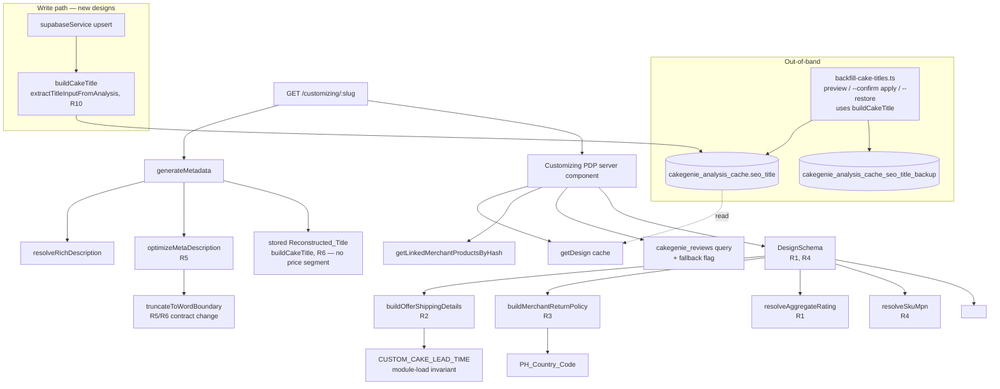

# Design Document: Customizing PDP SEO Fixes

## Overview

This feature improves the `/customizing/[slug]` route so every rendered PDP emits Google-compliant Product JSON-LD, a meta description free of mid-sentence ellipsis-pipe artifacts, and — the major change versus the original plan — a **deterministically reconstructed, customer-facing `<title>`** built from the design's own structured attributes (theme, colour, key detail, type, occasion) rather than the AI-emitted `seo_title`. The fixes touch:

- `src/lib/seo/cakeTitle.ts` — NEW pure module `buildCakeTitle` + `extractTitleInputFromAnalysis` + IP/occasion/detail vocabularies (R6, R7, R10 surface; single source of truth).
- `src/lib/commerce/machineReadable.ts` — Schema_Builder pure functions (R2, R3 surfaces).
- `src/app/customizing/[slug]/page.tsx` — Metadata_Builder helpers and `DesignSchema` (R1, R4, R5, R6 surfaces).
- `src/services/supabaseService.ts` — write path persists a `buildCakeTitle` result for new designs (R10 surface).
- An out-of-band Node/TS backfill `scripts/backfill-cake-titles.ts` that reconstructs `seo_title` for all ~10,591 rows, plus a thin SQL migration creating the backup table (R7 surface).

The backfill runs out-of-band (operator-invoked, not on every deploy). The application changes are additive to existing pure functions and components, plus the one write-path line and the new title module — no architectural shifts.

### Request Flow



The new constants `PH_Country_Code` and `CUSTOM_CAKE_LEAD_TIME` are introduced in `machineReadable.ts` and imported by the existing `buildMerchantReturnPolicy` and `buildOfferShippingDetails` helpers respectively. No call site changes are required for those helpers; their return shapes are extended in a strictly additive way (pre-existing keys preserved per R2.8 / R3.4).

The backfill is decoupled from request handling: it operates on stored data via the shared `buildCakeTitle`. After apply, the existing `revalidate = 3600` ISR window naturally republishes affected slugs; operators may optionally `revalidatePath('/customizing/<slug>')` for any slug requiring immediate refresh. New designs created after the backfill get a correct title at write time (R10), so the two paths stay consistent.

---

## Architecture

The feature is layered as decoupled rings — application code (helpers + component), the shared SEO title module, schema-builder pure functions, the write path, and an out-of-band backfill script:

```mermaid
flowchart LR
    subgraph App[Application — src/app/customizing/[slug]/]
        Page[page.tsx<br/>generateMetadata + DesignSchema wiring]
        Helpers[metadataHelpers.ts<br/>NEW pure module]
    end

    subgraph SEO[SEO lib — src/lib/seo/]
        Title[cakeTitle.ts<br/>NEW: buildCakeTitle<br/>+ extractTitleInputFromAnalysis]
    end

    subgraph SB[Schema_Builder — src/lib/commerce/]
        MR[machineReadable.ts<br/>+ PH_Country_Code<br/>+ CUSTOM_CAKE_LEAD_TIME]
    end

    subgraph Svc[Write path — src/services/]
        SS[supabaseService.ts<br/>upsert seo_title = buildCakeTitle, R10]
    end

    subgraph DB[Persistence — Supabase Postgres]
        Cache[(cakegenie_analysis_cache)]
        Listings[(cakegenie_merchant_products)]
        Reviews[(cakegenie_reviews)]
        Backup[(cakegenie_analysis_cache_seo_title_backup)]
    end

    subgraph OOB[Out-of-band backfill]
        Script[scripts/backfill-cake-titles.ts<br/>preview / --confirm / --restore]
    end

    Page --> Helpers
    Page --> MR
    Helpers --> MR
    SS --> Title
    Script --> Title
    Page -. read .-> Cache
    Page -. read .-> Listings
    Page -. read .-> Reviews
    SS -. write .-> Cache
    Script -. one-time write .-> Cache
    Script -. one-time write .-> Backup
```

Module-level dependency direction is one-way (`page.tsx → metadataHelpers.ts → machineReadable.ts`; `supabaseService.ts → cakeTitle.ts`; `backfill script → cakeTitle.ts`); the helper and title modules have no React imports and no I/O. The backfill ring is decoupled from request handling.

The pre-existing layering is preserved. The architectural additions are: (1) the new SEO title module `src/lib/seo/cakeTitle.ts` — the single source of truth for title construction, imported by both the write path and the backfill so they cannot drift; and (2) the sibling helper file `metadataHelpers.ts`, which extracts previously-inline meta-description functions so they become independently unit-testable.

## Components and Interfaces

### 1. `src/lib/commerce/machineReadable.ts` (Schema_Builder)

#### Added exports

```ts
// New constant — referentially shared by both applicableCountry and returnPolicyCountry (R3.1, R3.3).
export const PH_Country_Code: 'PH' = 'PH';

// New constant — drives ShippingDeliveryTime numeric values (R2.1, R2.2).
export const CUSTOM_CAKE_LEAD_TIME = {
  handlingTimeMinDays: 1,
  handlingTimeMaxDays: 3,
  transitTimeMinDays: 0,
  transitTimeMaxDays: 1,
} as const;

// New helper — extracted so R2.9 can be unit-tested without process-level side effects.
export function validateLeadTimeConstants(c: typeof CUSTOM_CAKE_LEAD_TIME): void;
```

#### Module-load invariant guard (R2.9)

`validateLeadTimeConstants(CUSTOM_CAKE_LEAD_TIME)` is invoked at the bottom of the module body (after the constant declaration). If any value is non-integer, negative, > 30, or violates `min ≤ max`, it throws `RangeError` whose message names the offending property. The throw runs at module import time; subsequent imports of `buildOfferShippingDetails` therefore fail fast, satisfying R2.9.

#### Modified: `buildOfferShippingDetails`

**Before:**
```ts
export function buildOfferShippingDetails(
  _merchant?: CakeGenieMerchant | null,
): {
  '@type': 'OfferShippingDetails';
  shippingDestination: { '@type': 'DefinedRegion'; addressCountry: 'PH' };
  doesNotShip: false;
};
```

**After (R2.4–R2.8):**
```ts
export function buildOfferShippingDetails(
  _merchant?: CakeGenieMerchant | null,
): {
  '@type': 'OfferShippingDetails';
  shippingDestination: { '@type': 'DefinedRegion'; addressCountry: 'PH' };
  doesNotShip: false;
  deliveryTime: {
    '@type': 'ShippingDeliveryTime';
    handlingTime: {
      '@type': 'QuantitativeValue';
      unitCode: 'DAY';
      minValue: number;
      maxValue: number;
    };
    transitTime: {
      '@type': 'QuantitativeValue';
      unitCode: 'DAY';
      minValue: number;
      maxValue: number;
    };
  };
};
```

The pre-existing keys `'@type'`, `shippingDestination`, `doesNotShip` retain identical literal values, satisfying R2.8.

#### Modified: `buildMerchantReturnPolicy`

**Before:**
```ts
export function buildMerchantReturnPolicy() {
  return {
    '@type': 'MerchantReturnPolicy',
    returnPolicyCategory: 'https://schema.org/MerchantReturnNotPermitted',
    merchantReturnDays: 0,
    returnFees: 'https://schema.org/ReturnFeesCustomerResponsibility',
    returnPolicyCountry: 'PH',
    url: DEFAULT_POLICY_URLS.returnPolicy,
  };
}
```

**After (R3.2–R3.5):**
```ts
export function buildMerchantReturnPolicy() {
  return {
    '@type': 'MerchantReturnPolicy',
    returnPolicyCategory: 'https://schema.org/MerchantReturnNotPermitted',
    merchantReturnDays: 0,
    returnFees: 'https://schema.org/ReturnFeesCustomerResponsibility',
    returnPolicyCountry: PH_Country_Code,
    applicableCountry: PH_Country_Code, // NEW — R3.2
    url: DEFAULT_POLICY_URLS.returnPolicy,
  };
}
```

`returnPolicyCountry` and `applicableCountry` both reference the same exported constant, satisfying R3.3 (`===` referential identity). No other field is added or removed (R3.5).

#### Removed / Deprecated

None. All existing exports retain their signatures so `machineReadable.test.ts` does not need any existing assertion modified (R9.5).

---

### 2. `src/app/customizing/[slug]/page.tsx` (route component)

#### Modified: `truncateToWordBoundary` (contract change)

**Before:** appends `'...'` whenever truncation occurs; reserves `maxLength - 3` for the body.

**After (R5.1, R6.7):**
```ts
function truncateToWordBoundary(text: string, maxLength: number): string;
// Postcondition: result.length <= maxLength.
// Postcondition: result NEVER appends '...' or '…'.
// Truncation is performed at the last space ≤ maxLength;
// if no space exists, returns text.substring(0, maxLength).
```

Callers must now apply the iterative trailing-punctuation strip themselves (R5.1) — this is what `optimizeMetaDescription` and the title builder do.

#### Modified: `optimizeMetaDescription` (algorithm rewrite — R5)

Signature unchanged: `function optimizeMetaDescription(descriptionText: string, price: number | null): string`.

The boilerplate-filter step is preserved verbatim. The post-truncation step is rewritten — see *Algorithms* below.

#### New: deterministic title builder (R6, R7, R10)

Title construction is **no longer** sourced from the AI-emitted `seo_title`. A new pure module `src/lib/seo/cakeTitle.ts` reconstructs the customer-facing title from the design's own structured attributes:

```ts
export const CAKE_TITLE_BUDGET = 49;

export interface CakeTitleInput {
  keyword?: string | null;        // theme, e.g. "Kuromi"
  cakeType?: string | null;       // analysis_json.cakeType
  colorTop?: string | null;       // icing_design.colors.top (hex or name)
  colorSide?: string | null;      // icing_design.colors.side
  colorType?: string | null;      // icing_design.color_type
  tags?: (string | null | undefined)[] | null;
  heroToppers?: (string | null | undefined)[] | null; // main_toppers[classification=hero].description
}

export function buildCakeTitle(input: CakeTitleInput, budget?: number): string;
```

Output follows Title_Structure `[Theme] [Color] [Detail] [Type] [Occasion] Cake` (see *Algorithms* below). Key design properties:

- **Franchise_List + `-Inspired`**: a curated token list (Sanrio, Disney/Pixar, Marvel/DC, anime, KPop, kids' shows, games, toys) drives the legal `-Inspired` qualifier. Real-company brands (McDonald's, Jollibee, Red Horse, Shopee) are intentionally excluded.
- **No PII**: the builder never reads `cake_messages[].text` or the old `seo_title`. Occasion/detail come from `tags`/`keyword`/hero-topper descriptions only.
- **Colour reuse**: hex→name uses the existing `hexToName` palette exported from `src/lib/utils/urlHelpers.ts` (now `export`ed), so titles share the slug colour vocabulary. `multicolor` designs omit colour.
- **Budget-safe**: segments are dropped Detail → Color → Type → Occasion, then the theme is word-truncated, so output is always ≤ `budget` (49) code points and the rendered `<title>` (`output + ' | Genie.ph'`) is ≤ 60.

The same `buildCakeTitle` export is consumed by (a) `generateMetadata` indirectly via the stored Reconstructed_Title, (b) the write path in `supabaseService.ts` (R10), and (c) the backfill script (R7) — one source of truth.

`generateMetadata` no longer appends a price segment to the title (Price_Segment removed); price remains in the meta description and Product JSON-LD. The title body is the stored `design.seo_title` (now a Reconstructed_Title); `truncateToWordBoundary` and `optimizeMetaDescription` remain in `metadataHelpers.ts` for the meta-description path only.

#### Modified: `DesignSchema` props (R1, R4)

**Before:**
```tsx
function DesignSchema({ design, prices }: { design: any; prices?: BasePriceInfo[] });
```

**After:**
```tsx
function DesignSchema({
  design,
  prices,
  siteReviewSummary,        // NEW — wired from page-level reviewSummary fetch
  isSiteReviewSummaryFallback, // NEW — true when constant {6, 4.8} fallback was used
  perDesignReviewStats,     // NEW — null today; reserved for future per-design feed (R1.1)
  linkedMerchantProducts,   // NEW — feeds SKU resolver (R4.3)
}: {
  design: any;
  prices?: BasePriceInfo[];
  siteReviewSummary: { total: number; averageRating: number };
  isSiteReviewSummaryFallback: boolean;
  perDesignReviewStats: { total: number; averageRating: number } | null;
  linkedMerchantProducts: LinkedMerchantProduct[];
});
```

#### Modified: page-level wiring

The existing `Promise.allSettled` block in the page server component already produces `reviewSummary`. We extend it to also surface a flag tracking whether the constant fallback was used:

```ts
let reviewSummary = { total: 6, averageRating: 4.8 };
let isSiteReviewSummaryFallback = true;       // NEW
if (ratingRowsResult.status === 'fulfilled' && ratingRowsResult.value.data) {
  const ratingRows = ratingRowsResult.value.data;
  if (ratingRows.length > 0) {
    const total = ratingRows.length;
    const averageRating = ratingRows.reduce((s, r) => s + r.rating, 0) / total;
    reviewSummary = { total, averageRating };
    isSiteReviewSummaryFallback = false;       // NEW
  }
}
```

`linkedMerchantProducts` is already produced by the existing `getLinkedMerchantProductsByHash(design.p_hash)` call in the same `Promise.allSettled` and just needs to be passed into `<DesignSchema>` as a new prop.

#### Removed

None.

---

### 3. Title reconstruction backfill `scripts/backfill-cake-titles.ts` (out-of-band component, R7)

Because the new title is computed by the TypeScript `buildCakeTitle` (not expressible in pure SQL), the backfill is a Node/TS script run out-of-band by an operator. It reuses the exact same `buildCakeTitle` export as the write path, guaranteeing parity (R7.2, R10.5).

#### Backup table (R7.5)

```sql
CREATE TABLE IF NOT EXISTS cakegenie_analysis_cache_seo_title_backup (
  slug TEXT NOT NULL,
  seo_title_before TEXT NOT NULL,
  backed_up_at TIMESTAMPTZ NOT NULL DEFAULT NOW(),
  migration_id TEXT NOT NULL DEFAULT 'title_reconstruct_v1',
  PRIMARY KEY (slug, migration_id, backed_up_at)
);
```

This table is created by a thin SQL migration `supabase/migrations/<timestamp>_create_seo_title_backup.sql`. Retention is policy (≥ 30 days), not schema-enforced — see *Risks*.

#### Script modes

The script defaults to **preview** and requires `--confirm` to apply (R7.8):

```text
# Preview — writes nothing, emits artifacts/seo-ecommerce/title-backfill-preview.csv
npx tsx scripts/backfill-cake-titles.ts

# Apply — transactional update + backup
npx tsx scripts/backfill-cake-titles.ts --confirm

# Restore (all rows, or one slug)
npx tsx scripts/backfill-cake-titles.ts --restore [--slug <slug>]
```

#### Algorithm

```text
backfill(confirm):
  rows = SELECT slug, seo_title, keywords, tags, analysis_json
         FROM cakegenie_analysis_cache            # paginated, 1000/page
  changes = []
  for row in rows:
    input = extractTitleInput(row)                # same mapping as write path
    next  = buildCakeTitle(input)
    if next != row.seo_title:
      changes.push({ slug, before: row.seo_title, after: next })
  writeCsv('artifacts/seo-ecommerce/title-backfill-preview.csv', changes)
  if not confirm:
    print(`${changes.length} rows would change`); return     # preview only (R7.1)
  # Apply in batches, each batch in one transaction (R7.4):
  for batch in chunk(changes, 500):
    BEGIN
      INSERT INTO ..._seo_title_backup (slug, seo_title_before, migration_id)
        VALUES ... (batch befores)                # backup first (R7.5)
      UPDATE cakegenie_analysis_cache
        SET seo_title = :after WHERE slug = :slug # per-row (R7.3, R7.6)
    COMMIT
  optionally revalidatePath('/customizing/<slug>') for changed slugs (R7.7 immediate refresh)
```

`extractTitleInput(row)` maps DB columns to `CakeTitleInput`:
- `keyword` ← `row.keywords`
- `cakeType` ← `row.analysis_json.cakeType`
- `colorTop` / `colorSide` ← `row.analysis_json.icing_design.colors.top|side`
- `colorType` ← `row.analysis_json.icing_design.color_type`
- `tags` ← `row.tags`
- `heroToppers` ← `row.analysis_json.main_toppers[] where classification === 'hero'`, mapped to `.description`

This is the SAME mapping the write path uses (R10.2), extracted into a shared helper `extractTitleInputFromAnalysis(analysisResult, keywords, tags)` in `src/lib/seo/cakeTitle.ts` so both call sites stay in lockstep.

Idempotence (R7.10): a second run computes identical titles, finds zero differing rows, and applies nothing.

### 4. Write-path change `src/services/supabaseService.ts` (R10)

The cache-write currently does:

```ts
const seoTitle = analysisResult.seo_title || `${keywords || 'Custom'} Cake | Genie.ph`;
```

It is changed to compute the title deterministically, ignoring `analysisResult.seo_title`:

```ts
const seoTitle = buildCakeTitle(
  extractTitleInputFromAnalysis(analysisResult, keywords, tags),
);
```

`tags` is already computed earlier in the same function (`generateTagsForAnalysis`). No other write-path field (`slug`, `alt_text`, `seo_description`, `price`, `availability`) changes (R10.6).

---

## Data Models

### `LeadTimeConstants`

```ts
type LeadTimeConstants = Readonly<{
  handlingTimeMinDays: number; // integer in [0, 30]
  handlingTimeMaxDays: number; // integer in [0, 30], ≥ handlingTimeMinDays
  transitTimeMinDays: number;  // integer in [0, 30]
  transitTimeMaxDays: number;  // integer in [0, 30], ≥ transitTimeMinDays
}>;
```

### Extended `OfferShippingDetails`

```ts
type OfferShippingDetailsV2 = {
  '@type': 'OfferShippingDetails';
  shippingDestination: { '@type': 'DefinedRegion'; addressCountry: 'PH' };
  doesNotShip: false;
  deliveryTime: {
    '@type': 'ShippingDeliveryTime';
    handlingTime: {
      '@type': 'QuantitativeValue';
      unitCode: 'DAY';
      minValue: number;
      maxValue: number;
    };
    transitTime: {
      '@type': 'QuantitativeValue';
      unitCode: 'DAY';
      minValue: number;
      maxValue: number;
    };
  };
};
```

### Extended `MerchantReturnPolicy`

```ts
type MerchantReturnPolicyV2 = {
  '@type': 'MerchantReturnPolicy';
  returnPolicyCategory: 'https://schema.org/MerchantReturnNotPermitted';
  merchantReturnDays: 0;
  returnFees: 'https://schema.org/ReturnFeesCustomerResponsibility';
  returnPolicyCountry: 'PH';
  applicableCountry: 'PH'; // NEW
  url: string;
};
```

### `DesignSchema` props extension

```ts
type DesignSchemaPropsV2 = {
  design: any;
  prices?: BasePriceInfo[];
  siteReviewSummary: { total: number; averageRating: number };
  isSiteReviewSummaryFallback: boolean;
  perDesignReviewStats: { total: number; averageRating: number } | null;
  linkedMerchantProducts: LinkedMerchantProduct[];
};
```

### JSON-LD before/after snippets

#### `shippingDetails.deliveryTime` (R2)

**Before:**
```json
{
  "@type": "OfferShippingDetails",
  "shippingDestination": { "@type": "DefinedRegion", "addressCountry": "PH" },
  "doesNotShip": false
}
```
**After:**
```json
{
  "@type": "OfferShippingDetails",
  "shippingDestination": { "@type": "DefinedRegion", "addressCountry": "PH" },
  "doesNotShip": false,
  "deliveryTime": {
    "@type": "ShippingDeliveryTime",
    "handlingTime": { "@type": "QuantitativeValue", "unitCode": "DAY", "minValue": 1, "maxValue": 3 },
    "transitTime":  { "@type": "QuantitativeValue", "unitCode": "DAY", "minValue": 0, "maxValue": 1 }
  }
}
```

#### `hasMerchantReturnPolicy.applicableCountry` (R3)

**Before:**
```json
{
  "@type": "MerchantReturnPolicy",
  "returnPolicyCategory": "https://schema.org/MerchantReturnNotPermitted",
  "merchantReturnDays": 0,
  "returnFees": "https://schema.org/ReturnFeesCustomerResponsibility",
  "returnPolicyCountry": "PH",
  "url": "https://genie.ph/return-policy"
}
```
**After:**
```json
{
  "@type": "MerchantReturnPolicy",
  "returnPolicyCategory": "https://schema.org/MerchantReturnNotPermitted",
  "merchantReturnDays": 0,
  "returnFees": "https://schema.org/ReturnFeesCustomerResponsibility",
  "returnPolicyCountry": "PH",
  "applicableCountry": "PH",
  "url": "https://genie.ph/return-policy"
}
```

#### `aggregateRating` block (R1)

**Before:** key absent.

**After (when site summary qualifies, i.e. `total ≥ 1 AND !isFallback`):**
```json
{
  "aggregateRating": {
    "@type": "AggregateRating",
    "ratingValue": 4.83,
    "reviewCount": 27,
    "bestRating": 5,
    "worstRating": 1
  }
}
```

#### SKU/MPN three resolution cases (R4)

**Case A — no listings (`linkedMerchantProducts.length === 0`):**
```json
{ "sku": "kuromi-light-purple-1-tier-cake-e3c3", "mpn": "abc123dehash" }
```
(`mpn = design.p_hash`, `sku = design.slug`. Distinct values.)

**Case B — one listing (`product_id = "PROD-42"`):**
```json
{ "sku": "PROD-42", "mpn": "abc123dehash" }
```

**Case C — listing whose `product_id` collides with `p_hash` (`product_id === p_hash === "abc123dehash"`):**
```json
{ "sku": "kuromi-light-purple-1-tier-cake-e3c3:design", "mpn": "abc123dehash" }
```
(SKU resolution would produce the same value as MPN, so the collision tiebreaker `slug + ':design'` activates per R4.5. Distinct values guaranteed.)

---

## Algorithms

### `optimizeMetaDescription` iterative trailing-punctuation strip (R5.1, R5.6)

```text
function optimizeMetaDescription(descriptionText, price):
  if descriptionText is empty: return ''

  # Step 1 — boilerplate filter (UNCHANGED from current impl)
  uniqueText = filterBoilerplateSentences(descriptionText)
  if uniqueText.length < 15: uniqueText = descriptionText.trim()

  # Step 2 — compute suffix
  finalPrice = (price > 0 && finite) ? round(price) : FALLBACK_MIN_PRICE
  suffix = ' | Price starts at ₱' + locale(finalPrice) + '. Customize now!'
  budget = 155 - codePointLength(suffix)

  # Step 3 — truncate to word boundary (NEW: no '...' appended)
  truncated = truncateToWordBoundary(uniqueText, budget)

  # Step 4 — iterative trailing-punctuation strip (R5.1)
  while truncated.length > 0 AND last code point of truncated is in {'.', '…', whitespace}:
    truncated = truncated.slice(0, -1)

  # Step 5 — empty-after-strip fallback (R5.6)
  if truncated.length == 0:
    return suffix.lstrip(' | ')   # → 'Price starts at ₱X,XXX. Customize now!'

  # Step 6 — restore single '.' if (and only if) the original ended in '.' but not '…'
  # (R5.5 — already-fits branch)
  if uniqueText.endsWith('.') AND NOT uniqueText.endsWith('…'):
    truncated = truncated + '.'

  return truncated + suffix
```

**Invariants:**
- After step 4, the final char of `truncated` is never `.`, `…`, or whitespace.
- The forbidden substrings `'... |'`, `'… |'`, `'.. |'` therefore cannot appear immediately before the suffix's leading ` | ` (R5.2).
- Total length ≤ 155 cp (step 3 budget + suffix) (R5.4).

### Deterministic title builder `buildCakeTitle` (R6, R7, R10)

```text
function buildCakeTitle({keyword, cakeType, colorTop, colorSide, colorType, tags, heroToppers}, budget=49):
  # THEME (R6.3, R6.4) — never reads cake_messages or old seo_title (R6.5)
  theme = titleCase(keyword?.trim() || '')
  theme = theme.replace(/\s*cake\s*$/i, '') || 'Custom'   # strip trailing 'Cake'
  if isFranchise(keyword):            # token-boundary match against Franchise_List
    theme = theme + '-Inspired'       # legal qualifier (R6.4)

  # SEGMENTS
  color    = (colorType == 'multicolor') ? '' : titleCase(hexToName(colorTop || colorSide))   # (R6.6)
  detail   = firstMatch(DETAIL_RULES, tags + heroToppers)        # Bow/Drip/Floral/Heart/...
  type     = mapType(cakeType)        # Bento | 2-Tier | 3-Tier | Rectangle | '' (1-tier omitted)
  occasion = firstMatch(OCCASION_TOKENS, keyword + tags)         # Birthday/Wedding/Debut/...

  # ASSEMBLE with de-dup (R6.7): drop any segment whose words already appear
  assemble(parts):
    kept = []; running = theme.lower()
    for p in parts:
      if p and not allWordsIn(p, running):
        kept.push(p); running += ' ' + p.lower()
    return dedupCake([theme, ...kept].join(' ') + ' Cake')   # never 'Cake Cake' (R6.2)

  # BUDGET REDUCTION (R6.8): drop Detail → Color → Type → Occasion
  for parts in [[color,detail,type,occasion],[color,type,occasion],[type,occasion],[occasion],[]]:
    title = assemble(parts)
    if codePointLen(title) <= budget: return title

  # Still over budget: word-truncate theme, keep ' Cake'
  return truncateThemeToFit(theme, budget)
```

**Invariants:**
- Always ends in the literal word `Cake`; never contains `Cake Cake` (R6.2).
- Never contains a numeric design code, ` with Price`, or a price (R6.9).
- `-Inspired` appended iff `keyword` ∈ Franchise_List, exactly once (R6.4).
- No title text is ever sourced from PII_Source_Fields (R6.5).
- Output length ≤ `budget` (49) code points, so `output + ' | Genie.ph'` ≤ 60 (R6.8, R6.10).
- Deterministic for identical input (R6.11).

### `aggregateRating` priority resolver (R1.1–R1.4, R1.9)

```text
function resolveAggregateRating({perDesign, site, isSiteFallback}):
  # Priority 1: per-design (R1.1, R1.3)
  if perDesign != null
     AND Number.isInteger(perDesign.total) AND perDesign.total >= 1
     AND Number.isFinite(perDesign.averageRating)
     AND perDesign.averageRating >= 1.00 AND perDesign.averageRating <= 5.00:
    return ratingBlock(perDesign.averageRating, perDesign.total)

  # Priority 2: site (R1.2, R1.9)
  if NOT isSiteFallback
     AND site != null
     AND Number.isInteger(site.total) AND site.total >= 1
     AND Number.isFinite(site.averageRating)
     AND site.averageRating >= 1.00 AND site.averageRating <= 5.00:
    return ratingBlock(site.averageRating, site.total)

  # Priority 3: omit (R1.4)
  return null

function ratingBlock(avg, count):
  return {
    '@type': 'AggregateRating',
    ratingValue: Number(avg.toFixed(2)),  # ≤ 2 decimals, JSON number (R1.7)
    reviewCount: count,                    # JSON integer (R1.8)
    bestRating: 5,                         # JSON number (R1.5)
    worstRating: 1,                        # JSON number (R1.5)
  }
```

### SKU/MPN resolver (R4.1–R4.7)

```text
function resolveSkuMpn({slug, p_hash, listings}):
  # MPN: prefer p_hash, fall back to slug (R4.1, R4.2)
  mpn = (typeof p_hash === 'string' && p_hash.length > 0) ? p_hash : slug

  # SKU: lex-min product_id from listings, or slug (R4.3, R4.4, R4.6)
  if listings.length > 0:
    sku = listings.map(l => l.product_id).sort()[0]   # UTF-16 code-unit ascending
  else:
    sku = slug

  # Collision tiebreaker (R4.5)
  if sku === mpn:
    sku = slug + ':design'

  return { sku, mpn }
```

`Array.prototype.sort()` with no comparator on a string array gives UTF-16 code-unit ascending order, matching R4.3 exactly. Determinism over query result orderings (R4.6) follows: any permutation of the input array sorts to the same first element.

The wiring contract `Product.sku === Product.offers.sku` and `Product.mpn === Product.offers.mpn` (R4.7) is enforced by reading once and binding both fields to the same local variables.

---

## Correctness Properties

*A property is a characteristic or behavior that should hold true across all valid executions of a system — essentially, a formal statement about what the system should do. Properties serve as the bridge between human-readable specifications and machine-verifiable correctness guarantees.*

### Property 1: AggregateRating priority resolver

*For any* tuple `(perDesignReviewStats, siteReviewSummary, isSiteReviewSummaryFallback)`, the block returned by `resolveAggregateRating`:
- equals `null` when neither input qualifies under R1.1/R1.2;
- otherwise has `@type === 'AggregateRating'`, `bestRating === 5`, `worstRating === 1`, `ratingValue` a finite JSON number with ≤ 2 decimals in [1.00, 5.00], and `reviewCount` a JSON integer ≥ 1;
- prefers `perDesign` over `site` when both qualify;
- treats `siteReviewSummary` as not qualifying whenever `isSiteReviewSummaryFallback === true`.

**Validates: Requirements 1.1, 1.2, 1.3, 1.4, 1.5, 1.6, 1.7, 1.8, 1.9**

### Property 2: OfferShippingDetails shape invariant

*For any* `merchant` argument (including `null` and `undefined`), the object returned by `buildOfferShippingDetails(merchant)`:
- has `'@type' === 'OfferShippingDetails'`, `shippingDestination.addressCountry === 'PH'`, `doesNotShip === false` (legacy fields preserved per R2.8);
- has `deliveryTime['@type'] === 'ShippingDeliveryTime'`;
- has `deliveryTime.handlingTime` and `deliveryTime.transitTime` matching the `QuantitativeValue` shape with `unitCode === 'DAY'` and numeric `minValue ≤ maxValue` drawn from `CUSTOM_CAKE_LEAD_TIME`.

**Validates: Requirements 2.4, 2.5, 2.6, 2.7, 2.8**

### Property 3: SKU/MPN resolver invariants

*For any* tuple `(slug: string, p_hash: string | null | undefined, listings: { product_id: string }[])` where `slug` is a non-empty string and every `product_id` is a non-empty string, the result `{sku, mpn}` of `resolveSkuMpn`:
- has `mpn === p_hash` when `p_hash` is a non-empty string, else `mpn === slug`;
- has `sku` equal to the lexicographic minimum (UTF-16 code-unit ascending) of `listings.map(l => l.product_id)` when `listings` is non-empty, else `sku === slug`, **except** when that resolved `sku` would equal `mpn`, in which case `sku === slug + ':design'`;
- satisfies `sku !== mpn` whenever both are non-empty;
- is invariant under permutations of `listings`.

**Validates: Requirements 4.1, 4.2, 4.3, 4.4, 4.5, 4.6, 4.7**

### Property 4: optimizeMetaDescription output contract

*For any* `(descriptionText: string, price: number | null)`, the string returned by `optimizeMetaDescription`:
- has Unicode code-point length ≤ 155 and ≥ the length of the suffix ` | Price starts at ₱X,XXX. Customize now!`;
- does not contain any of the substrings `'... |'`, `'… |'`, `'.. |'`;
- ends with the literal `'Customize now!'`;
- when non-empty after strip, has `' | Price starts at ₱'` immediately preceded by a non-whitespace, non-`.`, non-`…` code point;
- when empty after strip, begins with `'Price starts at ₱'`.

**Validates: Requirements 5.1, 5.2, 5.3, 5.4, 5.5, 5.6**

### Property 5: Deterministic title builder output contract

*For any* `CakeTitleInput`, the string returned by `buildCakeTitle(input, budget)`:
- ends with the literal word `'Cake'` and never contains `'Cake Cake'` (case-insensitive);
- never contains a digit-only internal code token, the substring `' with Price'`, or a `'₱'`/`'Php'` price;
- has Unicode code-point length ≤ `budget` (default 49);
- ends Theme_Segment with `'-Inspired'` iff `input.keyword` matches Franchise_List, exactly once;
- is byte-identical across repeated calls with the same `(input, budget)` (determinism, R6.11).

**Validates: Requirements 6.2, 6.3, 6.4, 6.6, 6.7, 6.8, 6.9, 6.10, 6.11**

### Property 7: Backfill ↔ write-path parity (R7.2, R10.5)

*For any* DB row, `extractTitleInputFromAnalysis(row.analysis_json, row.keywords, row.tags)` fed to `buildCakeTitle` yields the SAME string whether called from the backfill script or the `supabaseService` write path. (Discharged by both call sites importing the same functions; covered by a shared example fixture set.)

**Validates: Requirements 7.2, 10.1, 10.2, 10.5**

### Property 6: JSON-LD safety

*For any* `(design, prices, siteReviewSummary, isSiteReviewSummaryFallback, perDesignReviewStats, linkedMerchantProducts)` props, every `<script type="application/ld+json">` element rendered by `<DesignSchema>`:
- has innerHTML that, after reversing the `\u003c` escape applied for `<`, is a string `JSON.parse` accepts without throwing;
- contains no unescaped `</script` substring.

**Validates: Requirements 9.1, 9.2**

---

## Error Handling

| Failure mode | Detection | Response |
|---|---|---|
| `CUSTOM_CAKE_LEAD_TIME` mis-set (negative, non-integer, > 30, min > max) | `validateLeadTimeConstants` at module load | `RangeError` thrown synchronously; module import fails (R2.9) |
| `getDesign(slug)` returns `null` | Existing flow | `notFound()` (unchanged) |
| `cakegenie_reviews` query rejects | Existing `Promise.allSettled` | `reviewSummary` stays at `{6, 4.8}`, `isSiteReviewSummaryFallback = true`; no `aggregateRating` emitted (R1.9) |
| `getLinkedMerchantProductsByHash` rejects | Existing flow | Empty array; SKU falls back to slug (R4.4) |
| `description` boilerplate filter strips everything | Length check `< 15` | Re-use `descriptionText.trim()` (existing behavior preserved) |
| `description` becomes empty after trailing-punct strip | `truncated.length === 0` | Output begins with `Price starts at ₱` (R5.6) |
| Title overflow > 53 cp after step 5 | Length check inside `buildPdpTitle` | One `console.warn` + hard word-boundary truncation at 53 (R6.8) |
| Migration regex match yields no rows | `strip_id_leak_apply` returns 0 | No-op transaction; preview returns 0 (R7.3) |
| Migration apply fails mid-transaction | Postgres transactional semantics | Backup writes and UPDATEs both roll back atomically (R7.4) |
| JSON-LD contains `</script` injection | Existing `sanitize()` plus per-block `.replace(/</g, '\\u003c')` | Both safety nets preserved verbatim (R9.1) |

---

## Testing Strategy

### Test framework

Vitest 4.x with `--run` mode. Component tests use `@testing-library/react`. Property-based tests use `fast-check`. **`fast-check` is not currently a project dependency** — the design adds it to `devDependencies` so Properties 1–7 below can be expressed as PBT. If the dependency cannot be added (e.g. policy restriction), every property below maps to a tighter bank of example tests; that fallback is documented per-property.

### Why PBT applies here

The Schema_Builder helpers, `optimizeMetaDescription`, `buildCakeTitle`, `resolveAggregateRating`, and `resolveSkuMpn` are **pure functions** with universal output contracts and large input spaces (strings, numbers, arrays). They are exactly the case PBT is best at. The title backfill script (R7) is integration-only (DB I/O) and cannot be PBT'd, though its pure core (`buildCakeTitle`) is; the audit pipeline (R8) is external integration.

### File-by-file test plan

#### `src/lib/commerce/machineReadable.test.ts` (existing — append only, R9.5)

Append three new `describe` blocks. Existing assertions are not modified.

```ts
describe('buildOfferShippingDetails — R2 deliveryTime', () => {
  it('returns ShippingDeliveryTime with handlingTime/transitTime', /* example, R2.4–R2.7 */);
  it('preserves legacy shippingDestination.addressCountry and doesNotShip', /* R2.8 */);
  // PBT: Property 2
  it.runIf(hasFastCheck)('OfferShippingDetails shape invariant', /* fast-check */);
});

describe('PH_Country_Code — R3', () => {
  it('exports the literal "PH"', /* example, R3.1 */);
});

describe('buildMerchantReturnPolicy — R3.2–R3.5', () => {
  it('sets applicableCountry === PH_Country_Code', /* R3.2 */);
  it('uses the same reference for returnPolicyCountry and applicableCountry', /* R3.3 */);
  it('preserves all pre-existing fields', /* R3.4, R3.5 — keys equal expected set */);
});

describe('CUSTOM_CAKE_LEAD_TIME — R2.1–R2.3, R2.9', () => {
  it('initializes to {1, 3, 0, 1}', /* R2.2 */);
  it('all four values are integers in [0, 30]', /* R2.1 */);
  it('handlingTimeMin ≤ handlingTimeMax and transitTimeMin ≤ transitTimeMax', /* R2.3 */);
  it('validateLeadTimeConstants throws on bad input identifying the property', /* R2.9 */);
});
```

#### `src/app/customizing/[slug]/metadataHelpers.test.ts` (NEW, R5)

Tests the extracted module containing `truncateToWordBoundary` and `optimizeMetaDescription` (meta-description path only; the title is now built by `buildCakeTitle` in `src/lib/seo/cakeTitle.ts`).

```ts
describe('truncateToWordBoundary', () => {
  it('does not append "..." or "…"', /* R5.1 contract */);
});

describe('optimizeMetaDescription — R5', () => {
  it('strips trailing "." then "…" then whitespace iteratively', /* R5.1 */);
  it('does not contain "... |", "… |", or ".. |"', /* R5.2 */);
  it('ends with " | Price starts at ₱X,XXX. Customize now!" with non-punct preceding', /* R5.3 */);
  it('length ≤ 155 cp and ≥ suffix length', /* R5.4 */);
  it('input ending in "..." produces no ellipsis before " | "', /* R5.2 edge */);
  it('input ending in "…" produces no ellipsis before " | "', /* R5.5 edge */);
  it('input ending in "." preserves a single "." when within budget', /* R5.5 */);
  it('already-fits input is returned with suffix appended, no truncation', /* R5.5 */);
  it('input "...." returns suffix-only beginning with "Price starts at ₱"', /* R5.6 */);
  it('input "    " (whitespace) returns suffix-only', /* R5.6 */);
  it('price === null uses FALLBACK_MIN_PRICE 1099', /* R5 + page constant */);
  it('price === 0 uses FALLBACK_MIN_PRICE', /* R5 */);
  it('price === -50 uses FALLBACK_MIN_PRICE', /* R5 */);
  // PBT: Property 4
  it.runIf(hasFastCheck)('output contract holds for arbitrary (desc, price)', /* fast-check */);
});
```

#### `src/lib/seo/cakeTitle.test.ts` (NEW, R6 + R7 + R10)

Tests `buildCakeTitle` and `extractTitleInputFromAnalysis` against the canonical real-row fixtures (Kuromi, Corset Heart, Little Mermaid, Daisy Garden, 18th Birthday, Barista Coffee, Katseye, Graduation, Suertres, Sugar Skull, Red Horse, One Piece, Wedding, Gender Reveal, Mom Bento).

```ts
describe('buildCakeTitle — R6', () => {
  it('always ends in "Cake" and never contains "Cake Cake"', /* R6.2 */);
  it('appends "-Inspired" for Franchise_List themes (Kuromi, Little Mermaid, Katseye, One Piece)', /* R6.4 */);
  it('does NOT append "-Inspired" for brand themes (Red Horse, McDonald, Jollibee, Shopee)', /* R6.4 */);
  it('omits color when colorType === "multicolor"', /* R6.6 */);
  it('maps hex color via hexToName palette (e.g. #C4B5FD → Lavender)', /* R6.6 */);
  it('never emits a numeric internal code, " with Price", or a price', /* R6.9 */);
  it('output length ≤ 49 cp; output + " | Genie.ph" ≤ 60 cp', /* R6.8, R6.10 */);
  it('drops segments Detail→Color→Type→Occasion under budget pressure', /* R6.8 */);
  it('deterministic for identical input', /* R6.11 */);
  it('uses "Custom" theme when keyword empty/whitespace', /* R6.3 */);
  it('never reads cake_messages (PII): titles exclude customer names', /* R6.5 */);
  // PBT: Property 5
  it.runIf(hasFastCheck)('output contract holds for arbitrary inputs', /* fast-check */);
});

describe('extractTitleInputFromAnalysis — R7.2/R10.2 parity', () => {
  it('maps keyword/cakeType/colors/color_type/tags/hero-toppers identically for backfill and write path', /* Property 7 */);
});
```

#### `src/app/customizing/[slug]/designSchema.test.tsx` (NEW, R1 + R4)

Uses `@testing-library/react` `render()` + `container.querySelectorAll('script[type="application/ld+json"]')`.

```ts
describe('DesignSchema — R1 aggregateRating', () => {
  it('emits aggregateRating from perDesignReviewStats when perDesign qualifies and site qualifies (perDesign wins)', /* R1.1, R1.3 */);
  it('emits aggregateRating from siteReviewSummary when perDesign null and site qualifies and !isFallback', /* R1.2 */);
  it('omits aggregateRating when site is the {6, 4.8} constant fallback', /* R1.9 */);
  it('omits aggregateRating when neither qualifies', /* R1.4 */);
  it('emits ratingValue as JSON number (≤2 decimals) and reviewCount as JSON integer', /* R1.7, R1.8 */);
  it('emits bestRating: 5 and worstRating: 1 as numbers', /* R1.5 */);
  it('emits @type: "AggregateRating"', /* R1.6 */);
  it('omits aggregateRating when perDesign.total === 0', /* R1.4, R1.8 */);
  // PBT: Property 1
  it.runIf(hasFastCheck)('priority resolver invariants', /* fast-check */);
});


describe('DesignSchema — R4 SKU/MPN resolution', () => {
  it('Case A: empty linkedMerchantProducts → sku = slug, mpn = p_hash', /* R4.2, R4.4 */);
  it('Case B: one listing → sku = product_id, mpn = p_hash', /* R4.1, R4.3 */);
  it('Case B: multiple listings → sku = lex-min product_id', /* R4.3 */);
  it('Case C: collision (product_id === p_hash) → sku = slug + ":design"', /* R4.5 */);
  it('mpn = slug when p_hash is null/undefined/empty', /* R4.2 */);
  it('Product.sku === offers.sku and Product.mpn === offers.mpn', /* R4.7 */);
  it('result is invariant under permutations of linkedMerchantProducts', /* R4.6 */);
  // PBT: Property 3
  it.runIf(hasFastCheck)('SKU/MPN resolver invariants', /* fast-check */);
});

describe('DesignSchema — R9 JSON-LD safety', () => {
  it('every emitted script[type="application/ld+json"] parses with JSON.parse', /* R9.2 */);
  it('escapes "</script" via the existing sanitizer', /* R9.1 */);
  // PBT: Property 6
  it.runIf(hasFastCheck)('JSON-LD safety invariants', /* fast-check */);
});
```

### Property-based test configuration

When `fast-check` is available:
- Each property runs ≥ 100 iterations (`fc.assert(prop, { numRuns: 100 })`).
- Each property test contains a comment in the form:
  `// Feature: customizing-pdp-seo-fixes, Property N: <property-text>`
- Generators:
  - Strings: `fc.fullUnicodeString()` for description/title inputs (catches U+2026, surrogate pairs).
  - Prices: `fc.oneof(fc.constant(null), fc.constant(undefined), fc.double(), fc.integer())`.
  - Listings: `fc.array(fc.record({ product_id: fc.string({ minLength: 1 }) }), { maxLength: 8 })`.

When `fast-check` is **not** added (deferred), each `it.runIf(hasFastCheck)` test is replaced by 5–8 hand-rolled examples covering the same equivalence classes; properties remain in the design document as the validation contract.

### Audit pipeline manual verification (R8)

Documented as a single repeatable command sequence to be run **after merge**, against the three Reference_PDP_Set URLs:

```bash
URLS=(
  "https://genie.ph/customizing/kuromi-light-purple-1-tier-cake-e3c3"
  "https://genie.ph/customizing/custom-cake-white-1-tier-cake-383c"
  "https://genie.ph/customizing/pink-minimalist-light-pink-bento-cake-f707"
)
for U in "${URLS[@]}"; do
  python .agent/skills/scripts/fetch_page.py "$U" \
    | python .agent/skills/scripts/parse_html.py \
    | python .agent/skills/scripts/schema_ecommerce_validate.py --json
done
```

Acceptance gate (R8.1, R8.2, R8.7): every invocation returns `ok: true` AND zero findings whose `rule` ∈ `{shipping-deliveryTime, return-policy-applicableCountry}` AND no new finding `rule` values not present in `Pre_Feature_Baseline` (R9.7).

For R8.4, the kuromi URL is re-checked **after** the migration apply has run AND ≥ 3601 s have elapsed AND a fresh GET has reached the server: `parsed.title` and `parsed.h1[0]` must not contain ` - 1002`.

---

## Risks & Mitigations

| Risk | Mitigation |
|---|---|
| **Schema validator drift between baseline and post-merge** — new validator rules introduced in `schema_ecommerce_validate.py` between baseline capture and merge could cause R9.7 to flag spurious regressions. | Capture `Pre_Feature_Baseline` per-URL `{ok, findings[].rule}` in a JSON artifact in the same commit as this design (or one commit prior). Compare rule-id sets, not exact-finding counts. |
| **ISR cache stale post-backfill** — affected slugs render the old `seo_title` for up to 3600 s after the title backfill applies. | After apply, run `revalidatePath('/customizing/<slug>')` for any slug requiring an immediate refresh (operator script provided), or wait for the next ISR window. R7.7 explicitly accepts the wait. Document both options in the runbook. |
| **Minimum-review-count guidance vs requirement floor** — R1 allows `aggregateRating` whenever `total ≥ 1`, but Google has soft-deprecated star ratings for product listings with very low review counts; SERP-quality stars typically need ≥ 3. | Implement R1 exactly as stated (floor = 1) since the requirement is binding. Note in code: a future tightening to `total ≥ 3` is a one-line constant change in `resolveAggregateRating`. |
| **Lex-min Merchant_Listing ordering is arbitrary** — R4.3 picks the listing with the lex-smallest `product_id`, which has no business meaning (it's not "best", "newest", or "cheapest"). It is, however, deterministic. | Documented limitation. Future work: rank by merchant rating, listing freshness, or price. The current rule unblocks the SKU≠MPN constraint and is stable across renders (R4.6). |
| **Title backfill rollback path** — if applied broadly and a regression is observed (e.g. a reconstructed title reads worse than the original for some niche), restoration must be possible without data loss. | The `cakegenie_analysis_cache_seo_title_backup` table retains pre-image rows; the backfill `--restore` mode (per-slug or per-`migration_id`) writes them back (R7.9). Retention policy: ≥ 30 days post-apply (R7.5), enforced by operator runbook (no automatic cleanup in this feature). Preview CSV is reviewed before apply (R7.1). |
| **Reconstructed title loses a nuance the AI title captured** — e.g. an occasion stored only in `cake_messages` (PII, excluded) or a multicolor design left with a bare theme. | Accepted tradeoff: accuracy + no PII + no ID leak outweighs occasional terseness. Vocabularies (Franchise_List, OCCASION_TOKENS, DETAIL_RULES) are centralized in `cakeTitle.ts` and easily extended. Preview CSV surfaces weak titles before apply. |
| **`fast-check` not being a project dependency today** — adding it for this feature alone may require sign-off. | Tests are written so PBT cases are conditionally skipped (`it.runIf(hasFastCheck)`). The corresponding example-test fallbacks cover the same equivalence classes. Properties remain in the design as the formal contract regardless. |
| **New `cakeTitle.ts` module** — introduces a new SEO lib module imported by `page.tsx`, `supabaseService.ts`, and the backfill script. | Pure module, no I/O, no React. Single source of truth for `buildCakeTitle` + `extractTitleInputFromAnalysis`, so write path (R10) and backfill (R7) cannot drift. Reuses the existing `hexToName` palette (now exported) rather than reinventing colour mapping. |

---

## Out of Scope

(Restated from `requirements.md` § Introduction.)

- **MemberProgram and ProductGroup variants** in Product JSON-LD.
- **UCP profile compliance** (Universal Commerce Protocol).
- **Per-design review ingestion** — `perDesignReviewStats` is wired through as a typed prop today but is always supplied as `null` by the page; ingestion and surfacing are deferred.
- **Other routes** — `/shop/[merchantSlug]/[productSlug]`, the customizing index `/customizing`, and any non-PDP route. This feature is scoped to `/customizing/[slug]` only.
- **Migration sweep beyond `seo_title`** — alt-text, descriptions, and other cached columns are out of scope for this one-time migration even if they contain similar leaks.
- **Visual / e2e regression testing** — covered by the existing audit pipeline (R8); no new Playwright/Cypress flows are added.

---

## Summary of File Changes

| File | Change | Reason |
|---|---|---|
| `src/lib/seo/cakeTitle.ts` | **Create** | `buildCakeTitle` (R6 deterministic title builder), `extractTitleInputFromAnalysis` (shared DB→input mapper), Franchise_List / OCCASION_TOKENS / DETAIL_RULES vocabularies, `CAKE_TITLE_BUDGET`. Single source of truth for R6/R7/R10. |
| `src/lib/seo/cakeTitle.test.ts` | **Create** | Vitest suite covering `buildCakeTitle` (R6) against canonical real-row fixtures + `extractTitleInputFromAnalysis` parity (Property 7). |
| `src/lib/utils/urlHelpers.ts` | Modify | `export` the existing `hexToName` so `cakeTitle.ts` reuses the slug colour palette (no new hex mapping). |
| `src/services/supabaseService.ts` | Modify | Write path persists `seo_title = buildCakeTitle(extractTitleInputFromAnalysis(...))` instead of `analysisResult.seo_title` (R10). No other field changed. |
| `scripts/backfill-cake-titles.ts` | **Create** | Out-of-band Node/TS backfill: preview (CSV) / `--confirm` apply (transactional + backup) / `--restore`, reconstructing all ~10,591 rows via the shared builder (R7). |
| `supabase/migrations/<timestamp>_create_seo_title_backup.sql` | **Create** | Creates `cakegenie_analysis_cache_seo_title_backup` (R7.5). |
| `src/app/customizing/[slug]/page.tsx` | Modify | Wire `isSiteReviewSummaryFallback` flag and `linkedMerchantProducts` into `<DesignSchema>`; use stored Reconstructed_Title as title body with NO price segment; replace inline desc helpers with imports from `metadataHelpers.ts`; emit `aggregateRating` + new SKU/MPN + extended shipping/return schemas (R1, R4, R5, R6 wiring). |
| `src/app/customizing/[slug]/metadataHelpers.ts` | **Create** | Extract `truncateToWordBoundary` (contract change — no `'...'`), `optimizeMetaDescription` (R5 algorithm), `resolveAggregateRating` (R1), `resolveSkuMpn` (R4) as pure exports for unit testability. (Title building lives in `cakeTitle.ts`.) |
| `src/app/customizing/[slug]/metadataHelpers.test.ts` | **Create** | Vitest suite covering R5 (`optimizeMetaDescription`) edge cases per the test plan above. |
| `src/app/customizing/[slug]/designSchema.test.tsx` | **Create** | Vitest + `@testing-library/react` suite covering R1 priority resolution, R4 SKU/MPN resolution, R9 JSON-LD safety. |
| `src/lib/commerce/machineReadable.ts` | Modify | Add `PH_Country_Code` and `CUSTOM_CAKE_LEAD_TIME` constants + `validateLeadTimeConstants` (R2.1–R2.3, R2.9, R3.1); extend `buildOfferShippingDetails` return type with `deliveryTime` (R2.4–R2.8); extend `buildMerchantReturnPolicy` return with `applicableCountry` (R3.2–R3.5). |
| `src/lib/commerce/machineReadable.test.ts` | Modify (append-only) | New `describe` blocks for shipping deliveryTime, PH_Country_Code, return-policy applicableCountry, lead-time invariants. Existing assertions untouched (R9.5). |
| `package.json` | Modify (conditional) | Add `fast-check` to `devDependencies` for property-based tests. If declined, PBT cases are skipped via `it.runIf(hasFastCheck)` and the example fallbacks carry the test plan. |

No files are deleted. No existing function signatures are removed; all changes to `buildOfferShippingDetails` and `buildMerchantReturnPolicy` are strictly additive on the return type, satisfying R9.5.
