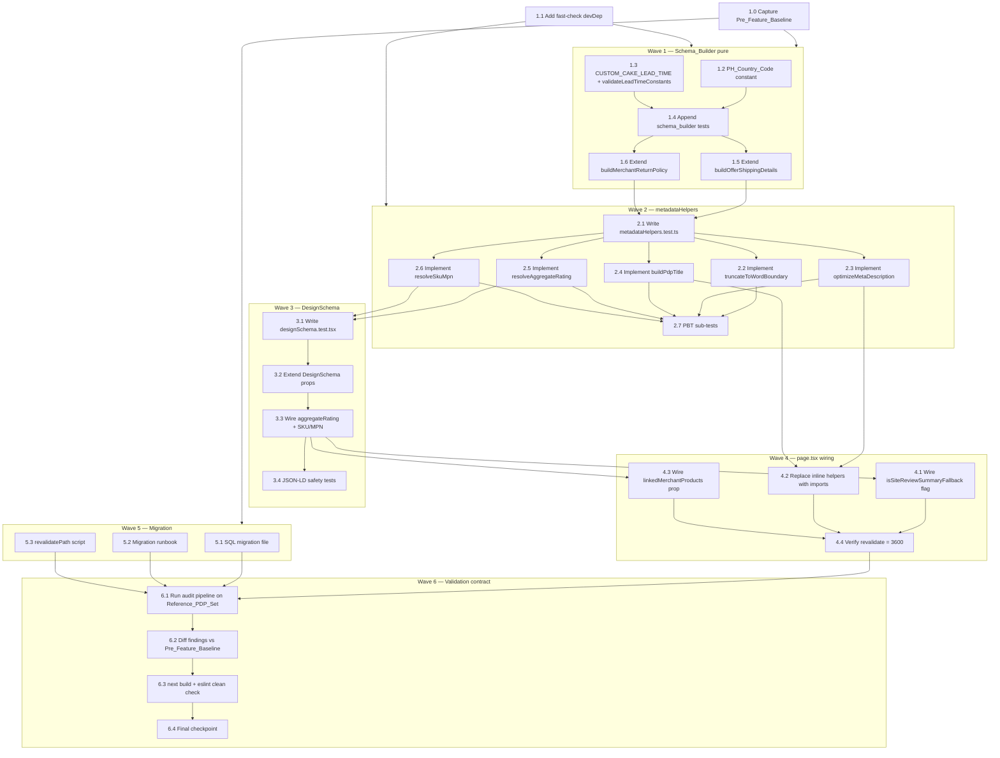

# Implementation Plan: Customizing PDP SEO Fixes

## Overview

This plan delivers seven point-fixes to `/customizing/[slug]` PDPs (R1–R7), gated by an audit-pipeline validation contract (R8) and a backwards-compatibility quality gate (R9). The work is decomposed into six independent waves so a wave-based scheduler can parallelize safely:

- **Wave 1** — Schema_Builder constants and pure builders in `src/lib/commerce/machineReadable.ts` (R2, R3). No dependencies on app code.
- **Wave 2** — Extracted pure helpers in `src/app/customizing/[slug]/metadataHelpers.ts` (R4, R5, R6, R1 priority resolver). Depends only on Wave 1.
- **Wave 3** — `DesignSchema` props extension and component-level integration tests (R1, R4, R9.1–R9.2). Depends on Wave 2.
- **Wave 4** — `page.tsx` wiring (R1, R4, R5, R6, R9.3). Depends on Waves 2 and 3.
- **Wave 5** — SQL migration for the `seo_title` ID-leak strip (R7). Independent of all app code.
- **Wave 6** — Post-merge audit pipeline run + R9.7 baseline diff (R8, R9.4, R9.7, R9.8). Depends on Waves 1–5.

A baseline-capture task (Task 1.0) **must run before any code change** because R9.7 cannot be discharged retroactively. `fast-check` is added as a devDependency in Task 1.1; if blocked, PBT sub-tasks fall back to hand-rolled examples per the design's testing strategy.

Tests follow Vitest 4.x conventions used in the existing `src/lib/commerce/machineReadable.test.ts` (`describe` / `it` / `expect` from `vitest`, no jest globals). For new modules with explicit test files in the design (`metadataHelpers.test.ts`, `designSchema.test.tsx`), tasks are TDD-ordered: write the failing tests first, then the implementation, then verify green.

## Task Flow Diagram



## Tasks

- [x] 1.0 Capture Pre_Feature_Baseline for Reference_PDP_Set (information-gathering only — no code change)
  - Run the Audit_Pipeline (`fetch_page.py | parse_html.py | schema_ecommerce_validate.py --json`) against all 3 Reference_PDP_Set URLs on the current `main` HEAD before any task in Waves 1–5 begins.
  - Persist the JSON output (`{ok, findings[].rule}` per URL) to `artifacts/seo-ecommerce/pre-feature-baseline.json` so R9.7 can compare rule-id sets after merge.
  - Also capture current `next build` TypeScript error count and `npx eslint .` warning count to `artifacts/seo-ecommerce/pre-feature-build-baseline.txt` for R9.4 and R9.8 comparison.
  - This task MUST complete before any other task. R9.7 is impossible to verify otherwise.
  - _Requirements: R8.6, R9.4, R9.7, R9.8_

- [x] 1.1 Add `fast-check` to `devDependencies` (or document deferral)
  - Run `pnpm add -D fast-check` (or `npm i -D fast-check`) and commit the lockfile change.
  - If the dependency cannot be added (policy block), document the deferral in `artifacts/seo-ecommerce/fast-check-deferred.md` and confirm that all PBT sub-tasks below (2.7, 3.4) will use the hand-rolled example fallbacks called out in design.md § Testing Strategy.
  - _Requirements: R9.6 (test-coverage clause)_

- [x] 1.2 Add `PH_Country_Code` exported constant to `src/lib/commerce/machineReadable.ts`
  - Export `export const PH_Country_Code: 'PH' = 'PH';` near the other exported constants.
  - The literal MUST be uppercase, exactly two ASCII characters, no surrounding whitespace.
  - _Requirements: R3.1_

- [x] 1.3 Add `CUSTOM_CAKE_LEAD_TIME` constant and `validateLeadTimeConstants` to `src/lib/commerce/machineReadable.ts`
  - Export `CUSTOM_CAKE_LEAD_TIME` as `{ handlingTimeMinDays: 1, handlingTimeMaxDays: 3, transitTimeMinDays: 0, transitTimeMaxDays: 1 } as const`.
  - Export `validateLeadTimeConstants(c)` that throws `RangeError` whose message identifies the offending property when any value is non-integer, negative, > 30, or violates `min ≤ max`.
  - Invoke `validateLeadTimeConstants(CUSTOM_CAKE_LEAD_TIME)` once at module load (after the constant declaration) so import fails fast on bad config.
  - _Requirements: R2.1, R2.2, R2.3, R2.9_

- [x]* 1.4 Append new `describe` blocks to `src/lib/commerce/machineReadable.test.ts` (TDD: write before 1.5/1.6 implementations)
  - Append-only — do NOT modify, remove, or `skip`/`only` any existing assertion (R9.5).
  - **describe('CUSTOM_CAKE_LEAD_TIME — R2.1–R2.3, R2.9')**: assert init values `{1, 3, 0, 1}`; assert all four are integers in `[0, 30]`; assert `min ≤ max`; assert `validateLeadTimeConstants({ handlingTimeMinDays: -1, ... })` throws `RangeError` whose message contains `'handlingTimeMinDays'`.
  - **describe('PH_Country_Code — R3')**: assert `PH_Country_Code === 'PH'` and `typeof PH_Country_Code === 'string'`.
  - **describe('buildOfferShippingDetails — R2 deliveryTime')**: assert returned `deliveryTime['@type'] === 'ShippingDeliveryTime'`; `deliveryTime.handlingTime` matches `{ '@type': 'QuantitativeValue', unitCode: 'DAY', minValue: 1, maxValue: 3 }`; `deliveryTime.transitTime` matches `{ '@type': 'QuantitativeValue', unitCode: 'DAY', minValue: 0, maxValue: 1 }`; legacy fields `'@type'`, `shippingDestination`, `doesNotShip` retain pre-change values (R2.8).
  - **describe('buildMerchantReturnPolicy — R3.2–R3.5')**: assert `applicableCountry === 'PH'` and `applicableCountry === returnPolicyCountry` referentially (`Object.is(...)`); assert key set is exactly `{ '@type', returnPolicyCategory, merchantReturnDays, returnFees, returnPolicyCountry, applicableCountry, url }`.
  - Run `vitest --run src/lib/commerce/machineReadable.test.ts` and confirm the new tests FAIL (red phase).
  - _Requirements: R2.1, R2.2, R2.3, R2.4, R2.5, R2.6, R2.7, R2.8, R2.9, R3.1, R3.2, R3.3, R3.4, R3.5, R9.5_
  - _Properties: 2_

- [x] 1.5 Extend `buildOfferShippingDetails` in `src/lib/commerce/machineReadable.ts` to emit `deliveryTime`
  - Add the `deliveryTime` field to the returned object using `CUSTOM_CAKE_LEAD_TIME` values; keep `'@type'`, `shippingDestination`, `doesNotShip` unchanged (R2.8).
  - Update the function's TypeScript return-type annotation to include `deliveryTime` per the `OfferShippingDetailsV2` shape in design.md § Data Models.
  - Run `vitest --run src/lib/commerce/machineReadable.test.ts` — the R2 tests added in 1.4 MUST now pass (green phase).
  - _Requirements: R2.4, R2.5, R2.6, R2.7, R2.8_

- [ ] 1.6 Extend `buildMerchantReturnPolicy` in `src/lib/commerce/machineReadable.ts` to emit `applicableCountry`
  - Add `applicableCountry: PH_Country_Code` to the returned object; bind `returnPolicyCountry` to the same `PH_Country_Code` reference so `===` referential equality holds (R3.3).
  - Do NOT add or remove any other field (R3.5).
  - Run `vitest --run src/lib/commerce/machineReadable.test.ts` — the R3 tests added in 1.4 MUST now pass.
  - _Requirements: R3.2, R3.3, R3.4, R3.5_

- [x] 2. Extract pure metadata helpers into `src/app/customizing/[slug]/metadataHelpers.ts` (TDD-first)

  - [x]* 2.1 Create failing test suite `src/app/customizing/[slug]/metadataHelpers.test.ts`
    - Use Vitest 4.x conventions matching `src/lib/commerce/machineReadable.test.ts` — `import { describe, expect, it } from 'vitest';`, no jest globals.
    - **describe('truncateToWordBoundary')**: assert no `'...'` or `'…'` is ever appended; assert `result.length <= maxLength`; assert truncation occurs at the last space `<= maxLength` or at `substring(0, maxLength)` when no space exists.
    - **describe('optimizeMetaDescription — R5')**: cover the 13 cases enumerated in design.md § Testing Strategy (iterative strip; no `'... |'` / `'… |'` / `'.. |'`; ends with `'Customize now!'`; length bounds; ellipsis edge cases; `.` preservation when within budget; whitespace-only input; price 0/null/negative all use `FALLBACK_MIN_PRICE = 1099`; etc.).
    - **describe('buildPdpTitle — R6')**: cover all 9 cases enumerated in design.md § Testing Strategy (`Title_Budget === 49`; never `' with Price'`; price segment iff finite & `(0, 9_999_999]`; always contains `'Cake Design'`; word-boundary truncation; exactly one `console.warn` per overflow using `vi.spyOn(console, 'warn')`; final length `<= 53`; short title yields total `<= 60`).
    - **describe('resolveAggregateRating — R1')**: cover priority cases — perDesign wins when both qualify; site used when perDesign null and `!isSiteReviewSummaryFallback`; null when fallback flag is true; null when neither qualifies; integer/finite/range guards; `bestRating: 5`, `worstRating: 1`, `@type: 'AggregateRating'`; `ratingValue` ≤ 2 decimals; `reviewCount` ≥ 1.
    - **describe('resolveSkuMpn — R4')**: Cases A/B/C from design.md § Data Models; permutation invariance; `mpn = slug` when `p_hash` is null/undefined/empty.
    - Run `vitest --run src/app/customizing/[slug]/metadataHelpers.test.ts` and confirm RED (file doesn't exist yet, all tests fail to import).
    - _Requirements: R1.1, R1.2, R1.3, R1.4, R1.5, R1.6, R1.7, R1.8, R1.9, R4.1, R4.2, R4.3, R4.4, R4.5, R4.6, R4.7, R5.1, R5.2, R5.3, R5.4, R5.5, R5.6, R6.1, R6.2, R6.3, R6.4, R6.5, R6.6, R6.7, R6.8, R6.9_
    - _Properties: 1, 3, 4, 5_

  - [x] 2.2 Implement and export `truncateToWordBoundary` in `src/app/customizing/[slug]/metadataHelpers.ts`
    - Contract change vs. current inline version: NEVER append `'...'` or `'…'`; truncate at last space `<= maxLength`, fall back to `substring(0, maxLength)` if no space.
    - Postcondition: `result.length <= maxLength`.
    - _Requirements: R5.1, R6.7 (contract change)_

  - [x] 2.3 Implement and export `optimizeMetaDescription` in `src/app/customizing/[slug]/metadataHelpers.ts`
    - Follow the 6-step algorithm in design.md § Algorithms § optimizeMetaDescription.
    - Preserve the existing `filterBoilerplateSentences` behavior verbatim (do not re-derive — copy from `page.tsx`).
    - Reuse `FALLBACK_MIN_PRICE = 1099` from page.tsx (export it from metadataHelpers as well so page.tsx can import a single source of truth).
    - Verify `vitest --run` passes the R5 tests added in 2.1.
    - _Requirements: R5.1, R5.2, R5.3, R5.4, R5.5, R5.6_
    - _Properties: 4_

  - [x] 2.4 Implement and export `buildPdpTitle` in `src/app/customizing/[slug]/metadataHelpers.ts`
    - Follow the 6-step algorithm in design.md § Algorithms § buildPdpTitle.
    - Use `Title_Budget = 49` (not a magic number — declare `const TITLE_BUDGET = 49` near the top of the function or as a module constant).
    - Strip any pre-existing `' | Genie.ph'` suffix from `seoTitle` before processing (the layout re-appends it via `metadata.title.template`).
    - Emit exactly one `console.warn` per overflow render whose argument string includes the offending `slug`.
    - Verify `vitest --run` passes the R6 tests added in 2.1.
    - _Requirements: R6.1, R6.2, R6.3, R6.4, R6.5, R6.6, R6.7, R6.8, R6.9_
    - _Properties: 5_

  - [x] 2.5 Implement and export `resolveAggregateRating` in `src/app/customizing/[slug]/metadataHelpers.ts`
    - Signature: `resolveAggregateRating({ perDesign, site, isSiteFallback }): AggregateRatingBlock | null`.
    - Follow the priority resolver in design.md § Algorithms § aggregateRating priority resolver.
    - Use `Number.isInteger` and `Number.isFinite` guards exactly as specified; clamp `ratingValue` to ≤ 2 decimal places via `Number(avg.toFixed(2))`.
    - Verify `vitest --run` passes the R1 tests added in 2.1.
    - _Requirements: R1.1, R1.2, R1.3, R1.4, R1.5, R1.6, R1.7, R1.8, R1.9_
    - _Properties: 1_

  - [x] 2.6 Implement and export `resolveSkuMpn` in `src/app/customizing/[slug]/metadataHelpers.ts`
    - Signature: `resolveSkuMpn({ slug, p_hash, listings }): { sku: string; mpn: string }`.
    - Follow the resolver in design.md § Algorithms § SKU/MPN resolver. Use `Array.prototype.sort()` with no comparator (UTF-16 code-unit ascending — matches R4.3).
    - Apply collision tiebreaker `slug + ':design'` when `sku === mpn`.
    - Verify `vitest --run` passes the R4 tests added in 2.1 including the permutation-invariance case.
    - _Requirements: R4.1, R4.2, R4.3, R4.4, R4.5, R4.6, R4.7_
    - _Properties: 3_

  - [x]* 2.7 Add `fast-check` PBT sub-cases inside `metadataHelpers.test.ts` (or document fallback if 1.1 was deferred)
    - Wrap each PBT block with `it.runIf(typeof globalThis.fc !== 'undefined' || ...)` or detect the import via dynamic feature flag.
    - **Property 1**: `resolveAggregateRating` priority/range invariants over `fc.oneof(...)` for `perDesign`/`site` shapes.
    - **Property 3**: `resolveSkuMpn` invariants over `fc.array(fc.record({ product_id: fc.string({ minLength: 1 }) }))`; assert `sku !== mpn` and permutation invariance.
    - **Property 4**: `optimizeMetaDescription` output contract over `fc.fullUnicodeString()` × `fc.oneof(fc.constant(null), fc.double(), fc.integer())`.
    - **Property 5**: `buildPdpTitle` output contract over the same generators.
    - Each property runs `numRuns: 100`. Add a comment header on each test: `// Feature: customizing-pdp-seo-fixes, Property N: <text>`.
    - If 1.1 deferred fast-check, replace each `fc.assert` block with 5–8 hand-rolled examples covering the equivalence classes per design.md § Testing Strategy.
    - _Requirements: R9.6_
    - _Properties: 1, 3, 4, 5_

- [x] 3. Extend `DesignSchema` component (TDD-first)

  - [x]* 3.1 Create failing test suite `src/app/customizing/[slug]/designSchema.test.tsx`
    - Use `import { render } from '@testing-library/react'` and `container.querySelectorAll('script[type="application/ld+json"]')` to reach into emitted JSON-LD. Parse innerHTML via `JSON.parse(script.innerHTML.replace(/\\u003c/g, '<'))`.
    - **describe('DesignSchema — R1 aggregateRating')**: 8 cases per design.md § Testing Strategy (perDesign wins; site used when perDesign null and `!isFallback`; omitted when site is constant fallback `{6, 4.8}`; omitted when neither qualifies; `ratingValue`/`reviewCount` JSON types; `bestRating: 5` / `worstRating: 1`; `@type` exact string; `total === 0` omits block).
    - **describe('DesignSchema — R4 SKU/MPN resolution')**: 7 cases — A/B (one+multi listings)/C/permutation/`p_hash` empty/`Product.sku === offers.sku` and `Product.mpn === offers.mpn` mirror.
    - **describe('DesignSchema — R9 JSON-LD safety')**: assert every emitted `<script type="application/ld+json">` parses with `JSON.parse` after reversing the `\u003c` escape; assert no unescaped `</script` substring appears in any innerHTML.
    - Run `vitest --run src/app/customizing/[slug]/designSchema.test.tsx` and confirm RED (component prop changes from 3.2 will be needed).
    - _Requirements: R1.1, R1.2, R1.3, R1.4, R1.5, R1.6, R1.7, R1.8, R1.9, R4.1, R4.2, R4.3, R4.4, R4.5, R4.6, R4.7, R9.1, R9.2_
    - _Properties: 1, 3, 6_

  - [x] 3.2 Extend `DesignSchema` props in `src/app/customizing/[slug]/page.tsx`
    - Add the 4 new props per design.md § Components § DesignSchema props extension: `siteReviewSummary`, `isSiteReviewSummaryFallback`, `perDesignReviewStats`, `linkedMerchantProducts`.
    - Type the props using the `DesignSchemaPropsV2` shape from design.md § Data Models.
    - Do not change the function name or its position in the file — additive prop change only.
    - _Requirements: R1.1, R1.2, R1.9, R4.3_

  - [x] 3.3 Wire `aggregateRating` and SKU/MPN resolution into the Product graph emitted by `DesignSchema`
    - Import `resolveAggregateRating` and `resolveSkuMpn` from `./metadataHelpers`.
    - At the top of the component body, compute `const aggregateRating = resolveAggregateRating({ perDesign: perDesignReviewStats, site: siteReviewSummary, isSiteFallback: isSiteReviewSummaryFallback });` and `const { sku, mpn } = resolveSkuMpn({ slug: design.slug, p_hash: design.p_hash, listings: linkedMerchantProducts });`.
    - In the Product JSON object, conditionally spread `...(aggregateRating ? { aggregateRating } : {})` so the key is omitted when null (R1.4).
    - Bind `Product.sku`, `Product.mpn`, `Product.offers.sku`, `Product.offers.mpn` to the same `sku`/`mpn` locals — guarantees R4.7 mirror equality.
    - Verify `vitest --run src/app/customizing/[slug]/designSchema.test.tsx` now passes the R1 + R4 tests added in 3.1.
    - _Requirements: R1.1, R1.2, R1.3, R1.4, R1.5, R1.6, R1.7, R1.8, R1.9, R4.1, R4.2, R4.3, R4.4, R4.5, R4.6, R4.7_

  - [x]* 3.4 Confirm JSON-LD safety tests (R9.1, R9.2) pass and add Property 6 PBT
    - The existing sanitizer (`.replace(/</g, '\\u003c')` on serialized JSON-LD) must remain in place — assert by reading `<script>` innerHTML and checking absence of `'</script'`.
    - Add a `fast-check` Property 6 case (or hand-rolled fallback) generating arbitrary `design`/`prices`/`siteReviewSummary` shapes and asserting every emitted `<script type="application/ld+json">` block round-trips through `JSON.parse` without throwing.
    - _Requirements: R9.1, R9.2_
    - _Properties: 6_

- [x] 4. Wire metadataHelpers and DesignSchema props into `src/app/customizing/[slug]/page.tsx`

  - [x] 4.1 Add `isSiteReviewSummaryFallback` flag to the page's review-summary fetch block
    - Modify the existing `Promise.allSettled` resolution per design.md § Components § page-level wiring: declare `let isSiteReviewSummaryFallback = true;` alongside `reviewSummary`, set to `false` only when `ratingRows.length > 0`.
    - Pass `isSiteReviewSummaryFallback` as a prop to `<DesignSchema>`.
    - _Requirements: R1.2, R1.9_

  - [x] 4.2 Replace inline `truncateToWordBoundary`, `optimizeMetaDescription`, and inline title construction with imports from `./metadataHelpers`
    - Delete the inline definitions at the top of `page.tsx`.
    - Import `truncateToWordBoundary`, `optimizeMetaDescription`, `buildPdpTitle`, and `FALLBACK_MIN_PRICE` from `./metadataHelpers`.
    - Inside `generateMetadata`, replace the inline title construction with `const title = buildPdpTitle({ seoTitle: design.seo_title, keywords: design.keywords, tags: design.tags, price: design.price, slug: design.slug });`.
    - Run `next build` (or at minimum `tsc --noEmit`) and confirm zero new errors in `page.tsx` (R9.4).
    - _Requirements: R5.1, R5.2, R5.3, R5.4, R5.5, R5.6, R6.1, R6.2, R6.3, R6.4, R6.5, R6.6, R6.7, R6.8, R6.9_

  - [x] 4.3 Pass `linkedMerchantProducts` and `perDesignReviewStats` props from `page.tsx` into `<DesignSchema>`
    - `linkedMerchantProducts` is already produced by the existing `getLinkedMerchantProductsByHash(design.p_hash)` call — pipe it directly into the component.
    - `perDesignReviewStats={null}` for now — per-design ingestion is out of scope for this feature (see design.md § Out of Scope). The prop is wired through so future ingestion is a one-line page-level change.
    - _Requirements: R4.3, R4.4_

  - [x] 4.4 Verify `export const revalidate = 3600` is unchanged in `page.tsx`
    - Open `page.tsx`, confirm the existing `export const revalidate = 3600` line is present and unmodified. (Information-gathering / regression-prevention check.)
    - This task is information-gathering only — no code change unless the line is missing.
    - _Requirements: R9.3_

- [x] 5. SQL migration for `seo_title` ID-leak strip (independent of app code)

  - [x] 5.1 Create `supabase/migrations/<timestamp>_strip_id_leak_from_seo_title.sql`
    - Body: `CREATE TABLE IF NOT EXISTS cakegenie_analysis_cache_seo_title_backup (...)` plus three `CREATE OR REPLACE FUNCTION` statements (`strip_id_leak_preview`, `strip_id_leak_apply`, `strip_id_leak_restore`) per design.md § Components § SQL migration.
    - Migration file body MUST NOT call `strip_id_leak_apply()` — operators invoke it explicitly (R7.8).
    - Use the regex `\s-\s\d{2,}(?=\s|$)` in `regexp_replace` — Postgres POSIX lookahead matches only the trailing occurrence (R7.2 worked example #4).
    - Verify the regex against the four worked examples in R7.2 by running each through `SELECT regexp_replace(...);` in `psql` against a scratch DB.
    - _Requirements: R7.1, R7.2, R7.3, R7.4, R7.5, R7.7, R7.8, R7.9_

  - [x] 5.2 Create migration runbook at `supabase/migrations/<timestamp>_strip_id_leak_from_seo_title.runbook.md`
    - Document operator commands in order: `SELECT * FROM strip_id_leak_preview();` (preview, R7.1) → eyeball diff → `SELECT strip_id_leak_apply();` (apply, R7.2) → record `affected` count → optionally `SELECT strip_id_leak_restore(p_slug => 'specific-slug');` (restore, R7.9).
    - Document the 30-day Backup_Store retention policy as operator responsibility (R7.5) — no automated cleanup ships with this feature.
    - Document the post-apply ISR refresh path: either wait for `revalidate = 3600` to elapse, or invoke the script from Task 5.3 to force immediate refresh (R7.6).
    - _Requirements: R7.5, R7.6, R7.8, R7.9_

  - [x]* 5.3 Create optional `revalidatePath` script at `scripts/revalidate-affected-slugs.ts`
    - Reads slugs from `cakegenie_analysis_cache_seo_title_backup` for the `migration_id = 'strip_id_leak_v1'` set, then calls `revalidatePath('/customizing/<slug>')` against the running Next.js server (via the existing on-demand-revalidation API or the `next` CLI).
    - Script is OPTIONAL — operators may instead wait the full 3600 s ISR window per R7.6.
    - _Requirements: R7.6 (optional immediate-refresh path)_

- [ ] 6. Validation contract — post-merge audit + R9 quality gates

  - [ ] 6.1 Run the Audit_Pipeline against every URL in Reference_PDP_Set after merge (information-gathering only)
    - Execute the bash loop documented in design.md § Testing Strategy § Audit pipeline manual verification against:
      - `https://genie.ph/customizing/kuromi-light-purple-1-tier-cake-e3c3`
      - `https://genie.ph/customizing/custom-cake-white-1-tier-cake-383c`
      - `https://genie.ph/customizing/pink-minimalist-light-pink-bento-cake-f707`
    - Persist outputs to `artifacts/seo-ecommerce/post-merge-audit.json`.
    - Acceptance: every URL returns `ok: true`, zero findings with `rule === 'shipping-deliveryTime'`, zero findings with `rule === 'return-policy-applicableCountry'`. R8.7 — non-zero exit OR `ok: false` blocks merge sign-off.
    - For the kuromi URL specifically: run AFTER Task 5 apply mode has executed, AFTER the 3601 s ISR_Window has elapsed, AND after at least one fresh GET has hit the server. Assert `parsed.title` and `parsed.h1[0]` do NOT contain `' - 1002'` (R8.4).
    - For URLs whose `Site_Review_Summary.total >= 1` and is NOT the constant fallback: assert the parsed Product graph contains an `aggregateRating` with `reviewCount === total` (R8.3).
    - Assert no `meta_description` matches `(\.{2,}|…)\s*\|\s*Price starts at` (R8.5).
    - _Requirements: R8.1, R8.2, R8.3, R8.4, R8.5, R8.6, R8.7_

  - [ ] 6.2 Diff post-merge findings against `Pre_Feature_Baseline` for R9.7 sign-off (information-gathering only)
    - Compare the rule-id sets per URL between `artifacts/seo-ecommerce/pre-feature-baseline.json` (from Task 1.0) and `artifacts/seo-ecommerce/post-merge-audit.json` (from Task 6.1).
    - Acceptance: no `rule` value appears in the post-merge findings that is absent from the pre-feature baseline for the same URL. If a new rule appears, the feature is NOT acceptable for merge per R9.7.
    - _Requirements: R9.7_

  - [x] 6.3 Run `next build` and `npx eslint .` and verify R9.4 + R9.8 quality gates (information-gathering only)
    - Run `next build` on the merged branch. Assert: zero TypeScript errors in changed files (`src/app/customizing/[slug]/page.tsx`, `src/lib/commerce/machineReadable.ts`, `src/app/customizing/[slug]/metadataHelpers.ts`); total project-wide TS error count `<=` baseline captured in Task 1.0.
    - Run `npx eslint .` on the merged branch. Assert: process exit code is 0; total ESLint warning count `<=` baseline captured in Task 1.0.
    - Run `vitest --run` to confirm all of `machineReadable.test.ts`, `metadataHelpers.test.ts`, `designSchema.test.tsx` pass; confirm no existing assertion in `machineReadable.test.ts` was modified (R9.5).
    - _Requirements: R9.4, R9.5, R9.6, R9.8_

  - [ ] 6.4 Final checkpoint — Ensure all tests pass
    - Confirm Tasks 1.0–6.3 are all green. Ensure all tests pass, ask the user if questions arise.
    - _Requirements: R8, R9_

## Notes

- Tasks marked with `*` are optional and can be skipped for a faster MVP. Test-writing tasks (1.4, 2.1, 2.7, 3.1, 3.4) and the optional revalidate script (5.3) are all marked `*`. Skipping the test-writing tasks means accepting that R9.6 (test-coverage clause) and Properties 1–6 will not be discharged via automated checks.
- Each task references specific requirement IDs (`R<n>.<m>`) for traceability per the standard task format. Test-writing tasks additionally reference Property IDs from design.md § Correctness Properties.
- **TDD ordering**: Tasks 1.4 → 1.5/1.6, 2.1 → 2.2–2.6, 3.1 → 3.2–3.3 follow red-then-green discipline for new modules with explicit test files in the design.
- **Information-gathering-only tasks** (1.0, 4.4, 6.1, 6.2, 6.3) involve no code change — the scheduler should de-prioritize them relative to code tasks within the same wave but they remain blocking on their wave-position semantics (1.0 before everything, 6.1–6.3 after everything).
- **`fast-check` deferral**: if Task 1.1 cannot land, Tasks 2.7 and 3.4 fall back to hand-rolled examples per design.md § Testing Strategy. Properties 1–6 remain as the formal validation contract regardless.
- **Out of scope** (no tasks generated for these): MemberProgram and ProductGroup variants, UCP profile compliance, per-design review ingestion (`perDesignReviewStats` is wired as `null` only), other routes (`/shop/...`, `/customizing` index), migration sweep beyond `seo_title`, e2e/Playwright/visual regression.

## Workflow Completion

This workflow has produced the planning artifacts (`requirements.md`, `design.md`, `tasks.md`) and a config file (`.config.kiro`) for the `customizing-pdp-seo-fixes` feature. Task execution is **not** part of this workflow.

To begin executing tasks, open `tasks.md` and click "Start task" next to each item, starting with Task 1.0 (Pre_Feature_Baseline capture) since it blocks all downstream work.

## Task Dependency Graph

```json
{
  "waves": [
    { "id": 0, "tasks": ["1.0", "1.1"] },
    { "id": 1, "tasks": ["1.2", "1.3", "5.1", "5.2", "5.3"] },
    { "id": 2, "tasks": ["1.4"] },
    { "id": 3, "tasks": ["1.5", "1.6"] },
    { "id": 4, "tasks": ["2.1"] },
    { "id": 5, "tasks": ["2.2", "2.3", "2.4", "2.5", "2.6"] },
    { "id": 6, "tasks": ["2.7", "3.1"] },
    { "id": 7, "tasks": ["3.2"] },
    { "id": 8, "tasks": ["3.3"] },
    { "id": 9, "tasks": ["3.4", "4.1", "4.2", "4.3", "4.4"] },
    { "id": 10, "tasks": ["6.1"] },
    { "id": 11, "tasks": ["6.2", "6.3"] }
  ]
}
```
