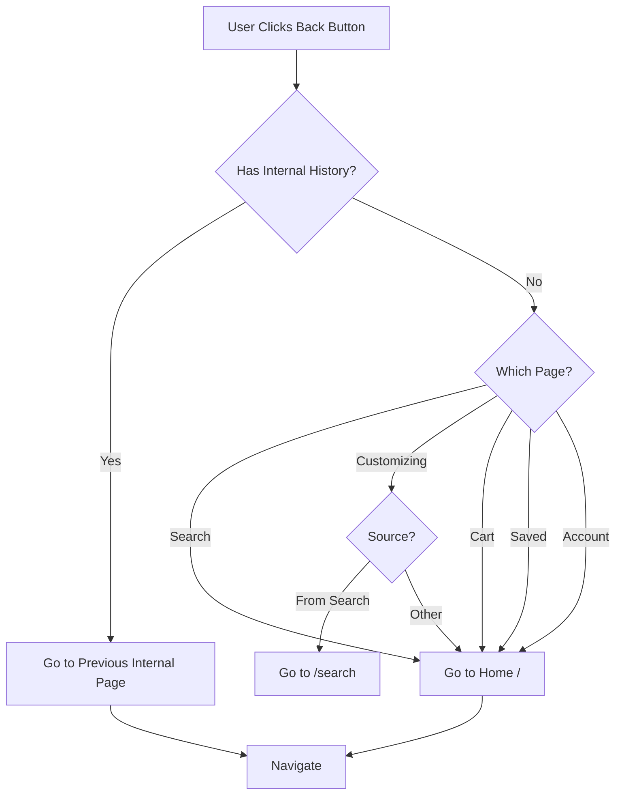

# Back Button Enhancement Plan

## Problem Statement

Currently, the back button near the search bar uses `router.back()` which relies on browser history. This is problematic because:

- Users may arrive from external sources (Google, social media, shared links)
- Browser history doesn't understand the app's logical structure
- Users get confused when back doesn't lead to a logical place in the app

## Goal

Make the back button follow the site's logical structure instead of browser history:

- **From Search page** → Go to **Home** (landing page)
- **From Customizing page** → Go to **Search** (if from search) OR **Home** (if direct)
- **From Cart** → Go to **Home** or previous page in app
- **From Saved items** → Go to **Home**
- **From Account** → Go to **Home**

## Site Structure Analysis

```
Home (/)
├── Search (/search)
│   └── Customizing (/customizing)
│       └── Cart (/cart)
├── Collections (/collections)
├── Saved (/saved)
├── Cart (/cart)
└── Account (/account)
```

## Implementation Plan

### Step 1: Create Navigation Context

Create a new context to track navigation history within the app:

- `src/contexts/NavigationContext.tsx`
- Track: current page, entry source, previous internal page
- Store in sessionStorage to persist across refreshes

### Step 2: Create useNavigation hook

Create a reusable hook for pages to determine their back destination:

- `src/hooks/useSmartBack.ts`
- Returns: `goBack()` function that navigates to logical destination
- Logic:
  1. Check if there's a valid internal previous page
  2. Use page-specific default (e.g., search → home)
  3. Fall back to home

### Step 3: Update Navigation Tracking

Modify existing navigation points to record entry source:

- Landing page: marks entry as "home"
- Search page: marks entry as "search", records previous as "home"
- Customizing page: marks entry as "customizing", records source (search, shared, etc.)
- Cart: marks entry as "cart"

### Step 4: Update Back Button Components

Update pages with back buttons to use smart navigation:

- `src/app/search/SearchingClient.tsx` - line 332
- `src/app/customizing/CustomizingClient.tsx` - add back button if missing
- Other pages as needed

### Step 5: Test Edge Cases

- Direct URL access (no internal history)
- Refresh on subpages
- Navigation from external links
- Deep linking to specific pages

## Files to Modify

1. **New files:**
   - `src/contexts/NavigationContext.tsx`
   - `src/hooks/useSmartBack.ts`

2. **Modified files:**
   - `src/app/LandingClient.tsx` - add navigation tracking
   - `src/app/search/SearchingClient.tsx` - use smart back
   - `src/app/customizing/CustomizingClient.tsx` - add/use smart back
   - Potentially other pages with back buttons

## Mermaid Flow Diagram



## Alternative Approaches Considered

1. **Always go home** - Too simple, loses context
2. **Browser back only** - Current problem
3. **Session storage only** - Doesn't track across page types well
4. **Full history stack** - Over-engineered for this use case

The chosen approach (smart back with session tracking) balances simplicity with good UX.
