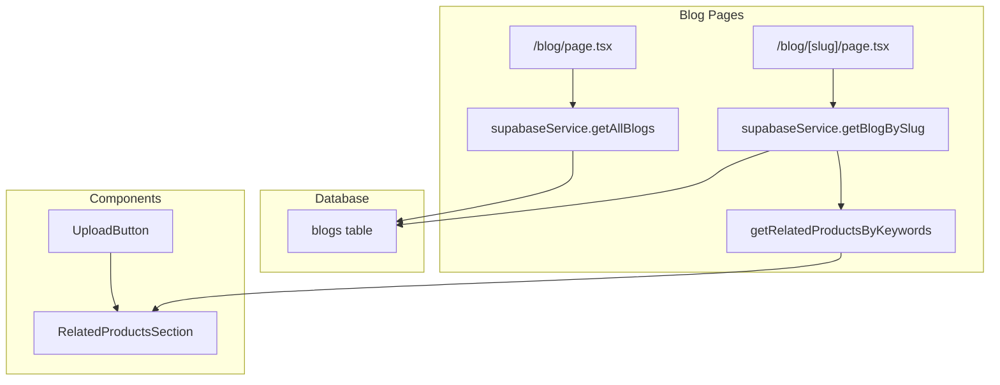

# Blog Migration to Supabase Plan

## Overview

Migrate all blog posts from static TypeScript file (`blogPosts.ts`) to Supabase database for easier management, while maintaining SEO-friendly SSR implementation.

## Current State

- Blog posts stored in `src/data/blogPosts.ts` as static array
- Blog pages use SSR with `generateStaticParams` for static generation
- Related cake designs fetched via Supabase service
- SEO metadata embedded in page components

## Target State

- Blog posts stored in Supabase `blogs` table
- Full SSR with dynamic fetching from database
- All existing SEO features preserved
- Upload button before related cake designs section

---

## Migration Steps

### Phase 1: Database Setup

1. Create `blogs` table in Supabase
2. Add RLS policies for public read access
3. Create indexes for performance

### Phase 2: Data Migration

1. Create migration script to insert all blog posts
2. Run migration to populate database
3. Verify data integrity

### Phase 3: Code Refactoring

1. Add blog CRUD functions to `supabaseService.ts`
2. Refactor `src/app/blog/page.tsx` for Supabase
3. Refactor `src/app/blog/[slug]/page.tsx` for Supabase
4. Update sitemap to fetch from database

### Phase 4: New Features

1. Create upload button component
2. Integrate into related products section
3. Add "Upload your design" CTA

---

## Database Schema

```sql
-- blogs table
CREATE TABLE blogs (
  id UUID PRIMARY KEY DEFAULT gen_random_uuid(),
  slug TEXT UNIQUE NOT NULL,
  title TEXT NOT NULL,
  excerpt TEXT NOT NULL,
  content TEXT NOT NULL,
  date DATE NOT NULL,
  author TEXT NOT NULL,
  author_url TEXT,
  image TEXT,
  keywords TEXT,
  cake_search_keywords TEXT,
  related_cakes_intro TEXT,
  created_at TIMESTAMPTZ DEFAULT NOW(),
  updated_at TIMESTAMPTZ DEFAULT NOW()
);

-- Indexes
CREATE INDEX idx_blogs_slug ON blogs(slug);
CREATE INDEX idx_blogs_date ON blogs(date DESC);
CREATE INDEX idx_blogs_cake_search_keywords ON blogs(cake_search_keywords);

-- RLS
ALTER TABLE blogs ENABLE ROW LEVEL SECURITY;
CREATE POLICY "Public can view blogs" ON blogs FOR SELECT USING (true);
```

---

## Architecture



---

## File Changes

| File | Action |
|------|--------|
| `scripts/create-blogs-table.sql` | Create database table |
| `scripts/migrate-blog-posts.ts` | Migrate data to Supabase |
| `src/services/supabaseService.ts` | Add blog CRUD functions |
| `src/app/blog/page.tsx` | Refactor for Supabase |
| `src/app/blog/[slug]/page.tsx` | Refactor for Supabase |
| `src/components/blog/UploadButton.tsx` | New component |
| `src/components/blog/RelatedProductsSection.tsx` | Add upload section |
| `src/app/sitemap.ts` | Update to fetch from DB |
| `src/app/sitemap-index.xml/route.ts` | Update to fetch from DB |
