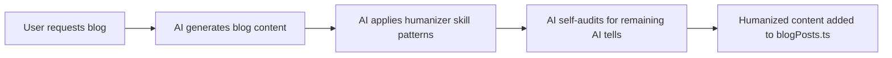

# Humanizer Blog Setup Plan

## Overview

This plan sets up the [humanizer](https://github.com/blader/humanizer) skill for use in the blog creation workflow. The goal is to automatically humanize AI-generated blog content before adding it to the codebase.

## What is Humanizer?

Humanizer is **NOT a Python package** - it's a **Claude Code skill file** that teaches AI to identify and remove AI-generated writing patterns. It's based on Wikipedia's "Signs of AI writing" guide maintained by WikiProject AI Cleanup.

The skill detects and fixes 24 patterns including:

- Significance inflation
- Promotional language
- AI vocabulary words
- Em dash overuse
- Rule of three patterns
- Vague attributions
- Generic positive conclusions

## Workflow



## Installation (COMPLETED)

### Step 1: Clone humanizer skill

```bash
mkdir -p .agent/skills/humanizer
# Copy SKILL.md from the GitHub repo
```

✅ **Done** - Skill file is at `.agent/skills/humanizer/SKILL.md`

### Step 2: Create blog-writer agent file

✅ **Done** - Agent file is at `.agent/skills/agents/blog-writer.md`

## Files Created

1. ✅ `.agent/skills/humanizer/SKILL.md` - The humanizer skill file with 24 AI patterns
2. ✅ `.agent/skills/agents/blog-writer.md` - Agent instructions for blog creation with humanizer

## Usage

When you ask me to create a blog post, I will:

1. Generate the blog content following SEO and content guidelines
2. Apply the humanizer skill patterns to identify AI-sounding text
3. Rewrite problematic sections
4. Do a final "obviously AI generated" audit pass
5. Present the humanized content for `src/data/blogPosts.ts`

## No External Dependencies

Unlike initially assumed, humanizer does NOT require:

- Python packages
- API keys
- External services

It's purely a prompt/skill that guides AI behavior.

## Reference

- [GitHub Repository](https://github.com/blader/humanizer)
- [Wikipedia: Signs of AI writing](https://en.wikipedia.org/wiki/Wikipedia:Signs_of_AI_writing)
