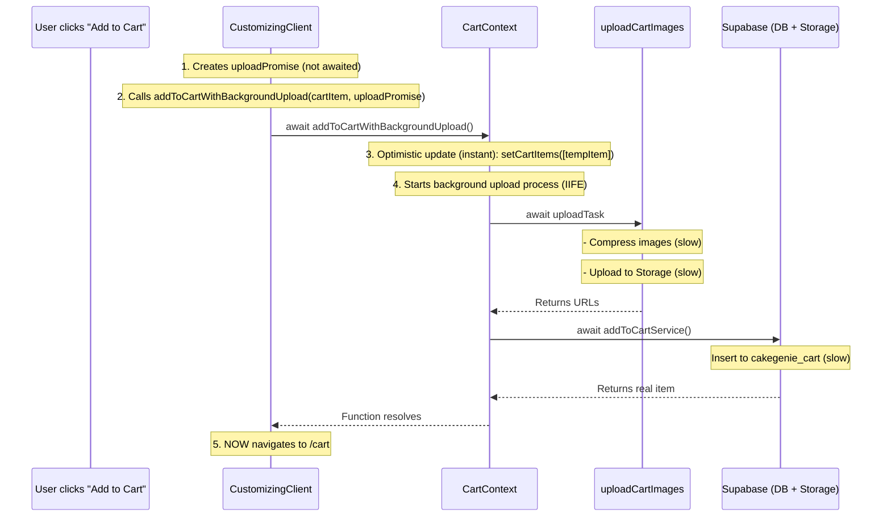

# Investigation: Slow Add to Cart Performance

## Problem Summary

When clicking "Add to Cart" on the customizing page, there's a significant delay before being forwarded to the cart page. The user expected the optimistic update to make this instant.

## Root Cause Analysis

The issue is in **how the `addToCartWithBackgroundUpload` function works** - it currently **waits for BOTH the image upload AND database insert to complete** before navigating to the cart.

### Flow Diagram



### The Problem (Code Evidence)

In [`CustomizingClient.tsx:645`](src/app/customizing/CustomizingClient.tsx):

```javascript
// Comment says: "we should NOT await the background task completion"
await addToCartWithBackgroundUpload(cartItem, uploadPromise);  // BUT IT DOES!

showSuccess('Added to cart!');
router.push('/cart');
```

In [`CartContext.tsx:497-538`](src/contexts/CartContext.tsx), the function awaits BOTH:

```javascript
const addToCartWithBackgroundUpload = useCallback(async (...) => {
    // 1. Optimistic update - THIS IS INSTANT
    setCartItems(prevItems => [tempItem, ...prevItems]);

    // 2. Background Process (BUT IT'S NOT TRULY BACKGROUND!)
    (async () => {
        const { originalImageUrl, finalImageUrl } = await uploadTask;  // AWAITED!
        // ...
        const { data: realItem, error } = await addToCartService(itemToSend);  // AWAITED!
        // ...
    })();
}, [supabase]);
```

### What's Taking Time

1. **Image Compression** - [`useImageManagement.ts:422`](src/hooks/useImageManagement.ts):

   ```javascript
   const compressedEditedFile = await compressImage(editedImageFile, { maxSizeMB: 1, fileType: 'image/webp' });
   ```

2. **Image Upload to Storage** - [`useImageManagement.ts:426-429`](src/hooks/useImageManagement.ts):

   ```javascript
   const [originalResult, editedResult] = await Promise.all([
       supabase.storage.from('cakegenie').upload(...),
       supabase.storage.from('cakegenie').upload(...)
   ]);
   ```

3. **Database Insert** - [`supabaseService.ts:1263-1267`](src/services/supabaseService.ts):

   ```javascript
   const { data, error } = await supabase
       .from('cakegenie_cart')
       .insert({ ...params, expires_at: expiresAt.toISOString() })
       .select()
       .single();
   ```

## The Fix

The optimistic update IS working (the item appears in cart instantly), but the **navigation is blocked waiting for the upload and DB insert to complete**.

### Solution Options

#### Option 1: True Fire-and-Forget Background (Recommended)

Modify `addToCartWithBackgroundUpload` to return IMMEDIATELY after the optimistic update, without awaiting the background process:

```typescript
const addToCartWithBackgroundUpload = useCallback((
    initialItem,
    uploadTask: Promise<{ originalImageUrl: string; finalImageUrl: string }>
) => {
    // 1. Optimistic update - IMMEDIATE
    setCartItems(prevItems => [tempItem, ...prevItems]);

    // 2. Fire-and-forget background process
    uploadTask
        .then(async ({ originalImageUrl, finalImageUrl }) => {
            // ... get user and prepare item ...
            await addToCartService(itemToSend);
            // ... replace temp with real item ...
        })
        .catch(error => {
            // Rollback on failure
            setCartItems(prev => prev.filter(item => item.cart_item_id !== tempId));
            showError("Failed to save item to cart. Please try again.");
        });
        
    // RETURN IMMEDIATELY - no await!
}, [supabase]);
```

#### Option 2: Just Don't Await (Simpler)

In `CustomizingClient.tsx`, simply don't await the function and let it run in background:

```javascript
// Don't await - fire and forget
addToCartWithBackgroundUpload(cartItem, uploadPromise);

showSuccess('Added to cart!');
router.push('/cart');
```

### Risks to Consider

1. **If the user closes the page before upload completes**: The item will be lost
2. **If there's an error**: The user might not know (need good error handling)
3. **Race conditions**: If the user adds multiple items quickly

### Recommended Approach

**Option 1** is better because:

- It still replaces the temp item with the real one once upload completes
- It handles errors gracefully by rolling back
- It provides a better UX than completely fire-and-forget

## Files Modified

1. [`src/contexts/CartContext.tsx`](src/contexts/CartContext.tsx) - Fixed `addToCartWithBackgroundUpload` to return immediately after optimistic update
2. [`src/app/customizing/CustomizingClient.tsx`](src/app/customizing/CustomizingClient.tsx) - Removed unnecessary await and updated comment

## Fix Implementation

### CartContext.tsx Changes

**Before:**

```typescript
const addToCartWithBackgroundUpload = useCallback(async (...) => {
    // Optimistic update
    setCartItems(prevItems => [tempItem, ...prevItems]);
    
    // Background Process - but it's awaited!
    (async () => {
        const { originalImageUrl, finalImageUrl } = await uploadTask;  // BLOCKS!
        await addToCartService(itemToSend);  // BLOCKS!
    })();
}, [supabase]);
```

**After:**

```typescript
const addToCartWithBackgroundUpload = useCallback(async (...) => {
    // Optimistic update - INSTANT
    setCartItems(prevItems => [tempItem, ...prevItems]);
    
    // Fire-and-forget - NO AWAIT!
    uploadTask
        .then(async ({ originalImageUrl, finalImageUrl }) => {
            // Upload and DB insert happen in background
            await addToCartService(itemToSend);
            // Replace temp with real item
            setCartItems(prev => prev.map(item => ...));
        })
        .catch(error => {
            // Rollback on failure
            setCartItems(prev => prev.filter(item => ...));
        });
    // Function returns immediately - navigation can happen right away!
}, [supabase]);
```

### CustomizingClient.tsx Changes

**Before:**

```javascript
await addToCartWithBackgroundUpload(cartItem, uploadPromise);
showSuccess('Added to cart!');
router.push('/cart');
```

**After:**

```javascript
addToCartWithBackgroundUpload(cartItem, uploadPromise);  // No await needed!
showSuccess('Added to cart!');
router.push('/cart');
```

## Expected Result After Fix

- Click "Add to Cart" → Immediately shows success toast and navigates to cart
- The cart page loads instantly with the temp item (Base64 image)
- In the background, images upload and DB insert happens
- Once complete, the temp item is replaced with the real item (with proper URLs)

This should make the add-to-cart feel nearly instantaneous!
