# Investigation: Customization State Leakage Bug

## Problem Statement

A user added a cake product to cart, and the details of the main topper and support elements did not match the image. Previous cake design customization data leaked into the newly added cart product.

## Root Cause Analysis

### Primary Issue: localStorage Fallback When `initialData` is Undefined

**Location:** [`CustomizationContext.tsx`](src/contexts/CustomizationContext.tsx:102-134)

```typescript
useEffect(() => {
    // Load state from localStorage on mount
    // Priority: initialData (SSR) > localStorage > defaults
    // If initialData is provided, we skip loading from localStorage to respect server source of truth
    if (initialData) return;  // <-- GUARD ONLY TRIGGERS IF initialData IS TRUTHY

    const savedAnalysis = localStorage.getItem('cakegenie_analysis');
    const savedCustomization = localStorage.getItem('cakegenie_customization');
    // ... loads stale data from localStorage
}, [initialData]);
```

**The Problem:**

- When `initialData` is `undefined` (not provided), the guard `if (initialData) return;` does NOT trigger
- This causes the context to load stale data from a previous session
- This happens on standard product pages that don't have pre-computed AI analysis (no `p_hash`)

### Additional Issues Found

#### Issue 1: `/customizing/page.tsx` Missing `CustomizationProvider` Wrapper

**Location:** [`src/app/customizing/page.tsx`](src/app/customizing/page.tsx:35-47)

```typescript
export default async function CustomizingPage() {
    return (
        <>
            <Suspense fallback={<div>...</div>}>
                <CustomizingClient />  // <-- NO CustomizationProvider WRAPPER!
            </Suspense>
        </>
    )
}
```

**The Problem:**

- The base `/customizing` page does NOT wrap `CustomizingClient` with `CustomizationProvider`
- This means it relies on a parent layout provider or the context's internal localStorage fallback
- If there's no parent provider, the context hook will return null and cause errors

#### Issue 2: `clearCustomization()` Does NOT Clear All localStorage Data

**Location:** [`CustomizationContext.tsx`](src/contexts/CustomizationContext.tsx:360-376)

```typescript
const clearCustomization = useCallback(() => {
    setAnalysisResult(null);
    setAnalysisId(null);
    // ... other state clears
    // Clear the stored image ref when clearing customization
    localStorage.removeItem('cakegenie_analysis');  // <-- ONLY CLEARS ANALYSIS
    // <-- DOES NOT CLEAR 'cakegenie_customization'!
}, []);
```

**The Problem:**

- `clearCustomization()` only removes `cakegenie_analysis` from localStorage
- It does NOT remove `cakegenie_customization` which contains `mainToppers`, `supportElements`, etc.
- This means customization data persists across product switches

#### Issue 3: No Product Identifier in localStorage Keys

**The Problem:**

- localStorage keys are generic: `cakegenie_analysis` and `cakegenie_customization`
- There's no way to validate if the stored data belongs to the current product
- When switching products, old data persists and gets loaded incorrectly

#### Issue 4: Race Condition in Product Loading

**Location:** [`CustomizingClient.tsx`](src/app/customizing/CustomizingClient.tsx:643-653)

```typescript
const hasSSRData = !!(analysisResult && targetPHash);
if (!hasSSRData) {
    clearCustomization();  // <-- Clears context state
    setIsAnalyzing(true);
} else {
    console.log("Reusing SSR Analysis Data");
}
```

**The Problem:**

- `clearCustomization()` is called, but the localStorage `useEffect` may have already run
- The localStorage data could be loaded before the clear happens
- There's no coordination between these effects

#### Issue 5: `useEffect` Dependency on Object Reference

**Location:** [`CustomizationContext.tsx`](src/contexts/CustomizationContext.tsx:134)

```typescript
}, [initialData]);  // <-- Object reference may change on every render
```

**The Problem:**

- If `initialData` is a new object reference on each render, the effect re-runs unnecessarily
- This could cause unexpected localStorage reads

---

## Data Flow Diagram

```mermaid
flowchart TD
    subgraph Product Page with p_hash
        A1[SSR Page Load] --> B1[analysis exists]
        B1 --> C1[initialState constructed]
        C1 --> D1[CustomizationProvider with initialData]
        D1 --> E1[Guard triggers - skip localStorage]
        E1 --> F1[Clean state from SSR]
    end

    subgraph Product Page without p_hash
        A2[SSR Page Load] --> B2[analysis is null]
        B2 --> C2[initialState is undefined]
        C2 --> D2[CustomizationProvider without initialData]
        D2 --> E2[Guard does NOT trigger]
        E2 --> F2[Loads stale localStorage data]
        F2 --> G2[BUG: Wrong toppers and elements]
    end

    subgraph clearCustomization Call
        H[clearCustomization called] --> I[Clears context state]
        I --> J[Removes cakegenie_analysis]
        I --> K[Does NOT remove cakegenie_customization]
        K --> L[Stale data persists]
    end
```



---

## Proposed Fix Plan

### Fix 1: Add `mapProductToDefaultState` Function

**File:** [`src/utils/customizationMapper.ts`](src/utils/customizationMapper.ts)

Add a new function to create a clean default state from product data:

```typescript
export function mapProductToDefaultState(
    product: CakeGenieMerchantProduct,
    prices?: BasePriceInfo[]
): CustomizationState {
    const cakeType: CakeType = '1 Tier'; // Default or extract from product
    
    return {
        cakeInfo: {
            type: cakeType,
            thickness: DEFAULT_THICKNESS_MAP[cakeType],
            flavors: ['Chocolate Cake'],
            size: DEFAULT_SIZE_MAP[cakeType]
        },
        mainToppers: [],
        supportElements: [],
        cakeMessages: [],
        icingDesign: { ...DEFAULT_ICING_DESIGN, dripPrice: 100, gumpasteBaseBoardPrice: 100 },
        additionalInstructions: '',
        analysisResult: null,
        analysisId: null,
        availability: 'normal'
    };
}
```

### Fix 2: Update `/customizing/[slug]/page.tsx` to Always Provide `initialData`

**File:** [`src/app/customizing/[slug]/page.tsx`](src/app/customizing/[slug]/page.tsx:839-896)

```typescript
// OLD CODE:
let initialState: CustomizationState | undefined;
if (analysis) {
    // ... construct state from analysis
    initialState = { ... };
}

// NEW CODE:
import { mapProductToDefaultState } from '@/utils/customizationMapper';

let initialState: CustomizationState;
if (analysis) {
    // ... construct state from analysis
    initialState = { ... };
} else {
    // Always provide a clean default state to prevent localStorage fallback
    initialState = mapProductToDefaultState(design, prices);
}
```

### Fix 3: Fix `clearCustomization()` to Clear All localStorage

**File:** [`src/contexts/CustomizationContext.tsx`](src/contexts/CustomizationContext.tsx:360-376)

```typescript
const clearCustomization = useCallback(() => {
    setAnalysisResult(null);
    setAnalysisId(null);
    setCakeInfo(null);
    setMainToppers([]);
    setSupportElements([]);
    setCakeMessages([]);
    setIcingDesign(null);
    setAdditionalInstructions('');
    setAnalysisError(null);
    setIsAnalyzing(false);
    setIsCustomizationDirty(false);
    setDirtyFields(new Set());
    setSEOMetadata(null);
    // Clear ALL localStorage data
    localStorage.removeItem('cakegenie_analysis');
    localStorage.removeItem('cakegenie_customization');  // <-- ADD THIS
}, []);
```

### Fix 4: Add Product Identifier Validation to localStorage

**File:** [`src/contexts/CustomizationContext.tsx`](src/contexts/CustomizationContext.tsx:102-134)

Option A - Add product ID to localStorage and validate:

```typescript
useEffect(() => {
    if (initialData) return;

    const savedAnalysis = localStorage.getItem('cakegenie_analysis');
    const savedCustomization = localStorage.getItem('cakegenie_customization');

    // NEW: Validate product ID if provided
    if (savedAnalysis) {
        try {
            const parsed = JSON.parse(savedAnalysis);
            // Only load if productId matches (if we add this to initialData)
            // For now, skip loading entirely if initialData was expected but missing
        } catch (e) {
            console.error('Failed to parse saved analysis:', e);
        }
    }
    // ... rest of logic
}, [initialData]);
```

Option B - Simpler approach: Never load from localStorage if on a product page:

```typescript
useEffect(() => {
    // Skip localStorage entirely if initialData was provided (even if undefined)
    // This forces explicit state initialization
    if (initialData !== undefined) return;  // <-- Check for undefined, not truthy

    // ... localStorage fallback only for non-product pages
}, [initialData]);
```

### Fix 5: Wrap `/customizing/page.tsx` with `CustomizationProvider`

**File:** [`src/app/customizing/page.tsx`](src/app/customizing/page.tsx:35-47)

```typescript
import { CustomizationProvider } from '@/contexts/CustomizationContext';

export default async function CustomizingPage() {
    return (
        <>
            <Suspense fallback={<div>...</div>}>
                <CustomizationProvider initialData={{}}>  // <-- ADD WRAPPER with empty initial state
                    <CustomizingClient />
                </CustomizationProvider>
            </Suspense>
        </>
    )
}
```

---

## Recommended Implementation Order

1. **Fix 3** - Clear all localStorage in `clearCustomization()` (Quick win, prevents persistence)
2. **Fix 1** - Add `mapProductToDefaultState` function (Foundation for Fix 2)
3. **Fix 2** - Always provide `initialData` in product pages (Primary fix)
4. **Fix 5** - Wrap `/customizing/page.tsx` with provider (Safety net)
5. **Fix 4** - Add validation (Optional, defense in depth)

---

## Testing Checklist

- [ ] Navigate from product A to product B - verify toppers/elements reset
- [ ] Add product to cart, navigate to new product - verify no leakage
- [ ] Refresh page on product with p_hash - verify SSR data loads correctly
- [ ] Refresh page on product without p_hash - verify clean state
- [ ] Test `/customizing` base page - verify no errors and clean state
- [ ] Test cart page - verify correct customization details stored

---

## Questions for User

1. Should we preserve any user preferences across products (e.g., default cake type, flavor)?
2. Is there a reason `clearCustomization()` was designed to NOT clear `cakegenie_customization`?
3. Are there other entry points that might have similar issues?
